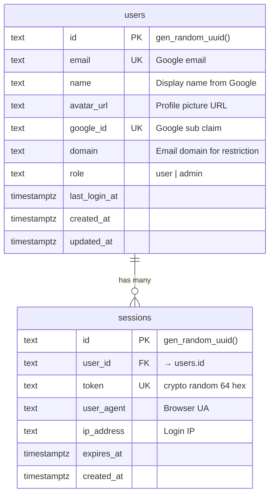
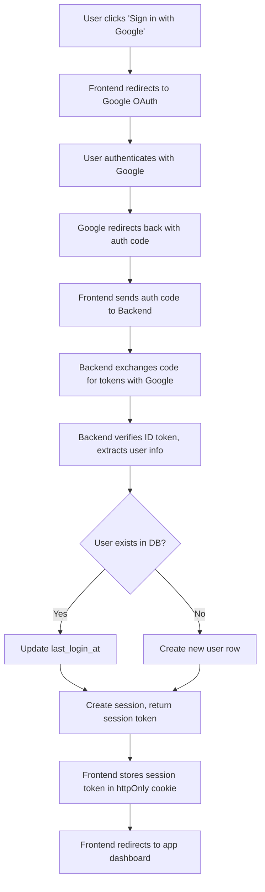
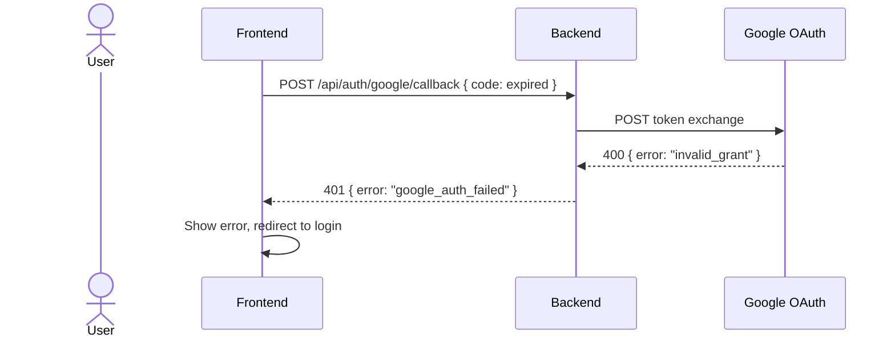
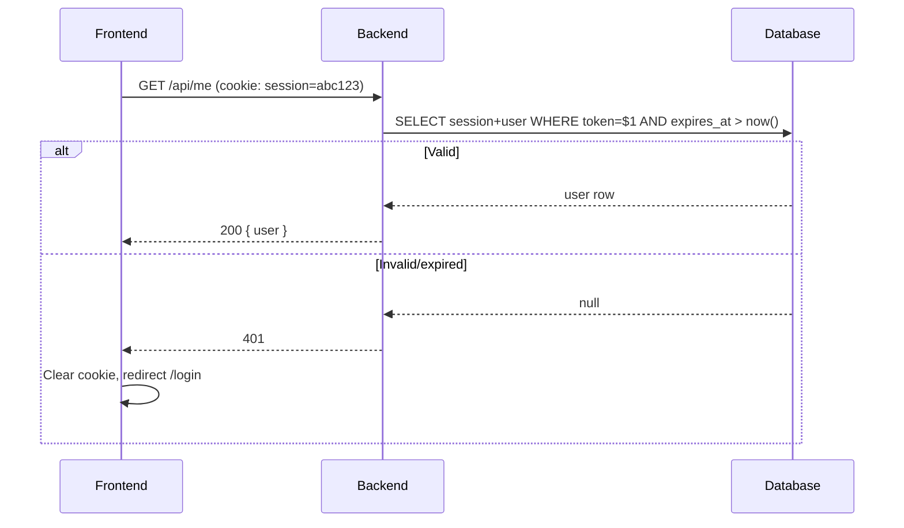

# Login with Google

## 1. Overview

### Problem Statement

Merchant cần user authentication cho app. Google Sign-In là phương thức phổ biến nhất — user không cần tạo password, merchant không cần quản lý credentials. App cần: login, session persistence, protected routes, logout.

### User Stories

- **End user**: Tôi click "Sign in with Google", chọn Google account, được redirect về app đã đăng nhập
- **End user**: Tôi close tab, mở lại → vẫn đăng nhập (session persist)
- **End user**: Tôi click Logout → session bị xoá, redirect về login page
- **Merchant admin**: Tôi thấy danh sách users đã đăng nhập qua admin panel
- **Merchant admin**: Tôi restrict access cho specific Google domains (e.g. chỉ @company.com)

### Khi nào dùng block này

- User nói: "login", "đăng nhập", "authentication", "sign in", "Google login"
- App cần protected routes (chỉ logged-in users truy cập được)
- Merchant muốn biết ai đang dùng app

### Khi nào KHÔNG dùng

- App hoàn toàn public (không cần login) → skip
- Merchant muốn username/password login → block: `auth.email-password`
- Merchant muốn Shopify OAuth (embedded app) → block: `auth.shopify-session-token`

---

## 2. Data Model



### Table: `users`

| Column | Type | Constraints | Notes |
|--------|------|-------------|-------|
| `id` | `text` | PK, default `gen_random_uuid()` | |
| `email` | `text` | UNIQUE, NOT NULL | Lowercase |
| `name` | `text` | NOT NULL | `given_name + family_name` |
| `avatar_url` | `text` | nullable | Google profile picture |
| `google_id` | `text` | UNIQUE, NOT NULL | `sub` claim |
| `domain` | `text` | NOT NULL | `email.split('@')[1]` |
| `role` | `text` | NOT NULL, default `'user'` | `user` or `admin` |
| `last_login_at` | `timestamptz` | NOT NULL | Updated every login |
| `created_at` | `timestamptz` | NOT NULL, default `now()` | |
| `updated_at` | `timestamptz` | NOT NULL, default `now()` | |

### Table: `sessions`

| Column | Type | Constraints | Notes |
|--------|------|-------------|-------|
| `id` | `text` | PK, default `gen_random_uuid()` | |
| `user_id` | `text` | FK → users.id, NOT NULL | |
| `token` | `text` | UNIQUE, NOT NULL | 64 hex chars |
| `user_agent` | `text` | nullable | |
| `ip_address` | `text` | nullable | |
| `expires_at` | `timestamptz` | NOT NULL | |
| `created_at` | `timestamptz` | NOT NULL, default `now()` | |

### Migration (reference)

```sql
CREATE TABLE IF NOT EXISTS users (
  id text PRIMARY KEY DEFAULT gen_random_uuid()::text,
  email text UNIQUE NOT NULL,
  name text NOT NULL,
  avatar_url text,
  google_id text UNIQUE NOT NULL,
  domain text NOT NULL,
  role text NOT NULL DEFAULT 'user',
  last_login_at timestamptz NOT NULL DEFAULT now(),
  created_at timestamptz NOT NULL DEFAULT now(),
  updated_at timestamptz NOT NULL DEFAULT now()
);

CREATE TABLE IF NOT EXISTS sessions (
  id text PRIMARY KEY DEFAULT gen_random_uuid()::text,
  user_id text NOT NULL REFERENCES users(id) ON DELETE CASCADE,
  token text UNIQUE NOT NULL,
  user_agent text,
  ip_address text,
  expires_at timestamptz NOT NULL,
  created_at timestamptz NOT NULL DEFAULT now()
);

CREATE INDEX idx_sessions_token ON sessions(token) WHERE expires_at > now();
CREATE INDEX idx_sessions_user_id ON sessions(user_id);
CREATE INDEX idx_users_domain ON users(domain);
```

---

## 3. Data Flow



---

## 4. Sequence Diagrams

### Happy Path: Login

```mermaid
sequenceDiagram
    actor U as User
    participant F as Frontend
    participant B as Backend
    participant G as Google OAuth
    participant DB as Database

    U->>F: Click "Sign in with Google"
    F->>F: Generate CSRF state token, store in cookie
    F->>G: Redirect to accounts.google.com/o/oauth2/v2/auth

    U->>G: Select Google account, consent
    G->>F: Redirect to /auth/callback?code=xxx&state=yyy

    F->>F: Verify state matches CSRF cookie
    F->>B: POST /api/auth/google/callback { code, redirect_uri }

    B->>G: POST oauth2.googleapis.com/token { code, client_secret }
    G-->>B: { access_token, id_token }

    B->>B: Verify id_token (JWT: iss + aud + exp + email_verified)
    B->>DB: UPSERT user by google_id
    B->>DB: INSERT session (token, expires_at)

    B-->>F: 200 { user } + Set-Cookie: session=xxx; HttpOnly
    F->>F: Redirect to /dashboard
```

### Error: Invalid code



### Session validation



---

## 5. State Management

| State | Storage | Survives Reload | Notes |
|-------|---------|-----------------|-------|
| `currentUser` | In-memory (reactive) | No — re-fetched via `/api/me` | `{ id, email, name, avatarUrl, role }` or `null` |
| `isLoading` | In-memory | No | True during `/api/me` fetch |
| `isAuthenticated` | Derived | — | `currentUser !== null` |
| Session token | `httpOnly` cookie | Yes | Frontend cannot read directly |
| CSRF state | `sameSite` cookie | Yes (5 min) | OAuth state validation |

### State transitions

```
App Boot → isLoading=true → GET /api/me
  ├── 200 → currentUser=user → Render app
  └── 401 → currentUser=null → Render login

Login Click → redirect Google → callback → POST /api/auth/google/callback
  ├── 200 → cookie set → redirect /dashboard
  └── 4xx → show error → stay login

Logout → POST /api/auth/logout → cookie cleared → redirect /login
```

---

## 6. Integration Points

### Inbound

| Caller | How | Purpose |
|--------|-----|---------|
| Any protected route | `authMiddleware` | Validate session |
| Admin panel | `user.role === "admin"` | Authorization |

### Outbound

| Target | How | Purpose |
|--------|-----|---------|
| Google OAuth | HTTPS | Token exchange + verify |
| Database | SQL | User + session CRUD |

### Events

| Event | Payload | When |
|-------|---------|------|
| `user.created` | `{ userId, email, name }` | First login |
| `user.logged_in` | `{ userId, sessionId }` | Every login |
| `user.logged_out` | `{ userId, sessionId }` | Logout |

---

## 7. Configuration Surface

| Key | Type | Default | Description |
|-----|------|---------|-------------|
| `GOOGLE_CLIENT_ID` | env var | (required) | OAuth client ID |
| `GOOGLE_CLIENT_SECRET` | env var | (required) | OAuth client secret |
| `SESSION_DURATION_DAYS` | number | `30` | Session lifetime |
| `ALLOWED_DOMAINS` | string[] | `[]` (all) | Restrict email domains |
| `LOGIN_REDIRECT_PATH` | string | `"/dashboard"` | Post-login redirect |
| `APP_URL` | env var | (required) | Full URL for redirect_uri |

### Google Cloud Console Setup

Claude Code outputs these in `SETUP.md`:

1. Go to https://console.cloud.google.com/apis/credentials
2. Create OAuth 2.0 Client ID (Web application)
3. Authorized redirect URIs: `{APP_URL}/auth/callback`
4. Copy Client ID → `GOOGLE_CLIENT_ID`
5. Copy Client Secret → `GOOGLE_CLIENT_SECRET`
