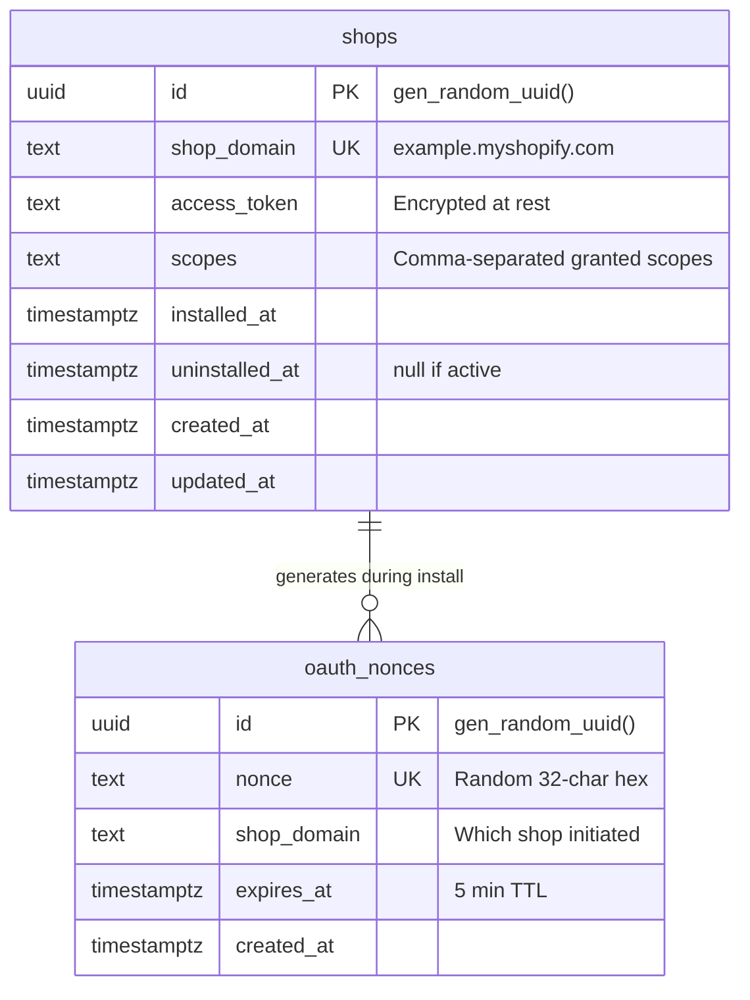
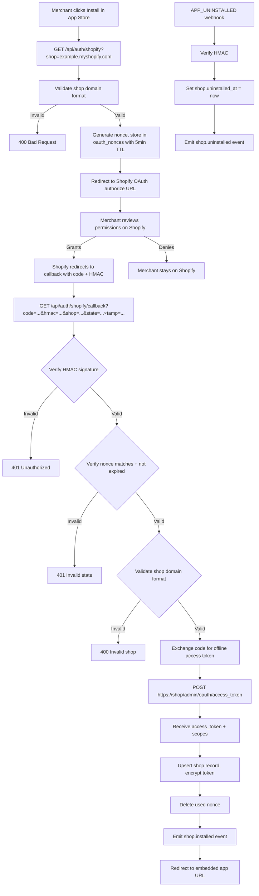
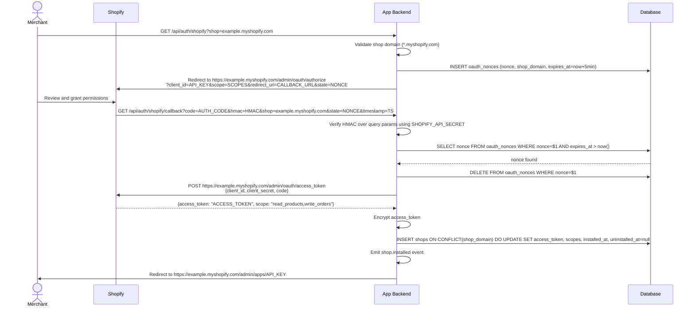
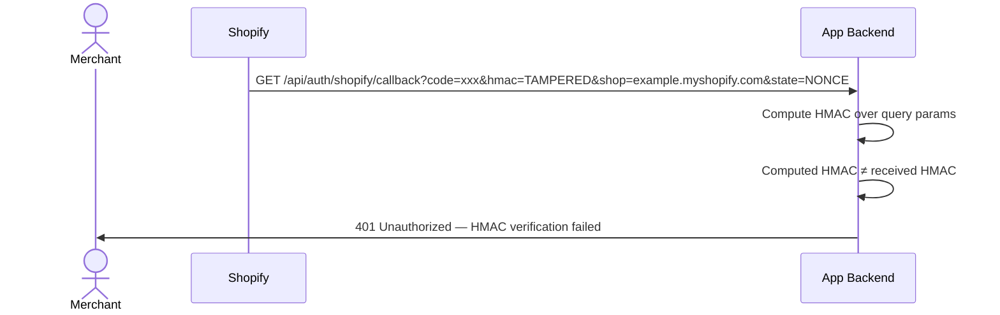
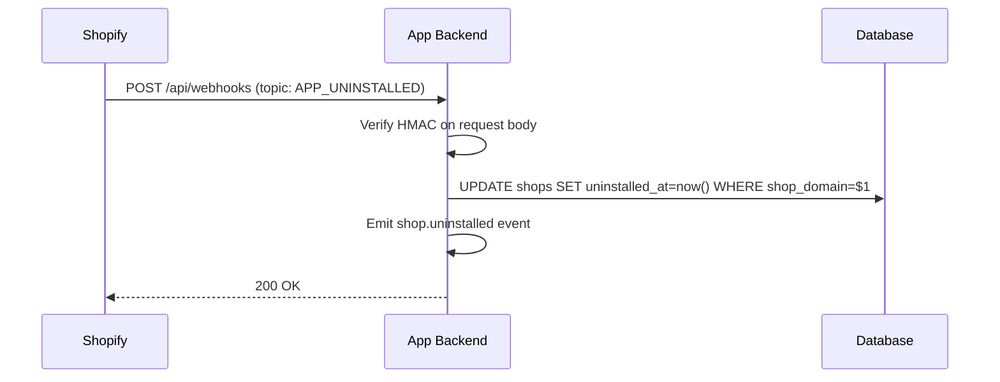

# Shopify App Installation & OAuth

## 1. Overview

### Problem Statement

Every Shopify app must implement the OAuth handshake to get installed on a merchant's store. The merchant clicks "Install" → Shopify redirects to the app with a permission prompt → the merchant grants access → Shopify returns an authorization code → the app exchanges it for an offline access token. This token persists and gives the app API access to the store's data. Without this flow, the app cannot read products, process orders, or do anything useful.

### User Stories

- **Merchant**: I found an app in the Shopify App Store, I want to install it on my store so it can access my store data and provide its features
- **Merchant**: I want to reinstall an app I previously uninstalled, and have it recognize my store
- **Merchant**: I want to uninstall an app and trust that it stops accessing my store data
- **Developer**: I want a secure, spec-compliant OAuth flow that handles edge cases like reinstalls, scope changes, and concurrent installations

### When to use this block

- App needs to be installed on Shopify stores
- User mentions: "shopify app", "install app", "oauth", "access token", "app installation"
- App needs to call Shopify Admin API on behalf of a merchant

### When NOT to use

- Building a Shopify theme (no OAuth needed)
- Building a sales channel (uses different auth flow)
- Need ongoing request authentication for embedded app → use `auth.shopify-session-token` (which depends on this block)

---

## 2. Data Model



### Table: `shops`

| Column | Type | Constraints | Notes |
|--------|------|-------------|-------|
| `id` | `uuid` | PK, default `gen_random_uuid()` | |
| `shop_domain` | `text` | NOT NULL, UNIQUE | `example.myshopify.com` format |
| `access_token` | `text` | NOT NULL | Encrypted at rest |
| `scopes` | `text` | NOT NULL | Comma-separated, e.g. `read_products,write_orders` |
| `installed_at` | `timestamptz` | NOT NULL, default `now()` | |
| `uninstalled_at` | `timestamptz` | nullable | Set on `APP_UNINSTALLED` webhook |
| `created_at` | `timestamptz` | NOT NULL, default `now()` | |
| `updated_at` | `timestamptz` | NOT NULL, default `now()` | |

### Table: `oauth_nonces`

Single-use CSRF tokens for the OAuth callback. Deleted immediately after use.

| Column | Type | Constraints | Notes |
|--------|------|-------------|-------|
| `id` | `uuid` | PK, default `gen_random_uuid()` | |
| `nonce` | `text` | NOT NULL, UNIQUE | Random 32-char hex string |
| `shop_domain` | `text` | NOT NULL | Which shop initiated the flow |
| `expires_at` | `timestamptz` | NOT NULL | 5 minutes from creation |
| `created_at` | `timestamptz` | NOT NULL, default `now()` | |

### Migration (reference)

```sql
CREATE TABLE IF NOT EXISTS shops (
  id uuid PRIMARY KEY DEFAULT gen_random_uuid(),
  shop_domain text NOT NULL UNIQUE,
  access_token text NOT NULL,
  scopes text NOT NULL,
  installed_at timestamptz NOT NULL DEFAULT now(),
  uninstalled_at timestamptz,
  created_at timestamptz NOT NULL DEFAULT now(),
  updated_at timestamptz NOT NULL DEFAULT now()
);

CREATE INDEX idx_shops_domain ON shops(shop_domain);

CREATE TABLE IF NOT EXISTS oauth_nonces (
  id uuid PRIMARY KEY DEFAULT gen_random_uuid(),
  nonce text NOT NULL UNIQUE,
  shop_domain text NOT NULL,
  expires_at timestamptz NOT NULL,
  created_at timestamptz NOT NULL DEFAULT now()
);

CREATE INDEX idx_nonces_expires ON oauth_nonces(expires_at);
```

---

## 3. Data Flow



---

## 4. Sequence Diagrams

### Install Flow (happy path)



### Install Flow (HMAC verification failure)



### Uninstall Flow



---

## 5. State Management

This block is backend-only. No frontend state — the OAuth flow uses server-side redirects.

| State | Storage | Survives Reload | Notes |
|-------|---------|-----------------|-------|
| `shop` | Database (`shops` table) | Yes | Persistent shop record with encrypted token |
| `nonce` | Database (`oauth_nonces` table) | Yes (5min TTL) | Deleted after single use |
| `install redirect` | HTTP redirect chain | No | Browser follows redirects |

### State transitions

```
Initial → GET /api/auth/shopify → nonce created → redirect to Shopify
Shopify → callback → nonce verified + deleted → code exchanged → shop upserted
APP_UNINSTALLED webhook → shop.uninstalled_at set
Reinstall → same flow, upsert overwrites token + clears uninstalled_at
```

---

## 6. Integration Points

### Inbound

| Caller | How | Purpose |
|--------|-----|---------|
| Shopify App Store / Manual URL | HTTP redirect | Initiate install flow |
| Shopify OAuth server | HTTP redirect | Return authorization code |
| Shopify webhook system | POST /api/webhooks | APP_UNINSTALLED notification |

### Outbound

| Target | How | Purpose |
|--------|-----|---------|
| Shopify OAuth endpoint | POST `https://{shop}/admin/oauth/access_token` | Exchange code for token |
| Database | SQL | Store shop + nonce records |

### Events

| Event | Payload | When |
|-------|---------|------|
| `shop.installed` | `{ shopId, shopDomain, scopes }` | OAuth flow completes, shop record upserted |
| `shop.uninstalled` | `{ shopId, shopDomain }` | APP_UNINSTALLED webhook received |
| `shop.reinstalled` | `{ shopId, shopDomain, previousScopes, newScopes }` | Shop reinstalls (upsert detects existing record) |

### Shared Utilities Introduced

This block introduces two shared utilities used by downstream blocks:

1. **HMAC-SHA256 verification** — `verifyShopifyHmac(secret, data, expectedHmac)` — constant-time comparison, used by webhooks, GDPR, app proxy blocks
2. **GraphQL Admin API client** — authenticated client with rate limiting, retry on 429/5xx, token injection from `shops` table

---

## 7. Configuration Surface

| Key | Type | Default | Description |
|-----|------|---------|-------------|
| `SHOPIFY_API_KEY` | `string` | required | App API key from Shopify Partner Dashboard |
| `SHOPIFY_API_SECRET` | `string` | required | App API secret (used for HMAC + token exchange) |
| `SHOPIFY_SCOPES` | `string` | required | Comma-separated scopes, e.g. `read_products,write_orders` |
| `APP_URL` | `string` | required | Full app URL (e.g. `https://myapp.com`) for redirect_uri |
| `OAUTH_NONCE_TTL_SECONDS` | `number` | `300` | Nonce expiry time (5 min default) |
