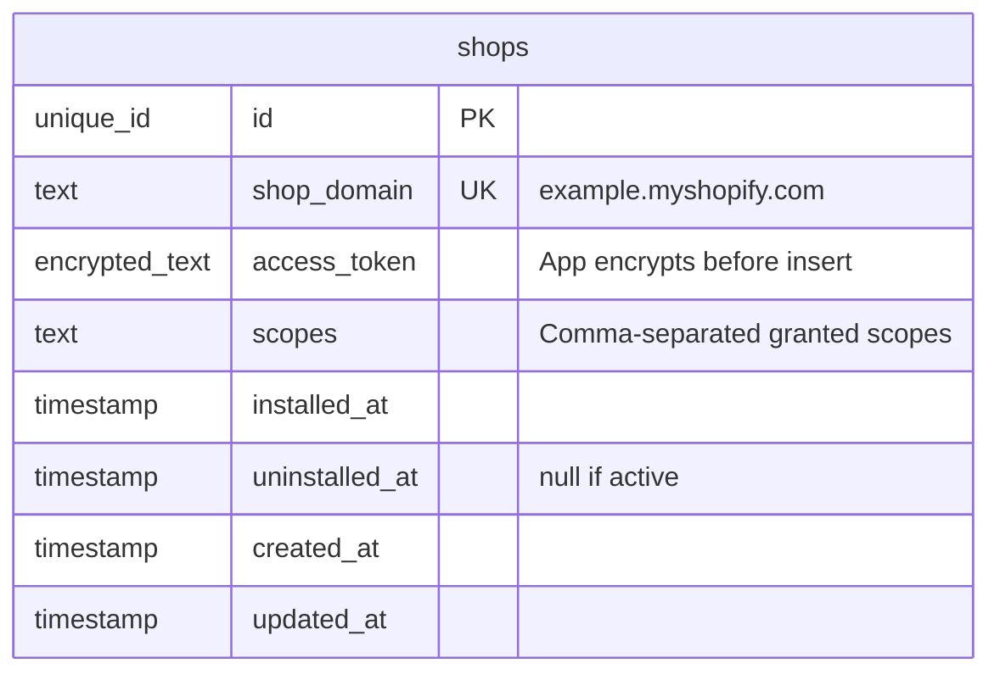
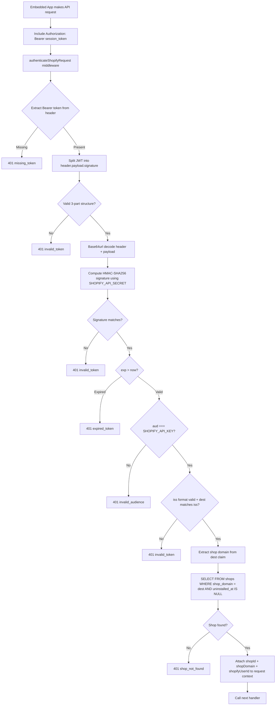
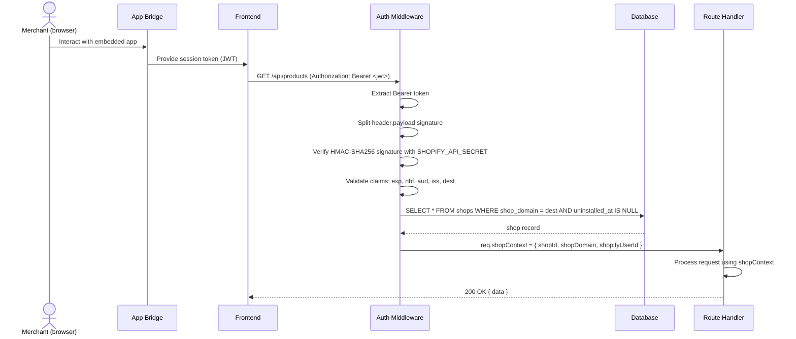
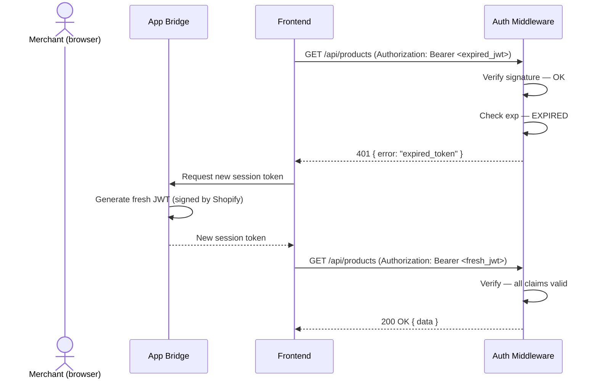
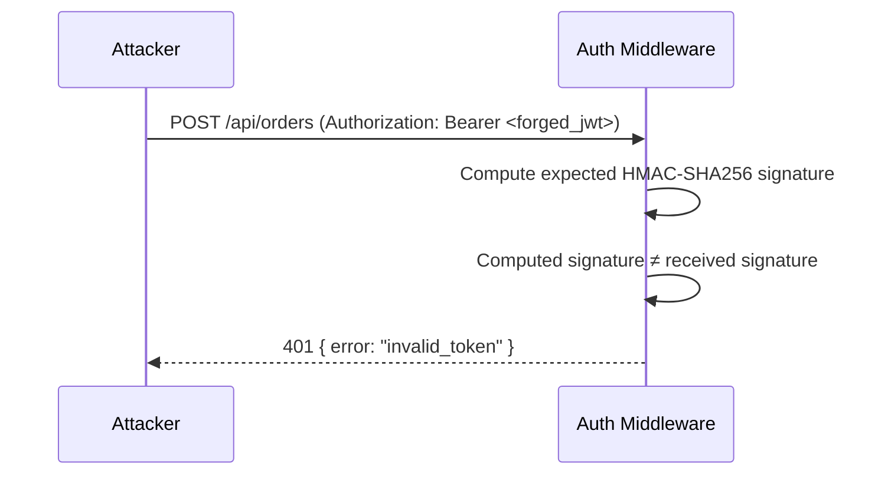

# Shopify Session Token Verification

## 1. Overview

### Problem Statement

After a merchant installs the app via OAuth, every subsequent request from the embedded app (running inside the Shopify Admin iframe) must be authenticated. Shopify App Bridge generates short-lived JWTs called "session tokens" — signed with the app's API secret — that the frontend includes in every API request. The backend must verify these tokens on every call to confirm the request is genuinely from an authenticated merchant session in Shopify Admin, not a forged request.

### User Stories

- **Merchant**: I use the app inside Shopify Admin and expect my API calls to be authenticated automatically without re-logging in
- **Developer**: I want a single middleware that handles auth for all my API routes, attaches shop context, and returns clear errors when tokens are invalid
- **Developer**: I want expired token errors to integrate cleanly with App Bridge's automatic token refresh so the user never sees an auth failure

### When to use this block

- Building an embedded Shopify app (runs in Shopify Admin iframe via App Bridge)
- Any API endpoint called by the embedded frontend needs authentication
- User mentions: "session token", "app bridge", "embedded app", "jwt verification", "shopify auth middleware"

### When NOT to use

- Non-embedded apps (public-facing storefronts, headless storefronts) — use `integration.shopify-app-proxy` instead
- Webhook handlers — those use HMAC body signing from `auth.shopify-oauth`'s shared utility
- Server-to-server calls where you already have the shop's offline access token — no session token involved

---

## 2. Data Model

> Types dưới đây là **logical types** (canonical mapping ở `docs/SPEC_GUIDELINES.md` mục 5). No new tables introduced — this block reads from `shops`, owned by `auth.shopify-oauth` (see that block's Reference Migration for dialect-specific SQL).



### JWT Structure (Shopify App Bridge session token)

The session token is a standard JWT with three base64url-encoded parts: `header.payload.signature`.

**Header** (always HS256 + JWT):
```json
{
  "alg": "HS256",
  "typ": "JWT"
}
```

**Payload**:

| Claim | Type | Description |
|-------|------|-------------|
| `iss` | `string` | Issuer — `https://{shop}.myshopify.com/admin` |
| `dest` | `string` | Destination — `https://{shop}.myshopify.com` |
| `aud` | `string` | Audience — must equal `SHOPIFY_API_KEY` |
| `sub` | `string` | Subject — Shopify user ID (not shop ID) |
| `exp` | `number` | Expiry unix timestamp (tokens live ~1 minute) |
| `nbf` | `number` | Not-before unix timestamp |
| `iat` | `number` | Issued-at unix timestamp |
| `jti` | `string` | JWT ID — unique token identifier |
| `sid` | `string` | Session ID — Shopify session identifier |

**Signature**: HMAC-SHA256 of `base64url(header) + "." + base64url(payload)` using `SHOPIFY_API_SECRET` as the key.

---

## 3. Data Flow



---

## 4. Sequence Diagrams

### Happy Path — Authenticated Request



### Error Path — Expired Token (App Bridge auto-refresh)



### Error Path — Invalid Signature (Forged Token)



---

## 5. State Management

This block is stateless. The middleware reads from the database per-request and attaches context. No session storage, no token caching.

| State | Storage | Survives Reload | Notes |
|-------|---------|-----------------|-------|
| `shopContext` | Request context (in-memory) | No | Attached per-request by middleware |
| `shops` | Database | Yes | Owned by `auth.shopify-oauth` |

### Per-request context shape

<!-- PATTERN: shop-context-shape -->
<!-- PURPOSE: Declare the per-request context attached by the auth middleware — downstream handlers read this -->
<!-- REFERENCE: language=typescript -->
<!-- ADAPT:
       - Type system: TypeScript `interface` shown; Go → struct `ShopContext`; Python → `TypedDict`/`dataclass`; Rust → struct
       - String vs typed ID: `shopId: string` shown as opaque ID; if using branded types (`ShopId & { __brand: "ShopId" }`), keep wire-shape identical for serialization
       - Naming convention: camelCase shown; snake_case at boundary OK if framework convention dictates (e.g., Python `shop_id`) — keep DB column names per `shopify-oauth` data model unchanged -->

```typescript
interface ShopContext {
  shopId: string;        // shops.id (unique_id, opaque)
  shopDomain: string;    // e.g. "example.myshopify.com"
  shopifyUserId: string; // JWT `sub` claim — Shopify staff user ID
}
```

---

## 6. Integration Points

### Inbound

| Caller | How | Purpose |
|--------|-----|---------|
| Embedded app frontend (App Bridge) | `Authorization: Bearer <jwt>` header | Authenticate every API request |

### Outbound

| Target | How | Purpose |
|--------|-----|---------|
| `shops` table | SQL SELECT | Look up shop by domain from JWT `dest` claim |

### Events

No events emitted. This is a middleware — it validates and passes context, not a workflow that produces side effects.

### Used by Downstream Blocks

All blocks that depend on `auth.shopify-session-token` use the `shopContext` attached by this middleware:

| Block | What it uses |
|-------|-------------|
| `billing.shopify-charges` | `shopId` to scope subscription queries |
| `data.shopify-metafields` | `shopId` + `shopDomain` for Shopify API calls |
| `operations.shopify-bulk` | `shopId` to scope bulk operation records |

---

## 7. Configuration Surface

Reuses configuration from `auth.shopify-oauth`. No additional config required.

| Key | Type | Default | Description |
|-----|------|---------|-------------|
| `SHOPIFY_API_KEY` | `string` | required | Used as the expected `aud` claim value |
| `SHOPIFY_API_SECRET` | `string` | required | Used as the HMAC-SHA256 signing secret for JWT verification |
