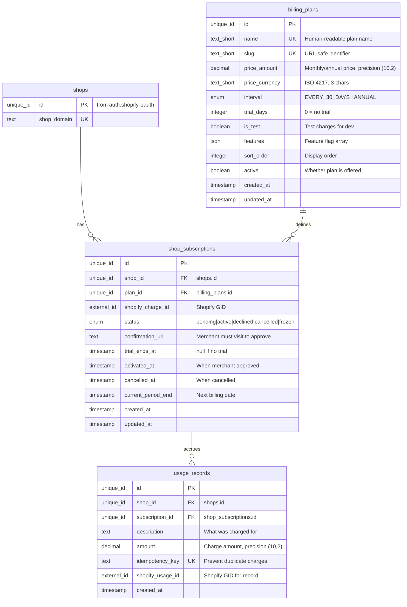
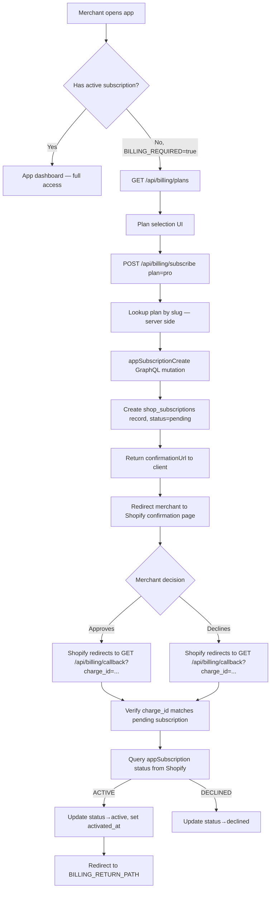
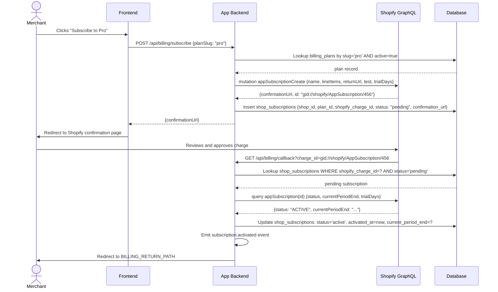
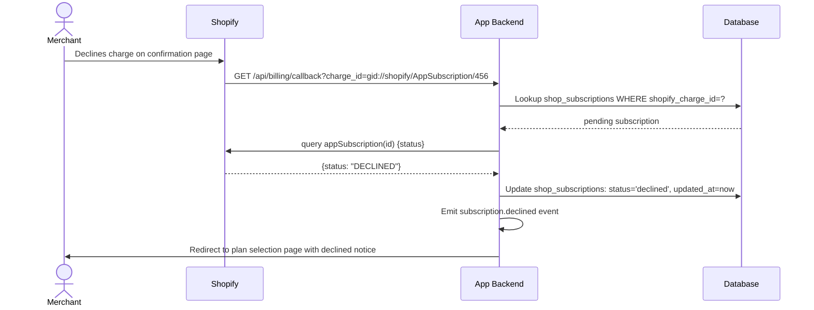
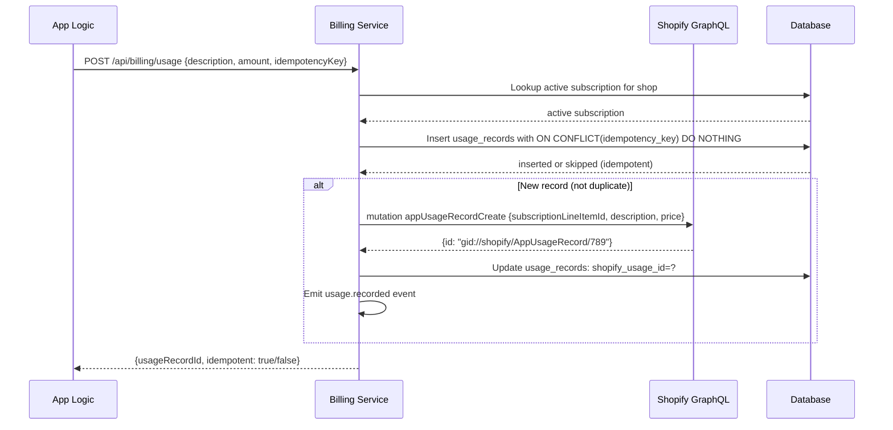
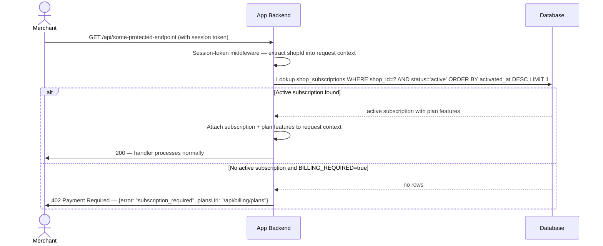
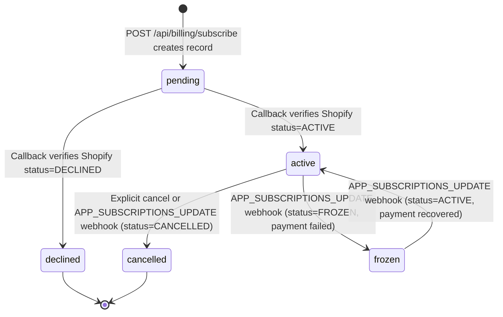

# Shopify App Billing & Subscriptions

## 1. Overview

### Problem Statement

Shopify apps must use Shopify's own Billing API to charge merchants — external payment processors are not allowed for app subscriptions. The merchant approves charges through Shopify's native UI, and Shopify handles collection, invoicing, and revenue share. Without the billing block, an app cannot monetize via the App Store. This block handles recurring subscriptions, one-time charges, and usage-based billing with the complete approve/activate lifecycle.

### User Stories

- **Merchant**: I want to see what plans are available before choosing one, including price, features, and trial period
- **Merchant**: I want to subscribe to a plan and be taken through Shopify's familiar payment approval screen
- **Merchant**: I want to upgrade or downgrade my plan as my needs change
- **Merchant**: I want to see my current billing status and when my trial ends
- **Developer**: I want to gate app features behind an active subscription so non-paying merchants cannot access them
- **Developer**: I want to record usage-based charges against a merchant's subscription without creating duplicate charges

### When to use this block

- App needs to charge merchants for access (required for paid Shopify App Store listings)
- User mentions: "billing", "subscription", "charge", "plan", "monetize", "trial", "usage-based billing"
- App needs feature gating based on subscription plan tier

### When NOT to use

- Building a free app with no monetization
- Charging customers (shoppers) — that uses Shopify's Payments API, not the Billing API
- Non-Shopify payments — Shopify App Store requires all merchant charges via Shopify Billing

---

## 2. Data Model

> Types dưới đây là **logical types** (canonical mapping ở `docs/SPEC_GUIDELINES.md` mục 5). Reference SQL dialect-specific ở mục [Reference Migration](#reference-migration-postgres) cuối section này.



### Table: `billing_plans`

| Column | Logical Type | Constraints | Notes |
|--------|--------------|-------------|-------|
| `id` | `unique_id` | PK | distributed-safe ID, immutable |
| `name` | `text_short` | NOT NULL, UNIQUE | Human-readable, e.g. `"Pro Plan"` |
| `slug` | `text_short` | NOT NULL, UNIQUE | URL-safe identifier, e.g. `"pro"`; ≤64 chars; matches `^[a-z0-9\-]+$` |
| `price_amount` | `decimal` | NOT NULL | Monthly/annual price; precision/scale: `(10,2)` for currency |
| `price_currency` | `text_short` | NOT NULL, default `'USD'` | ISO 4217 currency code (3 chars) |
| `interval` | `enum` | NOT NULL, default `'EVERY_30_DAYS'` | External contract: Shopify-dictated values `EVERY_30_DAYS` \| `ANNUAL` |
| `trial_days` | `integer` | NOT NULL, default `0` | 0 = no trial period |
| `is_test` | `boolean` | NOT NULL, default `false` | Test charges (dev/staging) |
| `features` | `json` | NOT NULL, default empty array `[]` | Feature flag array for this plan; queryable by key |
| `sort_order` | `integer` | NOT NULL, default `0` | Display ordering |
| `active` | `boolean` | NOT NULL, default `true` | Whether plan is offered to new subscribers |
| `created_at` | `timestamp` | NOT NULL, default = now | UTC instant |
| `updated_at` | `timestamp` | NOT NULL, default = now | UTC instant; updated on every row mutation |

**Indexes**: `(active, sort_order)` for plan listing query.

### Table: `shop_subscriptions`

| Column | Logical Type | Constraints | Notes |
|--------|--------------|-------------|-------|
| `id` | `unique_id` | PK | distributed-safe ID |
| `shop_id` | `unique_id` | NOT NULL, FK → `shops(id)` ON DELETE CASCADE | Tenant scope |
| `plan_id` | `unique_id` | NOT NULL, FK → `billing_plans(id)` | |
| `shopify_charge_id` | `external_id` | nullable | Shopify-issued GID, format `gid://shopify/AppSubscription/{numeric}` — external contract |
| `status` | `enum` | NOT NULL, default `'pending'` | App-internal state machine values `pending` \| `active` \| `declined` \| `cancelled` \| `frozen` (see section 5) |
| `confirmation_url` | `text` | nullable | URL merchant must visit to approve charge — issued by Shopify |
| `trial_ends_at` | `timestamp` | nullable | null if no trial |
| `activated_at` | `timestamp` | nullable | Set when merchant approves |
| `cancelled_at` | `timestamp` | nullable | Set when subscription is cancelled |
| `current_period_end` | `timestamp` | nullable | Next billing date — sourced from Shopify `currentPeriodEnd` field |
| `created_at` | `timestamp` | NOT NULL, default = now | UTC instant |
| `updated_at` | `timestamp` | NOT NULL, default = now | UTC instant |

**Indexes**: `shop_id` (lookup by tenant), `(shop_id, status)` (gate query — find active subscription per shop).

### Table: `usage_records`

| Column | Logical Type | Constraints | Notes |
|--------|--------------|-------------|-------|
| `id` | `unique_id` | PK | distributed-safe ID |
| `shop_id` | `unique_id` | NOT NULL, FK → `shops(id)` ON DELETE CASCADE | Tenant scope |
| `subscription_id` | `unique_id` | NOT NULL, FK → `shop_subscriptions(id)` | |
| `description` | `text` | NOT NULL | Human-readable charge description (≤100 chars per validation) |
| `amount` | `decimal` | NOT NULL, `> 0` | Charge amount in plan currency; precision/scale: `(10,2)` |
| `idempotency_key` | `text` | UNIQUE | Caller-provided key preventing duplicate charges (≤255 chars) |
| `shopify_usage_id` | `external_id` | nullable | Shopify-issued GID, format `gid://shopify/AppUsageRecord/{numeric}` |
| `created_at` | `timestamp` | NOT NULL, default = now | UTC instant |

**Indexes**: `shop_id`, `subscription_id`.

### Reference Migration (Postgres)

Reference SQL chia 3 block — một block / bảng — để giữ mỗi snippet ≤30 dòng theo `docs/SPEC_GUIDELINES.md` mục 6. Marker `ADAPT` chung cho cả 3 block dưới đây:

> **For MySQL/SQLite** — map theo bảng Logical Types ở `docs/SPEC_GUIDELINES.md` mục 5:
> - `uuid PRIMARY KEY DEFAULT gen_random_uuid()` → MySQL: `BINARY(16) PRIMARY KEY` + UUID() trigger; SQLite: `TEXT PRIMARY KEY` + uuid4 ở app layer
> - `timestamptz` → MySQL: `DATETIME(6)`; SQLite: `TEXT` (ISO 8601 with `Z` suffix)
> - `jsonb` → MySQL: `JSON`; SQLite: `TEXT` (JSON string, no native key query)
> - `decimal(10,2)` → MySQL: `DECIMAL(10,2)`; SQLite: `NUMERIC` (no precision enforcement — validate in app layer)
> - `text ... CHECK (col IN (...))` enum form → MySQL native `ENUM(...)`; SQLite supports `CHECK` same as Postgres

#### `billing_plans`

<!-- REFERENCE: dialect=postgres -->
<!-- ADAPT: see "For MySQL/SQLite" mapping above this snippet -->

```sql
CREATE TABLE IF NOT EXISTS billing_plans (
  id              uuid PRIMARY KEY DEFAULT gen_random_uuid(),
  name            text NOT NULL UNIQUE,
  slug            text NOT NULL UNIQUE,
  price_amount    decimal(10,2) NOT NULL,
  price_currency  text NOT NULL DEFAULT 'USD',
  interval        text NOT NULL DEFAULT 'EVERY_30_DAYS'
                    CHECK (interval IN ('EVERY_30_DAYS', 'ANNUAL')),
  trial_days      integer NOT NULL DEFAULT 0,
  is_test         boolean NOT NULL DEFAULT false,
  features        jsonb NOT NULL DEFAULT '[]',
  sort_order      integer NOT NULL DEFAULT 0,
  active          boolean NOT NULL DEFAULT true,
  created_at      timestamptz NOT NULL DEFAULT now(),
  updated_at      timestamptz NOT NULL DEFAULT now()
);

CREATE INDEX idx_plans_active ON billing_plans(active, sort_order);
```

#### `shop_subscriptions`

<!-- REFERENCE: dialect=postgres -->
<!-- ADAPT: see "For MySQL/SQLite" mapping above -->

```sql
CREATE TABLE IF NOT EXISTS shop_subscriptions (
  id                  uuid PRIMARY KEY DEFAULT gen_random_uuid(),
  shop_id             uuid NOT NULL REFERENCES shops(id) ON DELETE CASCADE,
  plan_id             uuid NOT NULL REFERENCES billing_plans(id),
  shopify_charge_id   text,
  status              text NOT NULL DEFAULT 'pending'
                        CHECK (status IN ('pending','active','declined','cancelled','frozen')),
  confirmation_url    text,
  trial_ends_at       timestamptz,
  activated_at        timestamptz,
  cancelled_at        timestamptz,
  current_period_end  timestamptz,
  created_at          timestamptz NOT NULL DEFAULT now(),
  updated_at          timestamptz NOT NULL DEFAULT now()
);

CREATE INDEX idx_sub_shop   ON shop_subscriptions(shop_id);
CREATE INDEX idx_sub_status ON shop_subscriptions(shop_id, status);
```

#### `usage_records`

<!-- REFERENCE: dialect=postgres -->
<!-- ADAPT: see "For MySQL/SQLite" mapping above -->

```sql
CREATE TABLE IF NOT EXISTS usage_records (
  id                uuid PRIMARY KEY DEFAULT gen_random_uuid(),
  shop_id           uuid NOT NULL REFERENCES shops(id) ON DELETE CASCADE,
  subscription_id   uuid NOT NULL REFERENCES shop_subscriptions(id),
  description       text NOT NULL,
  amount            decimal(10,2) NOT NULL,
  idempotency_key   text UNIQUE,
  shopify_usage_id  text,
  created_at        timestamptz NOT NULL DEFAULT now()
);

CREATE INDEX idx_usage_shop ON usage_records(shop_id);
CREATE INDEX idx_usage_sub  ON usage_records(subscription_id);
```

---

## 3. Data Flow



---

## 4. Sequence Diagrams

### Subscribe Flow (happy path)



### Merchant Declines Charge



### Usage Charge Recording



### Plan Gating Middleware



---

## 5. State Management

### Subscription Status State Machine

External contract: Shopify reports subscription state via UPPERCASE values (`ACTIVE`, `DECLINED`, `CANCELLED`, `FROZEN`, `PENDING`) in the `appSubscription.status` field and `APP_SUBSCRIPTIONS_UPDATE` webhook. The local DB uses lowercase mirrors (`active`, `declined`, `cancelled`, `frozen`, `pending`) — the case translation is the only normalization performed.



**Explicit transitions** (anything not listed is invalid):

| From | To | Trigger | Notes |
|------|----|---------|-------|
| (none) | `pending` | `POST /api/billing/subscribe` creates record | Initial state |
| `pending` | `active` | Callback receives Shopify `status=ACTIVE` | Sets `activated_at`, `current_period_end`, optional `trial_ends_at` |
| `pending` | `declined` | Callback receives Shopify `status=DECLINED` | Terminal |
| `active` | `cancelled` | Explicit cancel API OR webhook `status=CANCELLED` | Sets `cancelled_at`; terminal |
| `active` | `frozen` | Webhook `status=FROZEN` (payment failed) | Preserves `activated_at`; recoverable |
| `frozen` | `active` | Webhook `status=ACTIVE` (payment recovered) | Emits `subscription.activated` |

**Invalid transitions** (must reject or no-op):

- `declined → active` — already terminal; merchant must subscribe again, creating a new pending record
- `cancelled → active` — same as above
- `active → pending` — never; only callback can leave `pending`
- Re-running callback on already-`active` subscription — 404 (cannot re-activate)

| Status | Meaning | App Access |
|--------|---------|------------|
| `pending` | Charge created, awaiting merchant approval | Blocked (if `BILLING_REQUIRED`) |
| `active` | Charge approved, billing running | Allowed |
| `declined` | Merchant rejected the charge | Blocked |
| `cancelled` | Subscription cancelled | Blocked |
| `frozen` | Payment failed, Shopify froze account | Blocked |

### Frontend State

| State | Storage | Survives Reload | Notes |
|-------|---------|-----------------|-------|
| `selectedPlan` | Component state | No | Reset on navigation |
| `subscriptionStatus` | API fetch on mount | Yes (refetched) | From `GET /api/billing/status` |
| `trialDaysRemaining` | Computed from `trial_ends_at` | Yes (refetched) | Show countdown banner |
| `confirmationUrl` | Transient (redirect immediately) | No | Never stored |

---

## 6. Integration Points

### Inbound

| Caller | How | Purpose |
|--------|-----|---------|
| Merchant browser (App Bridge) | GET `/api/billing/plans` | List available plans |
| Merchant browser (App Bridge) | POST `/api/billing/subscribe` | Initiate subscription |
| Shopify billing system | GET `/api/billing/callback` | Charge approved/declined |
| App logic | POST `/api/billing/usage` | Record metered usage |
| All protected routes | Middleware | Gate access by subscription status |

### Outbound

| Target | How | Purpose |
|--------|-----|---------|
| Shopify GraphQL Admin API | `appSubscriptionCreate` mutation | Create charge for merchant approval |
| Shopify GraphQL Admin API | `node(id:)` query with `... on AppSubscription` fragment | Verify charge status on callback |
| Shopify GraphQL Admin API | `appUsageRecordCreate` mutation | Record metered usage charge |
| Database | SQL | Store plans, subscriptions, usage records |

### Events

| Event | Payload | When |
|-------|---------|------|
| `subscription.created` | `{ shopId, subscriptionId, planSlug, confirmationUrl }` | `POST /subscribe` creates pending record |
| `subscription.activated` | `{ shopId, subscriptionId, planSlug, activatedAt }` | Callback or webhook confirms `ACTIVE` status |
| `subscription.declined` | `{ shopId, subscriptionId, planSlug }` | Callback confirms `DECLINED` status |
| `subscription.cancelled` | `{ shopId, subscriptionId, planSlug, cancelledAt }` | Subscription cancelled |
| `usage.recorded` | `{ shopId, subscriptionId, amount, description, idempotencyKey }` | Usage record created in Shopify |

---

## 7. Configuration Surface

| Key | Type | Default | Description |
|-----|------|---------|-------------|
| `BILLING_REQUIRED` | `boolean` | `true` | Gate entire app behind active subscription |
| `BILLING_TRIAL_DAYS` | `number` | `7` | Default trial period (overridden per plan when `trial_days > 0`) |
| `BILLING_TEST_MODE` | `boolean` | `false` | Create test charges (use in dev/staging) |
| `BILLING_RETURN_PATH` | `string` | `"/"` | Redirect path after charge approval or decline |
