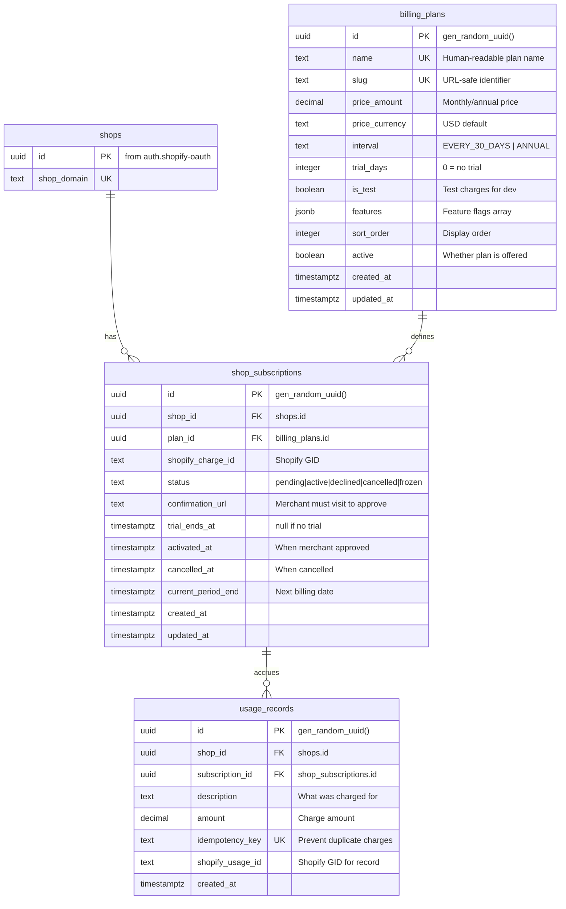
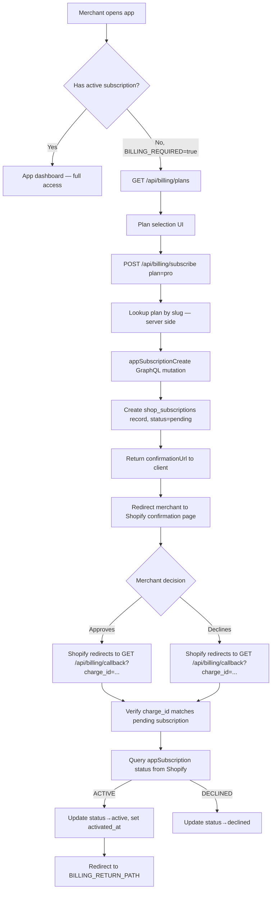
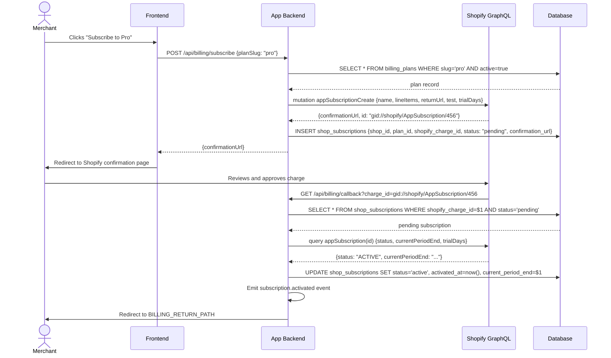
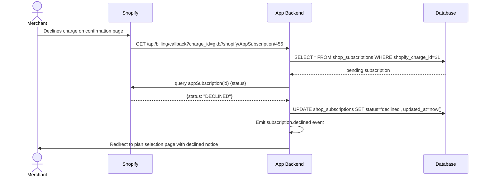
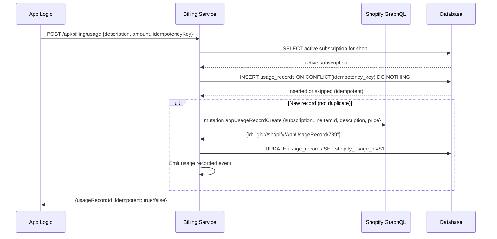
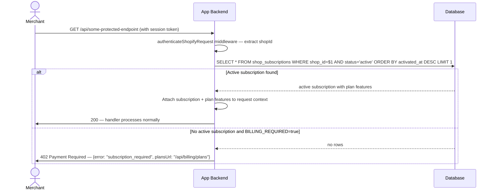
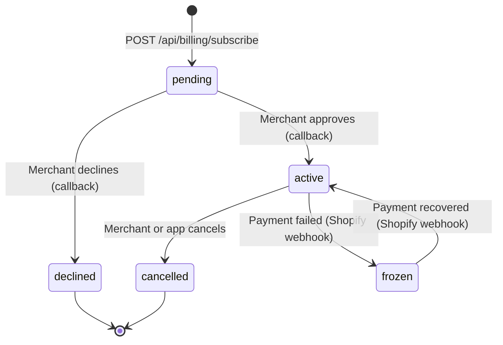

# Shopify App Billing & Subscriptions

## 1. Overview

### Problem Statement

Shopify apps must use Shopify's own Billing API to charge merchants — external payment processors are not allowed for app subscriptions. The merchant approves charges through Shopify's native UI, and Shopify handles collection, invoicing, and revenue share. Without the billing block, an app cannot monetize via the App Store. This block handles recurring subscriptions, one-time charges, and usage-based billing with the complete approve/activate lifecycle.

### User Stories

- **Merchant**: I want to see what plans are available before choosing one, including price, features, and trial period
- **Merchant**: I want to subscribe to a plan and be taken through Shopify's familiar payment approval screen
- **Merchant**: I want to upgrade or downgrade my plan as my needs change
- **Merchant**: I want to see my current billing status and when my trial ends
- **Developer**: I want to gate app features behind an active subscription so non-paying merchants cannot access them
- **Developer**: I want to record usage-based charges against a merchant's subscription without creating duplicate charges

### When to use this block

- App needs to charge merchants for access (required for paid Shopify App Store listings)
- User mentions: "billing", "subscription", "charge", "plan", "monetize", "trial", "usage-based billing"
- App needs feature gating based on subscription plan tier

### When NOT to use

- Building a free app with no monetization
- Charging customers (shoppers) — that uses Shopify's Payments API, not the Billing API
- Non-Shopify payments — Shopify App Store requires all merchant charges via Shopify Billing

---

## 2. Data Model



### Table: `billing_plans`

| Column | Type | Constraints | Notes |
|--------|------|-------------|-------|
| `id` | `uuid` | PK, default `gen_random_uuid()` | |
| `name` | `text` | NOT NULL, UNIQUE | Human-readable, e.g. `"Pro Plan"` |
| `slug` | `text` | NOT NULL, UNIQUE | URL-safe, e.g. `"pro"` |
| `price_amount` | `decimal(10,2)` | NOT NULL | Monthly/annual price |
| `price_currency` | `text` | NOT NULL, default `'USD'` | ISO 4217 currency code |
| `interval` | `text` | NOT NULL, default `'EVERY_30_DAYS'` | `EVERY_30_DAYS` or `ANNUAL` |
| `trial_days` | `integer` | NOT NULL, default `0` | 0 = no trial period |
| `is_test` | `boolean` | NOT NULL, default `false` | Test charges (dev/staging) |
| `features` | `jsonb` | NOT NULL, default `'[]'` | Feature flag array for this plan |
| `sort_order` | `integer` | NOT NULL, default `0` | Display ordering |
| `active` | `boolean` | NOT NULL, default `true` | Whether plan is offered to new subscribers |
| `created_at` | `timestamptz` | NOT NULL, default `now()` | |
| `updated_at` | `timestamptz` | NOT NULL, default `now()` | |

### Table: `shop_subscriptions`

| Column | Type | Constraints | Notes |
|--------|------|-------------|-------|
| `id` | `uuid` | PK, default `gen_random_uuid()` | |
| `shop_id` | `uuid` | NOT NULL, FK → `shops(id)` ON DELETE CASCADE | |
| `plan_id` | `uuid` | NOT NULL, FK → `billing_plans(id)` | |
| `shopify_charge_id` | `text` | nullable | Shopify's charge GID (e.g. `gid://shopify/AppSubscription/123`) |
| `status` | `text` | NOT NULL, default `'pending'` | State machine — see below |
| `confirmation_url` | `text` | nullable | URL merchant must visit to approve charge |
| `trial_ends_at` | `timestamptz` | nullable | null if no trial |
| `activated_at` | `timestamptz` | nullable | Set when merchant approves |
| `cancelled_at` | `timestamptz` | nullable | Set when subscription is cancelled |
| `current_period_end` | `timestamptz` | nullable | Next billing date |
| `created_at` | `timestamptz` | NOT NULL, default `now()` | |
| `updated_at` | `timestamptz` | NOT NULL, default `now()` | |

### Table: `usage_records`

| Column | Type | Constraints | Notes |
|--------|------|-------------|-------|
| `id` | `uuid` | PK, default `gen_random_uuid()` | |
| `shop_id` | `uuid` | NOT NULL, FK → `shops(id)` ON DELETE CASCADE | |
| `subscription_id` | `uuid` | NOT NULL, FK → `shop_subscriptions(id)` | |
| `description` | `text` | NOT NULL | Human-readable charge description |
| `amount` | `decimal(10,2)` | NOT NULL | Charge amount in plan currency |
| `idempotency_key` | `text` | UNIQUE | Prevents duplicate charges — caller-provided |
| `shopify_usage_id` | `text` | nullable | Shopify's usage record GID |
| `created_at` | `timestamptz` | NOT NULL, default `now()` | |

### Migration (reference)

```sql
CREATE TABLE IF NOT EXISTS billing_plans (
  id uuid PRIMARY KEY DEFAULT gen_random_uuid(),
  name text NOT NULL UNIQUE,
  slug text NOT NULL UNIQUE,
  price_amount decimal(10,2) NOT NULL,
  price_currency text NOT NULL DEFAULT 'USD',
  interval text NOT NULL DEFAULT 'EVERY_30_DAYS',
  trial_days integer NOT NULL DEFAULT 0,
  is_test boolean NOT NULL DEFAULT false,
  features jsonb NOT NULL DEFAULT '[]',
  sort_order integer NOT NULL DEFAULT 0,
  active boolean NOT NULL DEFAULT true,
  created_at timestamptz NOT NULL DEFAULT now(),
  updated_at timestamptz NOT NULL DEFAULT now()
);

CREATE INDEX idx_plans_active ON billing_plans(active, sort_order);

CREATE TABLE IF NOT EXISTS shop_subscriptions (
  id uuid PRIMARY KEY DEFAULT gen_random_uuid(),
  shop_id uuid NOT NULL REFERENCES shops(id) ON DELETE CASCADE,
  plan_id uuid NOT NULL REFERENCES billing_plans(id),
  shopify_charge_id text,
  status text NOT NULL DEFAULT 'pending',
  confirmation_url text,
  trial_ends_at timestamptz,
  activated_at timestamptz,
  cancelled_at timestamptz,
  current_period_end timestamptz,
  created_at timestamptz NOT NULL DEFAULT now(),
  updated_at timestamptz NOT NULL DEFAULT now()
);

CREATE INDEX idx_sub_shop ON shop_subscriptions(shop_id);
CREATE INDEX idx_sub_status ON shop_subscriptions(shop_id, status);

CREATE TABLE IF NOT EXISTS usage_records (
  id uuid PRIMARY KEY DEFAULT gen_random_uuid(),
  shop_id uuid NOT NULL REFERENCES shops(id) ON DELETE CASCADE,
  subscription_id uuid NOT NULL REFERENCES shop_subscriptions(id),
  description text NOT NULL,
  amount decimal(10,2) NOT NULL,
  idempotency_key text UNIQUE,
  shopify_usage_id text,
  created_at timestamptz NOT NULL DEFAULT now()
);

CREATE INDEX idx_usage_shop ON usage_records(shop_id);
CREATE INDEX idx_usage_sub ON usage_records(subscription_id);
```

---

## 3. Data Flow



---

## 4. Sequence Diagrams

### Subscribe Flow (happy path)



### Merchant Declines Charge



### Usage Charge Recording



### Plan Gating Middleware



---

## 5. State Management

### Subscription Status State Machine



| Status | Meaning | App Access |
|--------|---------|------------|
| `pending` | Charge created, awaiting merchant approval | Blocked (if BILLING_REQUIRED) |
| `active` | Charge approved, billing running | Allowed |
| `declined` | Merchant rejected the charge | Blocked |
| `cancelled` | Subscription cancelled | Blocked |
| `frozen` | Payment failed, Shopify froze account | Blocked |

### Frontend State

| State | Storage | Survives Reload | Notes |
|-------|---------|-----------------|-------|
| `selectedPlan` | Component state | No | Reset on navigation |
| `subscriptionStatus` | API fetch on mount | Yes (refetched) | From GET /api/billing/status |
| `trialDaysRemaining` | Computed from `trial_ends_at` | Yes (refetched) | Show countdown banner |
| `confirmationUrl` | Transient (redirect immediately) | No | Never stored |

---

## 6. Integration Points

### Inbound

| Caller | How | Purpose |
|--------|-----|---------|
| Merchant browser (App Bridge) | GET /api/billing/plans | List available plans |
| Merchant browser (App Bridge) | POST /api/billing/subscribe | Initiate subscription |
| Shopify billing system | GET /api/billing/callback | Charge approved/declined |
| App logic | POST /api/billing/usage | Record metered usage |
| All protected routes | Middleware | Gate access by subscription status |

### Outbound

| Target | How | Purpose |
|--------|-----|---------|
| Shopify GraphQL Admin API | `appSubscriptionCreate` mutation | Create charge for merchant approval |
| Shopify GraphQL Admin API | `appSubscription(id)` query | Verify charge status on callback |
| Shopify GraphQL Admin API | `appUsageRecordCreate` mutation | Record metered usage charge |
| Database | SQL | Store plans, subscriptions, usage records |

### Events

| Event | Payload | When |
|-------|---------|------|
| `subscription.created` | `{ shopId, subscriptionId, planSlug, confirmationUrl }` | POST /subscribe creates pending record |
| `subscription.activated` | `{ shopId, subscriptionId, planSlug, activatedAt }` | Callback confirms ACTIVE status |
| `subscription.declined` | `{ shopId, subscriptionId, planSlug }` | Callback confirms DECLINED status |
| `subscription.cancelled` | `{ shopId, subscriptionId, planSlug, cancelledAt }` | Subscription cancelled |
| `usage.recorded` | `{ shopId, subscriptionId, amount, description, idempotencyKey }` | Usage record created in Shopify |

---

## 7. Configuration Surface

| Key | Type | Default | Description |
|-----|------|---------|-------------|
| `BILLING_REQUIRED` | `boolean` | `true` | Gate entire app behind active subscription |
| `BILLING_TRIAL_DAYS` | `number` | `7` | Default trial period (overridden per plan) |
| `BILLING_TEST_MODE` | `boolean` | `false` | Create test charges (use in dev/staging) |
| `BILLING_RETURN_PATH` | `string` | `"/"` | Redirect path after charge approval or decline |
