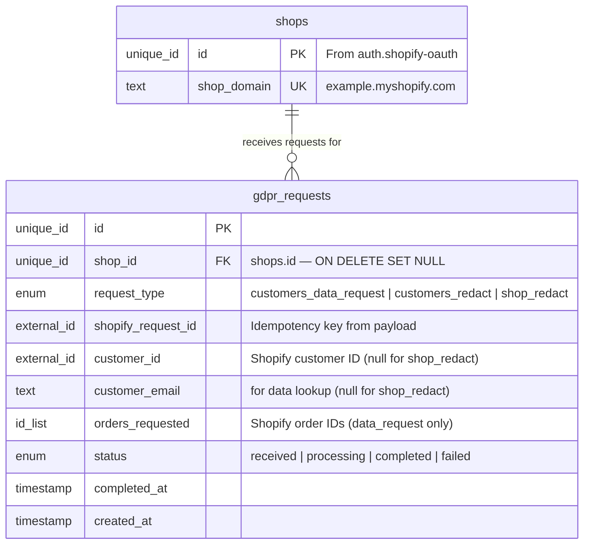
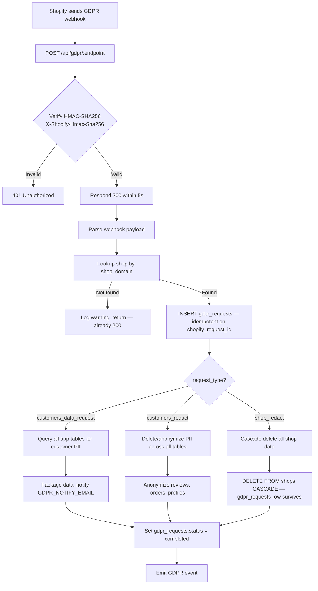
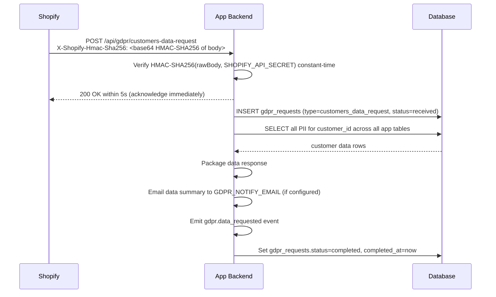
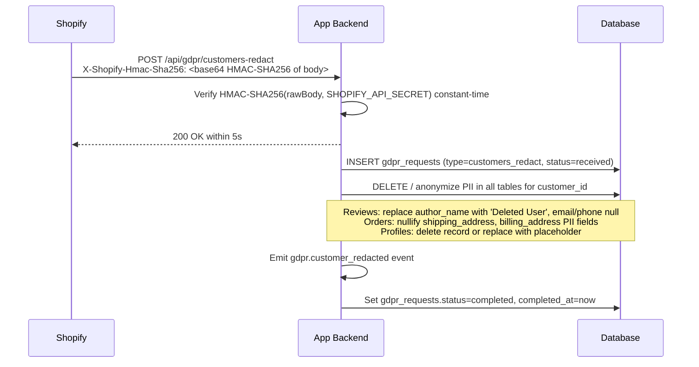

# Shopify GDPR Mandatory Webhooks

## 1. Overview

### Problem Statement

Every app published on the Shopify App Store must implement 3 mandatory GDPR/privacy webhook endpoints. Shopify calls these endpoints when a merchant's customer exercises their data rights (access or erasure) or when a merchant uninstalls and their shop data must be purged. Without these 3 endpoints, app review is rejected — they are a hard requirement, not optional compliance.

### User Stories

- **Merchant**: I want to know that when one of my customers requests their data, your app responds within the required timeframe
- **Merchant**: I want confidence that when a customer requests data erasure, your app deletes their personal information from all storage
- **Merchant**: I want assurance that if I uninstall your app, all my shop's data is purged within 48 hours
- **Developer**: I want a compliant GDPR implementation that won't get my app rejected from the App Store
- **Developer**: I want an audit trail of all GDPR requests so I can demonstrate compliance

### When to use this block

- Building any app for the Shopify App Store (mandatory for approval)
- User mentions: "GDPR", "data request", "data erasure", "privacy webhooks", "customer redact", "shop redact"
- App stores any customer PII (names, emails, addresses, order data)

### When NOT to use

- Building a Shopify theme (no GDPR webhooks needed — themes don't store data server-side)
- Internal tooling not published to the App Store
- Apps that provably store zero customer data (extremely rare in practice)

---

## 2. Data Model

> Types dưới đây là **logical types** (canonical mapping ở `docs/SPEC_GUIDELINES.md` mục 5). Reference SQL dialect-specific ở mục [Reference Migration](#reference-migration-postgres) cuối section này.



### Table: `gdpr_requests`

| Column | Logical Type | Constraints | Notes |
|--------|------|-------------|-------|
| `id` | `unique_id` | PK | distributed-safe ID |
| `shop_id` | `unique_id` | nullable, FK → `shops.id` **ON DELETE SET NULL** | Audit trail must survive shop purge (xem security.md mục 5) |
| `request_type` | `enum` | NOT NULL | one of: `customers_data_request`, `customers_redact`, `shop_redact` |
| `shopify_request_id` | `external_id` | nullable, UNIQUE when present | Idempotency key from Shopify payload `data_request.id` |
| `customer_id` | `external_id` | nullable | Shopify customer ID (Shopify-dictated 64-bit integer rendered as string); null for `shop_redact` |
| `customer_email` | `text` | nullable | Customer email for data lookup; null for `shop_redact` |
| `orders_requested` | `id_list` | nullable | Shopify order IDs in data request (≤1000) — only for `customers_data_request` |
| `status` | `enum` | NOT NULL, default `received` | one of: `received`, `processing`, `completed`, `failed` |
| `completed_at` | `timestamp` | nullable | Set when status transitions to `completed` |
| `created_at` | `timestamp` | NOT NULL, default = now | UTC instant |

**Indexes**: `shop_id`; partial index on `shopify_request_id WHERE shopify_request_id IS NOT NULL` for idempotency lookup.

### Reference Migration (Postgres)

<!-- REFERENCE: dialect=postgres -->
<!-- ADAPT: cho MySQL/SQLite — map theo bảng Logical Types ở docs/SPEC_GUIDELINES.md mục 5:
       - `uuid PRIMARY KEY DEFAULT gen_random_uuid()` → MySQL `BINARY(16) PRIMARY KEY` + UUID() trigger; SQLite `TEXT PRIMARY KEY` + uuid4 ở app layer
       - `timestamptz` → MySQL `DATETIME(6)`; SQLite `TEXT` ISO 8601 với `Z` suffix
       - `bigint[]` (id_list) → KHÔNG có native array trên MySQL/SQLite:
           MySQL: `JSON` (array form `[1,2,3]`) — query bằng `JSON_CONTAINS` hoặc tách bảng join `gdpr_request_orders`
           SQLite: `TEXT` (JSON-encoded array) — query phải decode ở app layer
           Tách bảng join là pattern an toàn nhất khi orders_requested có thể >100 hoặc cần index
       - `ON DELETE SET NULL`: phổ thông SQL — KHÔNG đổi sang CASCADE (sẽ xoá audit trail)
       - Partial index `WHERE col IS NOT NULL`: postgres + SQLite; MySQL dùng full index (chấp nhận duplicate NULL space) -->
```sql
CREATE TABLE IF NOT EXISTS gdpr_requests (
  id                 uuid PRIMARY KEY DEFAULT gen_random_uuid(),
  shop_id            uuid REFERENCES shops(id) ON DELETE SET NULL,
  request_type       text NOT NULL
                     CHECK (request_type IN ('customers_data_request','customers_redact','shop_redact')),
  shopify_request_id text,
  customer_id        text,
  customer_email     text,
  orders_requested   bigint[],
  status             text NOT NULL DEFAULT 'received'
                     CHECK (status IN ('received','processing','completed','failed')),
  completed_at       timestamptz,
  created_at         timestamptz NOT NULL DEFAULT now()
);

CREATE INDEX idx_gdpr_shop ON gdpr_requests(shop_id);
CREATE UNIQUE INDEX idx_gdpr_request_id
  ON gdpr_requests(shopify_request_id) WHERE shopify_request_id IS NOT NULL;
```

> **Note**: `customer_id` stored as `text` (not `bigint`) — Shopify customer IDs are 64-bit integers but spec-treated as opaque external IDs (matches logical type `external_id`). Storing as text avoids overflow risk if Shopify expands the ID space, and matches how Shopify GIDs are represented in newer APIs.

> **Note**: `orders_requested bigint[]` is postgres array. For MySQL/SQLite, see ADAPT notes — either JSON array column or a join table `gdpr_request_orders (gdpr_request_id, order_id)` works.

---

## 3. Data Flow



---

## 4. Sequence Diagrams

### Customer Data Request



### Customer Redact



### Shop Redact

```mermaid
sequenceDiagram
    participant S as Shopify
    participant A as App Backend
    participant DB as Database

    S->>A: POST /api/gdpr/shop-redact<br/>X-Shopify-Hmac-Sha256: <base64 HMAC-SHA256 of body>
    A->>A: Verify HMAC-SHA256(rawBody, SHOPIFY_API_SECRET) constant-time
    A-->>S: 200 OK within 5s
    A->>DB: INSERT gdpr_requests (type=shop_redact, shop_id=$id, status=received)
    Note over A,DB: gdpr_requests record preserved (ON DELETE SET NULL on shop_id FK)
    A->>DB: DELETE FROM shops WHERE id = $shop_id CASCADE
    Note over A,DB: CASCADE deletes all FK-dependent tables; gdpr_requests.shop_id becomes NULL
    A->>A: Emit gdpr.shop_redacted event
    A->>DB: Set gdpr_requests.status=completed, completed_at=now
```

---

## 5. State Management

This block is backend-only. No frontend state — all endpoints are called by Shopify, not by end users.

| State | Storage | Survives Reload | Notes |
|-------|---------|-----------------|-------|
| `gdpr_request` | Database (`gdpr_requests` table) | Yes | Persistent audit trail of all GDPR requests |
| `request status` | `gdpr_requests.status` column | Yes | `received → processing → completed / failed` |

### Status transitions

```
received → processing (async handler picks up the request)
processing → completed (all data collected/deleted/purged)
processing → failed (unrecoverable error during processing)
```

---

## 6. Integration Points

### Inbound — External Protocol Contract (Shopify-dictated)

Path naming convention dưới đây là **example** (app chọn paths) — nhưng **topic header values** và **payload schemas** dưới do Shopify dictate, KHÔNG đổi:

| Webhook Topic (header value `X-Shopify-Topic`) | Required path semantic | Required payload fields | Response SLA |
|---|---|---|---|
| `customers/data_request` | Any path, e.g. `/api/gdpr/customers-data-request` | `shop_id`, `shop_domain`, `customer.{id,email,phone}`, `orders_requested[]`, `data_request.id` | 200 within 5s; data must be **available** within **30 days** |
| `customers/redact` | Any path, e.g. `/api/gdpr/customers-redact` | `shop_id`, `shop_domain`, `customer.{id,email,phone}`, `orders_to_redact[]` | 200 within 5s; erasure must complete within **30 days** |
| `shop/redact` | Any path, e.g. `/api/gdpr/shop-redact` | `shop_id`, `shop_domain` | 200 within 5s; sent **48 hours after uninstall**; full purge within **30 days** |

Common to all 3:
- HMAC algorithm: **HMAC-SHA256** over raw body, base64-encoded in header `X-Shopify-Hmac-Sha256`
- 200 response **required within 5 seconds**; Shopify retries on failure (same idempotency semantics as other webhooks — see `webhooks.shopify-webhooks`)

### Outbound

| Target | How | Purpose |
|--------|-----|---------|
| Database | SQL | Log requests, delete/anonymize PII, cascade delete shop |
| Email (optional) | SMTP / transactional email | Notify `GDPR_NOTIFY_EMAIL` on data requests |

### Events

| Event | Payload | When |
|-------|---------|------|
| `gdpr.data_requested` | `{ shopId, shopDomain, customerId, customerEmail, requestId }` | Data request received and processed |
| `gdpr.customer_redacted` | `{ shopId, shopDomain, customerId, customerEmail, requestId }` | Customer PII erasure completed |
| `gdpr.shop_redacted` | `{ shopId, shopDomain, requestId }` | Full shop data purge completed |

### Shared Utilities Used

This block reuses utilities introduced by upstream blocks:

1. **HMAC-SHA256 verification** — `verifyShopifyHmac(secret, body, hmac)` from `auth.shopify-oauth` — identical to webhook body verification (base64-encoded signature, constant-time compare)
2. **Shop lookup** — `getShopByDomain(domain)` from `auth.shopify-oauth`

---

## 7. Configuration Surface

| Key | Type | Default | Description |
|-----|------|---------|-------------|
| `SHOPIFY_API_SECRET` | `string` | required | Used for HMAC verification of incoming GDPR webhooks (inherited from `auth.shopify-oauth`) |
| `GDPR_DATA_RETENTION_DAYS` | `number` | `0` | Days to wait before executing erasure after redact request (0 = immediate; **must complete within 30 days** per Shopify SLA) |
| `GDPR_NOTIFY_EMAIL` | `string` | `null` | Email address to notify when a data request is received |
