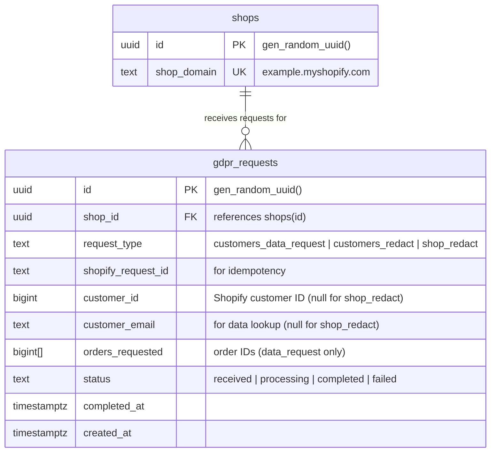
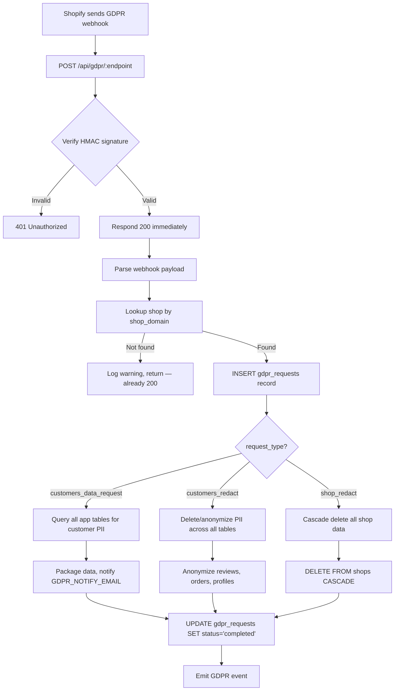
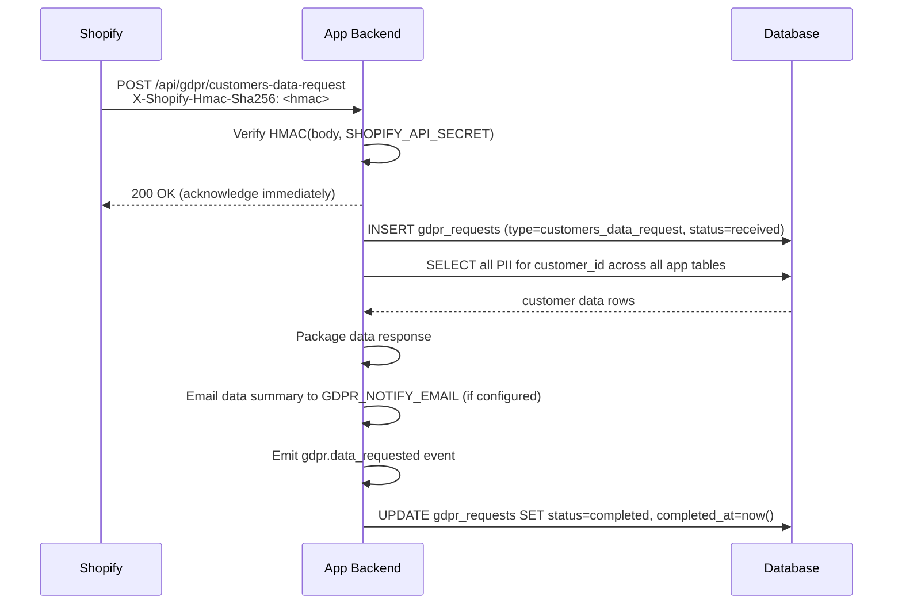
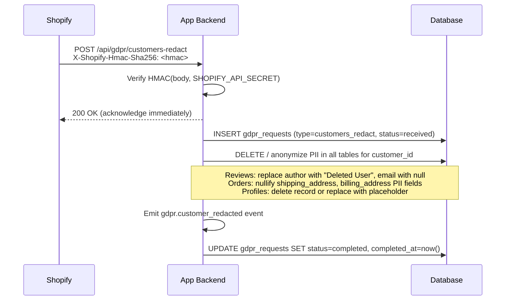
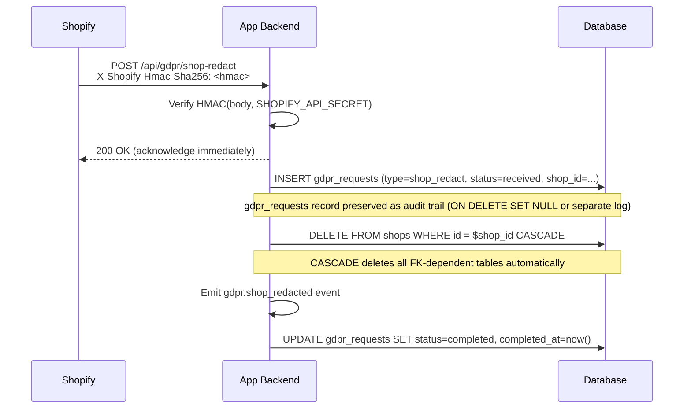

# Shopify GDPR Mandatory Webhooks

## 1. Overview

### Problem Statement

Every app published on the Shopify App Store must implement 3 mandatory GDPR/privacy webhook endpoints. Shopify calls these endpoints when a merchant's customer exercises their data rights (access or erasure) or when a merchant uninstalls and their shop data must be purged. Without these 3 endpoints, app review is rejected — they are a hard requirement, not optional compliance.

### User Stories

- **Merchant**: I want to know that when one of my customers requests their data, your app responds within the required timeframe
- **Merchant**: I want confidence that when a customer requests data erasure, your app deletes their personal information from all storage
- **Merchant**: I want assurance that if I uninstall your app, all my shop's data is purged within 48 hours
- **Developer**: I want a compliant GDPR implementation that won't get my app rejected from the App Store
- **Developer**: I want an audit trail of all GDPR requests so I can demonstrate compliance

### When to use this block

- Building any app for the Shopify App Store (mandatory for approval)
- User mentions: "GDPR", "data request", "data erasure", "privacy webhooks", "customer redact", "shop redact"
- App stores any customer PII (names, emails, addresses, order data)

### When NOT to use

- Building a Shopify theme (no GDPR webhooks needed — themes don't store data server-side)
- Internal tooling not published to the App Store
- Apps that provably store zero customer data (extremely rare in practice)

---

## 2. Data Model



### Table: `gdpr_requests`

| Column | Type | Constraints | Notes |
|--------|------|-------------|-------|
| `id` | `uuid` | PK, default `gen_random_uuid()` | |
| `shop_id` | `uuid` | NOT NULL, FK → `shops(id)` ON DELETE CASCADE | |
| `request_type` | `text` | NOT NULL | `customers_data_request`, `customers_redact`, or `shop_redact` |
| `shopify_request_id` | `text` | nullable | Unique request ID from Shopify payload (for idempotency) |
| `customer_id` | `bigint` | nullable | Shopify customer ID — null for `shop_redact` |
| `customer_email` | `text` | nullable | Customer email for data lookup — null for `shop_redact` |
| `orders_requested` | `bigint[]` | nullable | Order IDs included in data request — only for `customers_data_request` |
| `status` | `text` | NOT NULL, default `received` | `received`, `processing`, `completed`, `failed` |
| `completed_at` | `timestamptz` | nullable | Set when status transitions to `completed` |
| `created_at` | `timestamptz` | NOT NULL, default `now()` | |

### Migration (reference)

```sql
CREATE TABLE IF NOT EXISTS gdpr_requests (
  id                 uuid PRIMARY KEY DEFAULT gen_random_uuid(),
  shop_id            uuid NOT NULL REFERENCES shops(id) ON DELETE CASCADE,
  request_type       text NOT NULL,
  shopify_request_id text,
  customer_id        bigint,
  customer_email     text,
  orders_requested   bigint[],
  status             text NOT NULL DEFAULT 'received',
  completed_at       timestamptz,
  created_at         timestamptz NOT NULL DEFAULT now()
);

CREATE INDEX idx_gdpr_shop ON gdpr_requests(shop_id);
CREATE INDEX idx_gdpr_request_id ON gdpr_requests(shopify_request_id) WHERE shopify_request_id IS NOT NULL;
```

---

## 3. Data Flow



---

## 4. Sequence Diagrams

### Customer Data Request



### Customer Redact



### Shop Redact



---

## 5. State Management

This block is backend-only. No frontend state — all endpoints are called by Shopify, not by end users.

| State | Storage | Survives Reload | Notes |
|-------|---------|-----------------|-------|
| `gdpr_request` | Database (`gdpr_requests` table) | Yes | Persistent audit trail of all GDPR requests |
| `request status` | `gdpr_requests.status` column | Yes | `received → processing → completed / failed` |

### Status transitions

```
received → processing (async handler picks up the request)
processing → completed (all data collected/deleted/purged)
processing → failed (unrecoverable error during processing)
```

---

## 6. Integration Points

### Inbound

| Caller | How | Purpose |
|--------|-----|---------|
| Shopify Privacy webhooks | POST /api/gdpr/customers-data-request | Customer data access request |
| Shopify Privacy webhooks | POST /api/gdpr/customers-redact | Customer PII erasure order |
| Shopify Privacy webhooks | POST /api/gdpr/shop-redact | Full shop data purge (48h after uninstall) |

### Outbound

| Target | How | Purpose |
|--------|-----|---------|
| Database | SQL | Log requests, delete/anonymize PII, cascade delete shop |
| Email (optional) | SMTP / transactional email | Notify `GDPR_NOTIFY_EMAIL` on data requests |

### Events

| Event | Payload | When |
|-------|---------|------|
| `gdpr.data_requested` | `{ shopId, shopDomain, customerId, customerEmail, requestId }` | Data request received and processed |
| `gdpr.customer_redacted` | `{ shopId, shopDomain, customerId, customerEmail, requestId }` | Customer PII erasure completed |
| `gdpr.shop_redacted` | `{ shopId, shopDomain, requestId }` | Full shop data purge completed |

### Shared Utilities Used

This block reuses utilities introduced by upstream blocks:

1. **HMAC-SHA256 verification** — `verifyShopifyHmac(secret, body, hmac)` from `auth.shopify-oauth` — identical to webhook body verification
2. **Shop lookup** — `getShopByDomain(domain)` from `auth.shopify-oauth`

---

## 7. Configuration Surface

| Key | Type | Default | Description |
|-----|------|---------|-------------|
| `SHOPIFY_API_SECRET` | `string` | required | Used for HMAC verification of incoming GDPR webhooks (inherited from `auth.shopify-oauth`) |
| `GDPR_DATA_RETENTION_DAYS` | `number` | `0` | Days to wait before executing erasure after redact request (0 = immediate) |
| `GDPR_NOTIFY_EMAIL` | `string` | `null` | Email address to notify when a data request is received |
