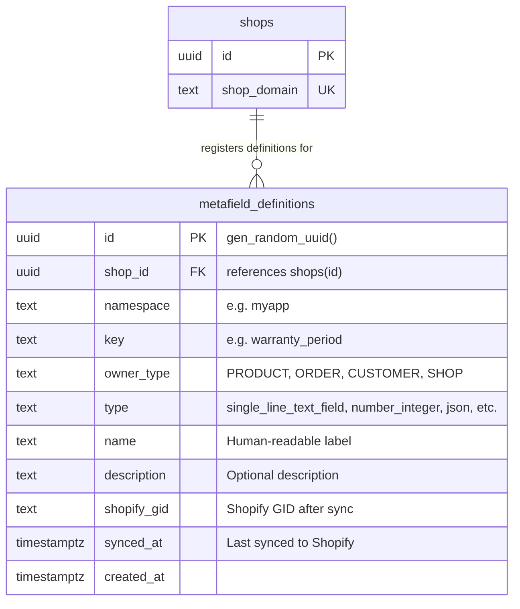
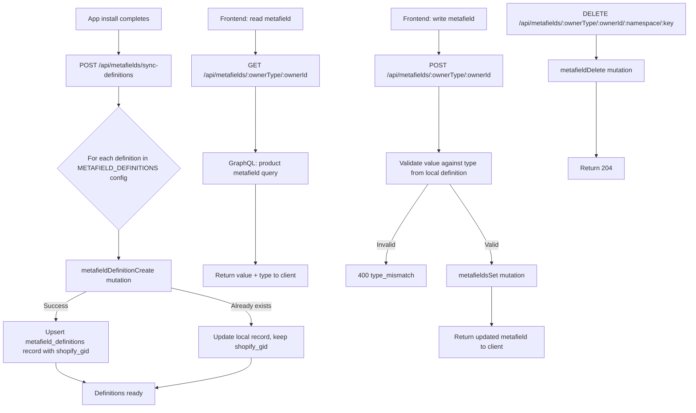
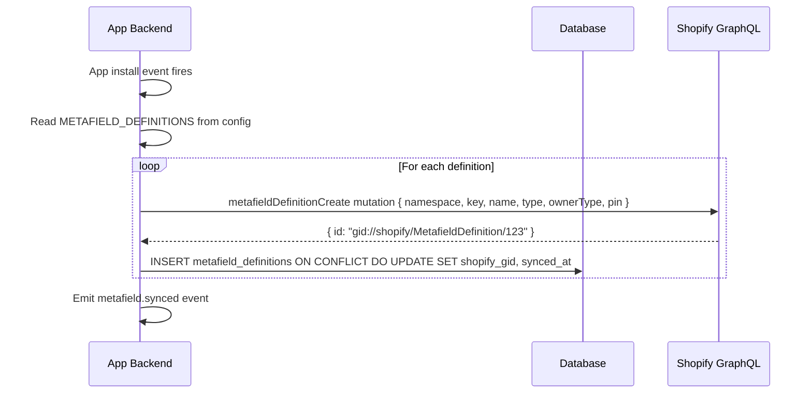
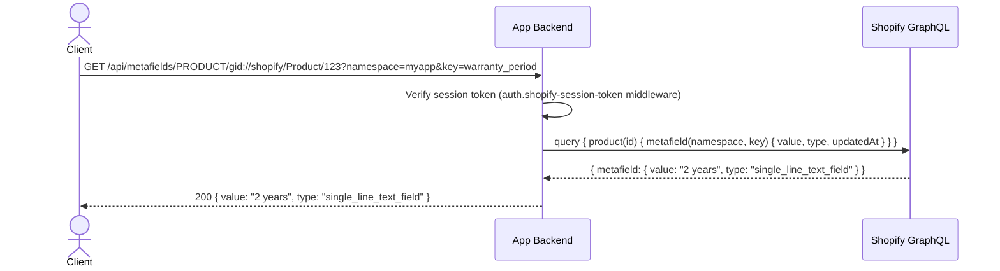
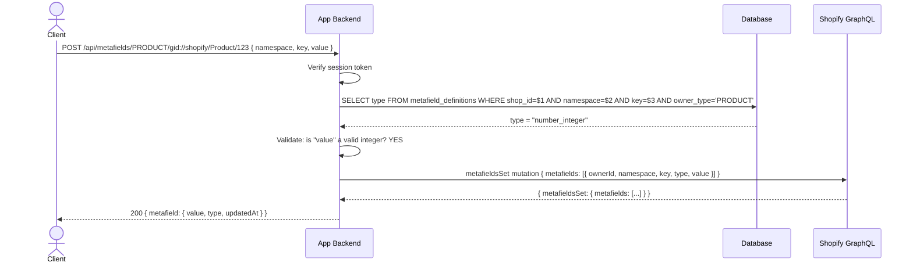
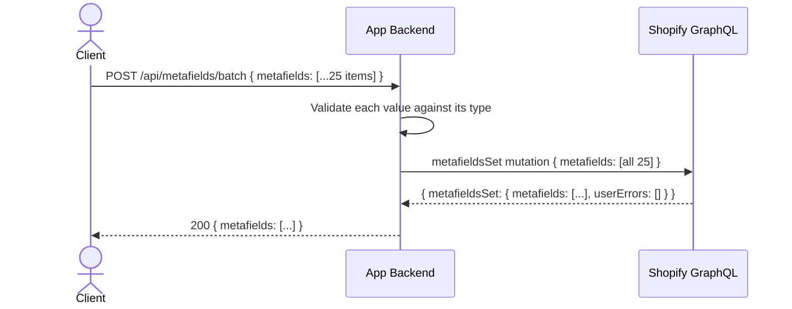

# Shopify Metafields

## 1. Overview

### Problem Statement

Shopify's built-in data model covers products, orders, and customers — but most apps need to store custom data against these resources. Metafields are Shopify's native extension mechanism: an app defines what fields exist (definitions), then reads and writes values for specific resources. Without this block, apps resort to storing Shopify resource data in their own database and keeping it in sync — a fragile pattern that diverges from Shopify's recommended approach.

### User Stories

- **Developer**: I want to store a custom "warranty period" value on products so merchants can display it on the storefront
- **Developer**: I want to read and write custom order attributes (e.g. delivery instructions) that persist in Shopify
- **Developer**: I want to define metafield types once at install time, then read and write values without repeating type information in every call
- **Merchant**: I want custom fields I set via the app to appear in Shopify Admin alongside the product

### When to use this block

- App needs to attach custom data to Shopify resources (products, orders, customers, shop)
- User mentions: "metafields", "custom data", "custom attributes", "extend Shopify data model"
- App reads/writes data that logically belongs to a Shopify resource (not the app's own domain objects)

### When NOT to use

- Storing app-internal data that has no relationship to a Shopify resource — use your own DB tables
- Storing large blobs or binary data — use file uploads or external storage
- Storing data that needs complex querying — metafields have limited filtering capability in Shopify's API

---

## 2. Data Model



### Table: `metafield_definitions`

Local registry that mirrors what has been registered in Shopify. Used for validation and sync — the source of truth for values is always Shopify.

| Column | Type | Constraints | Notes |
|--------|------|-------------|-------|
| `id` | `uuid` | PK, default `gen_random_uuid()` | |
| `shop_id` | `uuid` | NOT NULL, FK → `shops(id)` ON DELETE CASCADE | Tenant isolation |
| `namespace` | `text` | NOT NULL | App namespace prefix, e.g. `myapp` |
| `key` | `text` | NOT NULL | Field key within namespace, e.g. `warranty_period` |
| `owner_type` | `text` | NOT NULL | `PRODUCT`, `ORDER`, `CUSTOMER`, `SHOP`, etc. |
| `type` | `text` | NOT NULL | Shopify metafield type, e.g. `single_line_text_field` |
| `name` | `text` | NOT NULL | Human-readable label shown in Shopify Admin |
| `description` | `text` | nullable | Optional description |
| `shopify_gid` | `text` | nullable | Shopify GID returned after `metafieldDefinitionCreate` |
| `synced_at` | `timestamptz` | nullable | Timestamp of last successful sync to Shopify |
| `created_at` | `timestamptz` | NOT NULL, default `now()` | |

**Unique constraint**: `UNIQUE(shop_id, namespace, key, owner_type)` — one definition per shop per namespace+key+owner combination.

> **Important**: Metafield **values** live in Shopify, not in the app's database. This table only stores definitions (the schema). Every read/write of a value goes through the Shopify GraphQL API.

### Migration (reference)

```sql
CREATE TABLE IF NOT EXISTS metafield_definitions (
  id uuid PRIMARY KEY DEFAULT gen_random_uuid(),
  shop_id uuid NOT NULL REFERENCES shops(id) ON DELETE CASCADE,
  namespace text NOT NULL,
  key text NOT NULL,
  owner_type text NOT NULL,
  type text NOT NULL,
  name text NOT NULL,
  description text,
  shopify_gid text,
  synced_at timestamptz,
  created_at timestamptz NOT NULL DEFAULT now(),
  UNIQUE(shop_id, namespace, key, owner_type)
);

CREATE INDEX idx_metafield_defs_shop ON metafield_definitions(shop_id);
CREATE INDEX idx_metafield_defs_owner ON metafield_definitions(shop_id, owner_type);
```

---

## 3. Data Flow



---

## 4. Sequence Diagrams

### Definition Sync (on install)



### Read Metafield



### Write Metafield (with type validation)



### Batch Write (up to 25 metafields)



---

## 5. State Management

This block is backend-only. The only local state is the definitions registry.

| State | Storage | Survives Reload | Notes |
|-------|---------|-----------------|-------|
| `metafield_definitions` | Database | Yes | Local mirror of definitions registered in Shopify |
| Metafield values | Shopify (via GraphQL) | Yes | Never stored locally — always fetched on demand |
| Sync status | `synced_at` column | Yes | Tracks last successful sync per definition |

### State transitions

```
Config has definitions → POST /api/metafields/sync-definitions → metafieldDefinitionCreate → record upserted with shopify_gid
Config changes → re-sync → upsert updates existing records
Shop uninstalls → CASCADE DELETE removes all metafield_definitions records
```

---

## 6. Integration Points

### Inbound

| Caller | How | Purpose |
|--------|-----|---------|
| App install handler | Internal call | Trigger definition sync after OAuth completes |
| Embedded app frontend | HTTP (authenticated) | Read/write metafield values via API endpoints |
| Admin UI or background job | HTTP (authenticated) | Batch write or sync definitions on config change |

### Outbound

| Target | How | Purpose |
|--------|-----|---------|
| Shopify GraphQL Admin API | GraphQL mutation | `metafieldDefinitionCreate` — register definitions |
| Shopify GraphQL Admin API | GraphQL mutation | `metafieldsSet` — write values (batch up to 25) |
| Shopify GraphQL Admin API | GraphQL query | Read metafields for a resource |
| Shopify GraphQL Admin API | GraphQL mutation | `metafieldDelete` — remove a value |
| Database | SQL | Store/query metafield definitions |

### Events

| Event | Payload | When |
|-------|---------|------|
| `metafield.synced` | `{ shopId, count, definitions[] }` | Definition sync completes successfully |
| `metafield.set` | `{ shopId, ownerId, ownerType, namespace, key }` | Metafield value written |
| `metafield.deleted` | `{ shopId, ownerId, ownerType, namespace, key }` | Metafield value deleted |

---

## 7. Configuration Surface

| Key | Type | Default | Description |
|-----|------|---------|-------------|
| `METAFIELD_NAMESPACE` | `string` | app handle | Namespace prefix for all metafields (e.g. `myapp`) |
| `METAFIELD_DEFINITIONS` | `object[]` | `[]` | Array of `{ key, name, type, ownerType, description }` to register |
| `METAFIELD_PIN_TO_ADMIN` | `boolean` | `true` | Pin definitions in Shopify Admin UI for merchant visibility |

### Supported Metafield Types

| Category | Types |
|----------|-------|
| Text | `single_line_text_field`, `multi_line_text_field`, `rich_text_field` |
| Numeric | `number_integer`, `number_decimal` |
| Boolean | `boolean` |
| Date/Time | `date`, `date_time` |
| Structured | `json`, `url`, `color` |
| Reference | `product_reference`, `variant_reference`, `collection_reference`, `file_reference` |
| Lists | `list.single_line_text_field`, `list.number_integer`, `list.product_reference`, etc. |
