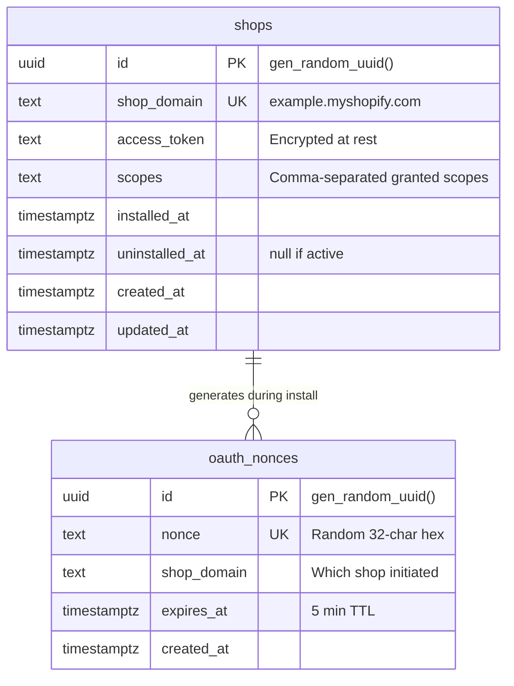
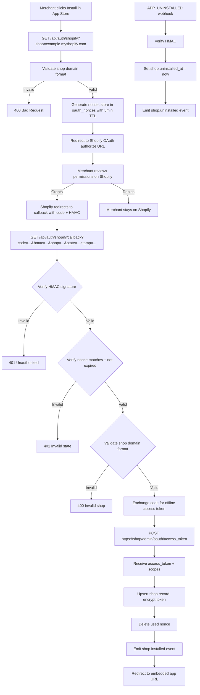
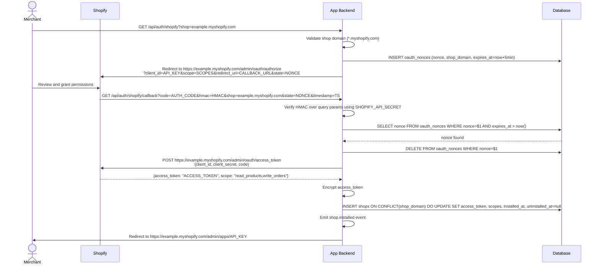
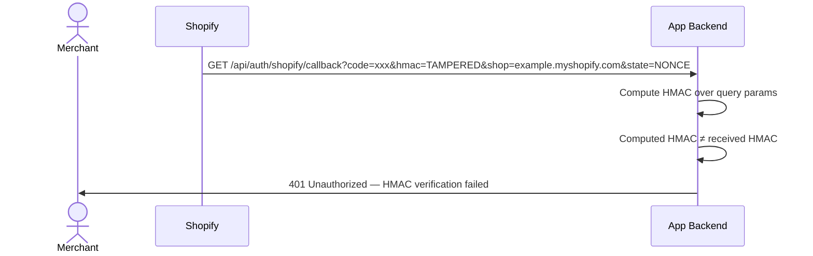
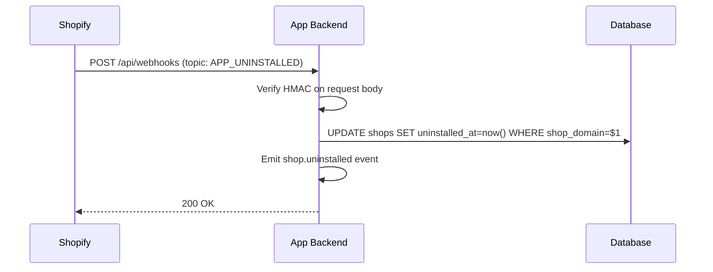

# Shopify Blocks Implementation Plan

> **For agentic workers:** REQUIRED SUB-SKILL: Use superpowers:subagent-driven-development (recommended) or superpowers:executing-plans to implement this plan task-by-task. Steps use checkbox (`- [ ]`) syntax for tracking.

**Goal:** Create 8 Shopify-specific primitive block specs following the established format in this repository.

**Architecture:** Each block is a directory under its category containing README.md, backend.md, security.md, acceptance.md, Gherkin .feature files, and fixture JSON files. Blocks use the composable prerequisites pattern — `auth.shopify-oauth` is the foundation, all others declare dependencies via `prerequisites` frontmatter field.

**Tech Stack:** Markdown specs, Gherkin BDD scenarios, JSON fixtures, SQL data models, TypeScript code patterns, Mermaid diagrams.

**Design Spec:** `docs/superpowers/specs/2026-05-15-shopify-blocks-design.md`

**Format Reference:** Use `ugc/product-reviews/` as the canonical format reference for all files.

**Parallelization:** Tasks 1-4 are sequential (dependency chain). Tasks 5-8 can run in parallel after Task 4.

---

## Task 1: auth.shopify-oauth

**Files:**
- Create: `auth/shopify-oauth/README.md`
- Create: `auth/shopify-oauth/backend.md`
- Create: `auth/shopify-oauth/security.md`
- Create: `auth/shopify-oauth/install-flow.feature`
- Create: `auth/shopify-oauth/uninstall.feature`
- Create: `auth/shopify-oauth/security.feature`
- Create: `auth/shopify-oauth/fixtures/oauth-callback.json`
- Create: `auth/shopify-oauth/fixtures/shop-records.json`
- Create: `auth/shopify-oauth/acceptance.md`

- [ ] **Step 1: Create directory structure**

```bash
mkdir -p auth/shopify-oauth/fixtures
```

- [ ] **Step 2: Create README.md**

```markdown
---
id: "auth.shopify-oauth"
name: "Shopify App Installation & OAuth"
version: "1.0.0"
category: "auth"
tags: [shopify, oauth, installation, access-token, embedded-app]
prerequisites: []
complexity: medium
estimated_effort: "~45 min"
files:
  - README.md
  - backend.md
  - security.md
  - install-flow.feature
  - uninstall.feature
  - security.feature
  - fixtures/oauth-callback.json
  - fixtures/shop-records.json
  - acceptance.md
---

# Shopify App Installation & OAuth

## 1. Overview

### Problem Statement

Every Shopify app must implement the OAuth handshake to get installed on a merchant's store. The merchant clicks "Install" → Shopify redirects to the app with a permission prompt → the merchant grants access → Shopify returns an authorization code → the app exchanges it for an offline access token. This token persists and gives the app API access to the store's data. Without this flow, the app cannot read products, process orders, or do anything useful.

### User Stories

- **Merchant**: I found an app in the Shopify App Store, I want to install it on my store so it can access my store data and provide its features
- **Merchant**: I want to reinstall an app I previously uninstalled, and have it recognize my store
- **Merchant**: I want to uninstall an app and trust that it stops accessing my store data
- **Developer**: I want a secure, spec-compliant OAuth flow that handles edge cases like reinstalls, scope changes, and concurrent installations

### When to use this block

- App needs to be installed on Shopify stores
- User mentions: "shopify app", "install app", "oauth", "access token", "app installation"
- App needs to call Shopify Admin API on behalf of a merchant

### When NOT to use

- Building a Shopify theme (no OAuth needed)
- Building a sales channel (uses different auth flow)
- Need ongoing request authentication for embedded app → use `auth.shopify-session-token` (which depends on this block)

---

## 2. Data Model



### Table: `shops`

| Column | Type | Constraints | Notes |
|--------|------|-------------|-------|
| `id` | `uuid` | PK, default `gen_random_uuid()` | |
| `shop_domain` | `text` | NOT NULL, UNIQUE | `example.myshopify.com` format |
| `access_token` | `text` | NOT NULL | Encrypted at rest |
| `scopes` | `text` | NOT NULL | Comma-separated, e.g. `read_products,write_orders` |
| `installed_at` | `timestamptz` | NOT NULL, default `now()` | |
| `uninstalled_at` | `timestamptz` | nullable | Set on `APP_UNINSTALLED` webhook |
| `created_at` | `timestamptz` | NOT NULL, default `now()` | |
| `updated_at` | `timestamptz` | NOT NULL, default `now()` | |

### Table: `oauth_nonces`

Single-use CSRF tokens for the OAuth callback. Deleted immediately after use.

| Column | Type | Constraints | Notes |
|--------|------|-------------|-------|
| `id` | `uuid` | PK, default `gen_random_uuid()` | |
| `nonce` | `text` | NOT NULL, UNIQUE | Random 32-char hex string |
| `shop_domain` | `text` | NOT NULL | Which shop initiated the flow |
| `expires_at` | `timestamptz` | NOT NULL | 5 minutes from creation |
| `created_at` | `timestamptz` | NOT NULL, default `now()` | |

### Migration (reference)

```sql
CREATE TABLE IF NOT EXISTS shops (
  id uuid PRIMARY KEY DEFAULT gen_random_uuid(),
  shop_domain text NOT NULL UNIQUE,
  access_token text NOT NULL,
  scopes text NOT NULL,
  installed_at timestamptz NOT NULL DEFAULT now(),
  uninstalled_at timestamptz,
  created_at timestamptz NOT NULL DEFAULT now(),
  updated_at timestamptz NOT NULL DEFAULT now()
);

CREATE INDEX idx_shops_domain ON shops(shop_domain);

CREATE TABLE IF NOT EXISTS oauth_nonces (
  id uuid PRIMARY KEY DEFAULT gen_random_uuid(),
  nonce text NOT NULL UNIQUE,
  shop_domain text NOT NULL,
  expires_at timestamptz NOT NULL,
  created_at timestamptz NOT NULL DEFAULT now()
);

CREATE INDEX idx_nonces_expires ON oauth_nonces(expires_at);
```

---

## 3. Data Flow



---

## 4. Sequence Diagrams

### Install Flow (happy path)



### Install Flow (HMAC verification failure)



### Uninstall Flow



---

## 5. State Management

This block is backend-only. No frontend state — the OAuth flow uses server-side redirects.

| State | Storage | Survives Reload | Notes |
|-------|---------|-----------------|-------|
| `shop` | Database (`shops` table) | Yes | Persistent shop record with encrypted token |
| `nonce` | Database (`oauth_nonces` table) | Yes (5min TTL) | Deleted after single use |
| `install redirect` | HTTP redirect chain | No | Browser follows redirects |

### State transitions

```
Initial → GET /api/auth/shopify → nonce created → redirect to Shopify
Shopify → callback → nonce verified + deleted → code exchanged → shop upserted
APP_UNINSTALLED webhook → shop.uninstalled_at set
Reinstall → same flow, upsert overwrites token + clears uninstalled_at
```

---

## 6. Integration Points

### Inbound

| Caller | How | Purpose |
|--------|-----|---------|
| Shopify App Store / Manual URL | HTTP redirect | Initiate install flow |
| Shopify OAuth server | HTTP redirect | Return authorization code |
| Shopify webhook system | POST /api/webhooks | APP_UNINSTALLED notification |

### Outbound

| Target | How | Purpose |
|--------|-----|---------|
| Shopify OAuth endpoint | POST `https://{shop}/admin/oauth/access_token` | Exchange code for token |
| Database | SQL | Store shop + nonce records |

### Events

| Event | Payload | When |
|-------|---------|------|
| `shop.installed` | `{ shopId, shopDomain, scopes }` | OAuth flow completes, shop record upserted |
| `shop.uninstalled` | `{ shopId, shopDomain }` | APP_UNINSTALLED webhook received |
| `shop.reinstalled` | `{ shopId, shopDomain, previousScopes, newScopes }` | Shop reinstalls (upsert detects existing record) |

### Shared Utilities Introduced

This block introduces two shared utilities used by downstream blocks:

1. **HMAC-SHA256 verification** — `verifyShopifyHmac(secret, data, expectedHmac)` — constant-time comparison, used by webhooks, GDPR, app proxy blocks
2. **GraphQL Admin API client** — authenticated client with rate limiting, retry on 429/5xx, token injection from `shops` table

---

## 7. Configuration Surface

| Key | Type | Default | Description |
|-----|------|---------|-------------|
| `SHOPIFY_API_KEY` | `string` | required | App API key from Shopify Partner Dashboard |
| `SHOPIFY_API_SECRET` | `string` | required | App API secret (used for HMAC + token exchange) |
| `SHOPIFY_SCOPES` | `string` | required | Comma-separated scopes, e.g. `read_products,write_orders` |
| `APP_URL` | `string` | required | Full app URL (e.g. `https://myapp.com`) for redirect_uri |
| `OAUTH_NONCE_TTL_SECONDS` | `number` | `300` | Nonce expiry time (5 min default) |
```

- [ ] **Step 3: Create backend.md**

```markdown
# Backend Patterns — Shopify App Installation & OAuth

## API Endpoints

### OAuth Flow

| Method | Path | Purpose | Auth |
|--------|------|---------|------|
| `GET` | `/api/auth/shopify` | Initiate install, redirect to Shopify | None (shop param required) |
| `GET` | `/api/auth/shopify/callback` | Handle OAuth callback, exchange code | None (HMAC verified) |

### Internal (called by other blocks)

| Function | Purpose |
|----------|---------|
| `getShopByDomain(domain)` | Look up shop record by myshopify.com domain |
| `getShopToken(shopId)` | Get decrypted access token for API calls |
| `verifyShopifyHmac(secret, data, hmac)` | HMAC-SHA256 verification (shared utility) |

---

## Install Redirect Handler

<!-- PATTERN: shopify-oauth-redirect -->
<!-- PURPOSE: Validate shop domain, generate nonce, redirect to Shopify permission screen -->
<!-- ADAPT: Crypto for nonce generation, redirect mechanism -->

```typescript
// GET /api/auth/shopify?shop=example.myshopify.com

async function handleInstallRedirect(req: Request): Promise<Response> {
  const shop = req.query.shop;

  // 1. Validate shop domain format
  if (!shop || !isValidShopDomain(shop)) {
    return error(400, "invalid_shop_domain");
  }

  // 2. Generate cryptographically random nonce
  const nonce = crypto.randomBytes(16).toString("hex"); // 32 chars

  // 3. Store nonce with TTL
  await db.insert("oauth_nonces", {
    nonce,
    shop_domain: shop,
    expires_at: new Date(Date.now() + config.OAUTH_NONCE_TTL_SECONDS * 1000),
  });

  // 4. Build Shopify authorize URL
  const authUrl = new URL(`https://${shop}/admin/oauth/authorize`);
  authUrl.searchParams.set("client_id", config.SHOPIFY_API_KEY);
  authUrl.searchParams.set("scope", config.SHOPIFY_SCOPES);
  authUrl.searchParams.set("redirect_uri", `${config.APP_URL}/api/auth/shopify/callback`);
  authUrl.searchParams.set("state", nonce);

  return redirect(302, authUrl.toString());
}

function isValidShopDomain(shop: string): boolean {
  // Only allow *.myshopify.com domains — prevents open redirect
  return /^[a-zA-Z0-9][a-zA-Z0-9\-]*\.myshopify\.com$/.test(shop);
}
```

## OAuth Callback Handler

<!-- PATTERN: shopify-oauth-callback -->
<!-- PURPOSE: Verify HMAC + nonce, exchange code for offline token, upsert shop -->
<!-- ADAPT: HTTP client for token exchange, encryption for token storage -->

```typescript
// GET /api/auth/shopify/callback?code=...&hmac=...&shop=...&state=...&timestamp=...

async function handleOAuthCallback(req: Request): Promise<Response> {
  const { code, hmac, shop, state, timestamp, ...rest } = req.query;

  // 1. Verify HMAC over all query params (except hmac and signature)
  const params = { code, shop, state, timestamp, ...rest };
  const sortedParams = Object.keys(params).sort()
    .map(key => `${key}=${params[key]}`).join("&");

  if (!verifyShopifyHmac(config.SHOPIFY_API_SECRET, sortedParams, hmac)) {
    return error(401, "hmac_verification_failed");
  }

  // 2. Validate shop domain format
  if (!isValidShopDomain(shop)) {
    return error(400, "invalid_shop_domain");
  }

  // 3. Verify nonce (state parameter)
  const nonceRecord = await db.query(
    `SELECT * FROM oauth_nonces WHERE nonce = $1 AND expires_at > now()`,
    [state]
  );
  if (!nonceRecord) {
    return error(401, "invalid_or_expired_state");
  }

  // Delete nonce immediately (single-use)
  await db.query(`DELETE FROM oauth_nonces WHERE nonce = $1`, [state]);

  // 4. Exchange code for offline access token
  const tokenResponse = await fetch(`https://${shop}/admin/oauth/access_token`, {
    method: "POST",
    headers: { "Content-Type": "application/json" },
    body: JSON.stringify({
      client_id: config.SHOPIFY_API_KEY,
      client_secret: config.SHOPIFY_API_SECRET,
      code,
    }),
  });

  if (!tokenResponse.ok) {
    return error(502, "token_exchange_failed");
  }

  const { access_token, scope } = await tokenResponse.json();

  // 5. Encrypt token and upsert shop record
  const encryptedToken = encrypt(access_token);
  const shop_record = await db.query(`
    INSERT INTO shops (shop_domain, access_token, scopes, installed_at, uninstalled_at)
    VALUES ($1, $2, $3, now(), null)
    ON CONFLICT (shop_domain) DO UPDATE SET
      access_token = $2,
      scopes = $3,
      installed_at = now(),
      uninstalled_at = null,
      updated_at = now()
    RETURNING *
  `, [shop, encryptedToken, scope]);

  // 6. Emit event
  emit("shop.installed", {
    shopId: shop_record.id,
    shopDomain: shop,
    scopes: scope,
  });

  // 7. Redirect to embedded app in Shopify admin
  return redirect(302, `https://${shop}/admin/apps/${config.SHOPIFY_API_KEY}`);
}
```

## HMAC Verification (Shared Utility)

<!-- PATTERN: shopify-hmac-verify -->
<!-- PURPOSE: Constant-time HMAC-SHA256 verification — used by OAuth, webhooks, GDPR, app proxy -->
<!-- ADAPT: Crypto library -->

```typescript
function verifyShopifyHmac(
  secret: string,
  data: string | Buffer,
  expectedHmac: string
): boolean {
  const computed = crypto
    .createHmac("sha256", secret)
    .update(data)
    .digest("hex");

  // Constant-time comparison to prevent timing attacks
  if (computed.length !== expectedHmac.length) return false;
  return crypto.timingSafeEqual(
    Buffer.from(computed, "hex"),
    Buffer.from(expectedHmac, "hex")
  );
}
```

## Shop Lookup (Shared Utility)

<!-- PATTERN: shop-lookup -->
<!-- PURPOSE: Retrieve shop record by domain — used by all blocks needing shop context -->
<!-- ADAPT: DB client -->

```typescript
async function getShopByDomain(domain: string): Promise<Shop | null> {
  return db.query(
    `SELECT * FROM shops WHERE shop_domain = $1 AND uninstalled_at IS NULL`,
    [domain]
  );
}

async function getShopToken(shopId: string): Promise<string> {
  const shop = await db.query(`SELECT access_token FROM shops WHERE id = $1`, [shopId]);
  if (!shop) throw new Error("shop_not_found");
  return decrypt(shop.access_token);
}
```

## Token Encryption

<!-- PATTERN: token-encryption -->
<!-- PURPOSE: Encrypt/decrypt Shopify access tokens at rest -->
<!-- ADAPT: Encryption key management, algorithm choice -->

```typescript
// AES-256-GCM recommended — provides confidentiality + integrity
const ALGORITHM = "aes-256-gcm";

function encrypt(plaintext: string): string {
  const iv = crypto.randomBytes(12);
  const cipher = crypto.createCipheriv(ALGORITHM, getEncryptionKey(), iv);
  const encrypted = Buffer.concat([cipher.update(plaintext, "utf8"), cipher.final()]);
  const tag = cipher.getAuthTag();
  // Format: iv:tag:ciphertext (all hex)
  return `${iv.toString("hex")}:${tag.toString("hex")}:${encrypted.toString("hex")}`;
}

function decrypt(encoded: string): string {
  const [ivHex, tagHex, ciphertextHex] = encoded.split(":");
  const decipher = crypto.createDecipheriv(
    ALGORITHM, getEncryptionKey(), Buffer.from(ivHex, "hex")
  );
  decipher.setAuthTag(Buffer.from(tagHex, "hex"));
  return decipher.update(Buffer.from(ciphertextHex, "hex")) + decipher.final("utf8");
}
```

## Nonce Cleanup

<!-- PATTERN: nonce-cleanup -->
<!-- PURPOSE: Periodic cleanup of expired nonces to prevent table bloat -->
<!-- ADAPT: Job scheduler -->

```typescript
// Run periodically (e.g., every 10 minutes)
async function cleanupExpiredNonces(): Promise<number> {
  const result = await db.query(
    `DELETE FROM oauth_nonces WHERE expires_at < now() RETURNING id`
  );
  return result.rowCount;
}
```

## Error Handling

| Error Code | HTTP Status | When |
|------------|-------------|------|
| `invalid_shop_domain` | 400 | Shop param missing or not `*.myshopify.com` |
| `hmac_verification_failed` | 401 | HMAC signature doesn't match |
| `invalid_or_expired_state` | 401 | Nonce not found or expired |
| `token_exchange_failed` | 502 | Shopify rejected the authorization code |
| `shop_not_found` | 404 | Shop domain not in database |

## Anti-patterns

**DON'T** accept the access token from the client or store it unencrypted. The offline access token is equivalent to a password — encrypt at rest, never log, never return in API responses.

**DON'T** skip HMAC verification on the callback. Without it, an attacker can forge callbacks with arbitrary authorization codes.

**DON'T** reuse nonces or skip the nonce check. The nonce (state parameter) prevents CSRF attacks on the OAuth callback endpoint.

**DON'T** validate the shop domain with a loose regex that allows subdomains or non-myshopify.com domains. This prevents open redirect attacks.

**DON'T** use the online access token mode for background tasks. Offline tokens persist and work for webhooks, background jobs, and scheduled tasks. Online tokens expire when the merchant's session ends.
```

- [ ] **Step 4: Create security.md**

```markdown
# Security — Shopify App Installation & OAuth

## Threat Model

### 1. CSRF via Forged Callback

**Impact**: Critical — attacker could trick a merchant into installing a malicious app instance or linking their store to an attacker's account.

**Mitigations**:
- Nonce (state parameter) generated server-side with `crypto.randomBytes(16)`
- Nonce stored in database with 5-minute TTL
- Single-use: deleted immediately after verification
- HMAC verification on all callback query parameters provides additional layer
- Nonce is bound to the shop domain that initiated the flow

### 2. Shop Domain Spoofing

**Impact**: High — attacker could redirect the OAuth flow to a domain they control, intercepting the authorization code.

**Mitigations**:
- Strict regex validation: only `*.myshopify.com` domains accepted
- HMAC signature from Shopify covers the `shop` parameter — tampering detected
- The `redirect_uri` in the initial request is registered in the Shopify Partner Dashboard and cannot be changed

### 3. Access Token Exposure

**Impact**: Critical — stolen access token gives full API access to the merchant's store within granted scopes.

**Mitigations**:
- Encrypted at rest using AES-256-GCM (confidentiality + integrity)
- Encryption key stored in environment variable, never in code
- Never logged — log redaction for any request/response containing tokens
- Never returned in API responses to any client
- Never stored in cookies, localStorage, or URL parameters

### 4. Replay Attack on Callback

**Impact**: Medium — replaying a valid callback could re-trigger the install flow.

**Mitigations**:
- Nonce is deleted immediately after use — replay fails with "invalid_or_expired_state"
- Authorization code is single-use on Shopify's side — replay fails at token exchange
- Timestamp parameter can be checked for freshness (within acceptable window)

### 5. Scope Escalation

**Impact**: High — app could end up with more permissions than intended.

**Mitigations**:
- Requested scopes defined in `SHOPIFY_SCOPES` config, not dynamic
- Granted scopes from token exchange response are stored and can be compared
- If granted scopes differ from requested, the discrepancy is logged

## Input Validation Rules

| Field | Validation | Error Code |
|-------|-----------|------------|
| `shop` (query param) | Required, matches `^[a-zA-Z0-9][a-zA-Z0-9\-]*\.myshopify\.com$` | `invalid_shop_domain` |
| `hmac` (query param) | Required, valid HMAC-SHA256 hex string | `hmac_verification_failed` |
| `state` (query param) | Required, exists in oauth_nonces, not expired | `invalid_or_expired_state` |
| `code` (query param) | Required, non-empty string (opaque to us) | `token_exchange_failed` |
| `timestamp` (query param) | Required, numeric, within reasonable window | `invalid_timestamp` |

## Secrets Management

| Secret | Storage | Rotation |
|--------|---------|----------|
| `SHOPIFY_API_KEY` | Environment variable | Rotate via Shopify Partner Dashboard |
| `SHOPIFY_API_SECRET` | Environment variable | Rotate via Partner Dashboard (invalidates all HMAC + existing tokens) |
| `TOKEN_ENCRYPTION_KEY` | Environment variable | Rotate with re-encryption migration |
| Shop access tokens | Database (encrypted) | Refreshed on app reinstall |
```

- [ ] **Step 5: Create install-flow.feature**

```gherkin
Feature: App Installation Flow
  As a Shopify merchant
  I want to install a Shopify app via OAuth
  So that the app can access my store data and provide its features

  Background:
    Given the app is configured with API key "test-api-key" and secret "test-api-secret"
    And the app URL is "https://myapp.example.com"
    And the requested scopes are "read_products,write_orders"

  @happy
  Scenario: Successful first-time installation
    When a merchant visits GET /api/auth/shopify?shop=example.myshopify.com
    Then the app generates a nonce and stores it in oauth_nonces with a 5-minute TTL
    And the merchant is redirected to "https://example.myshopify.com/admin/oauth/authorize"
    And the redirect URL includes client_id "test-api-key"
    And the redirect URL includes scope "read_products,write_orders"
    And the redirect URL includes state matching the stored nonce

    When Shopify calls GET /api/auth/shopify/callback with:
      | code      | auth-code-123              |
      | hmac      | valid-hmac-for-params      |
      | shop      | example.myshopify.com      |
      | state     | matching-nonce             |
      | timestamp | current-timestamp          |
    Then the app verifies the HMAC signature
    And the app verifies the nonce exists and is not expired
    And the nonce is deleted from oauth_nonces
    And the app exchanges the code for an offline access token
    And a shop record is created with domain "example.myshopify.com"
    And the access token is stored encrypted
    And a "shop.installed" event is emitted
    And the merchant is redirected to "https://example.myshopify.com/admin/apps/test-api-key"

  @happy
  Scenario: Reinstall after previous uninstall
    Given a shop "example.myshopify.com" exists with uninstalled_at set
    When the merchant completes the OAuth flow for "example.myshopify.com"
    Then the existing shop record is updated (not duplicated)
    And access_token is updated with the new token
    And uninstalled_at is set to null
    And installed_at is updated to now
    And a "shop.reinstalled" event is emitted

  @happy
  Scenario: Reinstall with different scopes
    Given a shop "example.myshopify.com" exists with scopes "read_products"
    And the app now requests scopes "read_products,write_orders"
    When the merchant completes the OAuth flow
    Then the shop record scopes are updated to "read_products,write_orders"
    And the access token is replaced with the new one

  @error
  Scenario: Invalid shop domain format
    When a merchant visits GET /api/auth/shopify?shop=evil.example.com
    Then the response status is 400
    And the response body contains error "invalid_shop_domain"
    And no nonce is created

  @error
  Scenario: Missing shop parameter
    When a merchant visits GET /api/auth/shopify without a shop parameter
    Then the response status is 400
    And the response body contains error "invalid_shop_domain"

  @error
  Scenario: HMAC verification fails on callback
    When Shopify calls GET /api/auth/shopify/callback with a tampered hmac
    Then the response status is 401
    And the response body contains error "hmac_verification_failed"
    And no shop record is created or updated

  @error
  Scenario: Expired nonce on callback
    Given a nonce was created 6 minutes ago (past the 5-minute TTL)
    When Shopify calls GET /api/auth/shopify/callback with the expired nonce as state
    Then the response status is 401
    And the response body contains error "invalid_or_expired_state"

  @error
  Scenario: Nonce already used (replay attempt)
    Given a nonce was already used and deleted
    When Shopify calls GET /api/auth/shopify/callback with the used nonce as state
    Then the response status is 401
    And the response body contains error "invalid_or_expired_state"

  @error
  Scenario: Token exchange fails with Shopify
    Given the HMAC and nonce are valid
    When the app exchanges the code and Shopify returns a 400 error
    Then the response status is 502
    And the response body contains error "token_exchange_failed"
    And no shop record is created
```

- [ ] **Step 6: Create uninstall.feature**

```gherkin
Feature: App Uninstall
  As the app backend
  I want to handle the APP_UNINSTALLED webhook
  So that I mark the shop as inactive and stop processing

  Background:
    Given the app is configured with API secret "test-api-secret"
    And a shop "example.myshopify.com" exists with an active installation

  @happy
  Scenario: Handle APP_UNINSTALLED webhook
    When Shopify sends POST /api/webhooks with topic "APP_UNINSTALLED"
    And the request body contains shop domain "example.myshopify.com"
    And the X-Shopify-Hmac-Sha256 header is valid
    Then the response status is 200
    And the shop record for "example.myshopify.com" has uninstalled_at set to now
    And a "shop.uninstalled" event is emitted

  @error
  Scenario: Reject uninstall webhook with invalid HMAC
    When Shopify sends POST /api/webhooks with topic "APP_UNINSTALLED"
    And the X-Shopify-Hmac-Sha256 header is invalid
    Then the response status is 401
    And the shop record is not modified

  @edge
  Scenario: Uninstall webhook for unknown shop
    When Shopify sends POST /api/webhooks with topic "APP_UNINSTALLED"
    And the shop domain "unknown.myshopify.com" does not exist in the database
    Then the response status is 200
    And no error is thrown (idempotent behavior)

  @edge
  Scenario: Duplicate uninstall webhook
    Given the shop "example.myshopify.com" already has uninstalled_at set
    When Shopify sends POST /api/webhooks with topic "APP_UNINSTALLED" again
    Then the response status is 200
    And uninstalled_at is updated to the new timestamp
```

- [ ] **Step 7: Create security.feature**

```gherkin
Feature: OAuth Security
  As the app backend
  I want to enforce security controls on the OAuth flow
  So that the installation is protected against attacks

  Background:
    Given the app is configured with API key "test-api-key" and secret "test-api-secret"

  @security
  Scenario: HMAC uses constant-time comparison
    Given a valid callback request
    When HMAC verification runs
    Then the comparison uses crypto.timingSafeEqual (not === operator)

  @security
  Scenario: Nonces are cryptographically random
    When a nonce is generated
    Then it uses crypto.randomBytes (not Math.random)
    And it is 32 characters of hex

  @security
  Scenario: Access token is never logged
    When a successful OAuth flow completes
    Then no log entry contains the plaintext access token
    And no log entry contains an access token prefix

  @security
  Scenario: Access token is never returned in API responses
    When any API endpoint is called
    Then no response body contains the access_token field with a real value

  @security
  Scenario: Shop domain regex prevents open redirect
    When the shop parameter is "evil.com/admin/oauth/authorize?redirect_uri=http://evil.com&shop=legit.myshopify.com"
    Then the validation rejects it as invalid_shop_domain

  @security
  Scenario: Callback params excluding hmac and signature are HMAC-verified
    Given callback params: code=ABC, shop=x.myshopify.com, state=NONCE, timestamp=123
    When HMAC is computed
    Then it covers the sorted string "code=ABC&shop=x.myshopify.com&state=NONCE&timestamp=123"
    And the "hmac" and "signature" params are excluded from the HMAC input
```

- [ ] **Step 8: Create fixtures/oauth-callback.json**

```json
[
  {
    "_comment": "Valid OAuth callback params — use for happy path install test",
    "query_params": {
      "code": "abc123def456",
      "hmac": "a1b2c3d4e5f6a1b2c3d4e5f6a1b2c3d4e5f6a1b2c3d4e5f6a1b2c3d4e5f6a1b2",
      "shop": "test-store.myshopify.com",
      "state": "f47ac10b58cc4372a5670e02b2c3d479",
      "timestamp": "1700000000"
    },
    "token_exchange_response": {
      "access_token": "<EXAMPLE_SHOPIFY_ACCESS_TOKEN>",
      "scope": "read_products,write_orders,read_customers"
    }
  },
  {
    "_comment": "Callback with tampered HMAC — use for HMAC failure test",
    "query_params": {
      "code": "abc123def456",
      "hmac": "0000000000000000000000000000000000000000000000000000000000000000",
      "shop": "test-store.myshopify.com",
      "state": "f47ac10b58cc4372a5670e02b2c3d479",
      "timestamp": "1700000000"
    }
  },
  {
    "_comment": "Callback with invalid shop domain — use for domain validation test",
    "query_params": {
      "code": "abc123def456",
      "hmac": "valid-hmac",
      "shop": "evil-domain.example.com",
      "state": "f47ac10b58cc4372a5670e02b2c3d479",
      "timestamp": "1700000000"
    }
  },
  {
    "_comment": "Token exchange error responses from Shopify",
    "error_responses": {
      "invalid_grant": {
        "status": 400,
        "body": { "error": "invalid_grant", "error_description": "authorization code was not found or was already used" }
      },
      "invalid_client": {
        "status": 400,
        "body": { "error": "invalid_client", "error_description": "API key or secret is invalid" }
      }
    }
  }
]
```

- [ ] **Step 9: Create fixtures/shop-records.json**

```json
[
  {
    "_comment": "Active shop with full access — use for authenticated API tests",
    "id": "shop-001",
    "shop_domain": "test-store.myshopify.com",
    "access_token": "encrypted:a1b2c3d4...",
    "scopes": "read_products,write_orders,read_customers",
    "installed_at": "2025-01-15T10:00:00Z",
    "uninstalled_at": null,
    "created_at": "2025-01-15T10:00:00Z",
    "updated_at": "2025-01-15T10:00:00Z"
  },
  {
    "_comment": "Uninstalled shop — use for reinstall and uninstall tests",
    "id": "shop-002",
    "shop_domain": "old-store.myshopify.com",
    "access_token": "encrypted:e5f6g7h8...",
    "scopes": "read_products",
    "installed_at": "2024-06-01T08:00:00Z",
    "uninstalled_at": "2025-01-10T15:30:00Z",
    "created_at": "2024-06-01T08:00:00Z",
    "updated_at": "2025-01-10T15:30:00Z"
  },
  {
    "_comment": "Shop with limited scopes — use for scope mismatch tests",
    "id": "shop-003",
    "shop_domain": "limited-store.myshopify.com",
    "access_token": "encrypted:i9j0k1l2...",
    "scopes": "read_products",
    "installed_at": "2025-01-20T12:00:00Z",
    "uninstalled_at": null,
    "created_at": "2025-01-20T12:00:00Z",
    "updated_at": "2025-01-20T12:00:00Z"
  }
]
```

- [ ] **Step 10: Create acceptance.md**

```markdown
# Acceptance Checklist — Shopify App Installation & OAuth

Claude Code runs this checklist after implementation, before reporting done.

## Database

- [ ] Migration runs successfully (`shops` + `oauth_nonces` tables created)
- [ ] `UNIQUE` constraint on `shops.shop_domain` is active
- [ ] `UNIQUE` constraint on `oauth_nonces.nonce` is active
- [ ] Index on `oauth_nonces.expires_at` exists (for cleanup queries)
- [ ] All shop queries include tenant scoping where applicable

## Install Flow

- [ ] GET /api/auth/shopify?shop=valid.myshopify.com generates nonce and redirects to Shopify
- [ ] Redirect URL includes correct client_id, scope, redirect_uri, and state
- [ ] GET /api/auth/shopify?shop=invalid.com returns 400
- [ ] GET /api/auth/shopify without shop param returns 400
- [ ] Callback verifies HMAC over all query params (excluding hmac and signature)
- [ ] Callback verifies nonce exists in DB and is not expired
- [ ] Nonce is deleted after successful verification (single-use)
- [ ] Authorization code is exchanged for offline access token via POST to Shopify
- [ ] Access token is encrypted before storing in database
- [ ] Shop record is upserted (new install creates, reinstall updates)
- [ ] On reinstall, `uninstalled_at` is set to null and `installed_at` is updated
- [ ] `shop.installed` event is emitted on successful install
- [ ] Merchant is redirected to embedded app URL after install

## Uninstall

- [ ] APP_UNINSTALLED webhook sets `uninstalled_at` on shop record
- [ ] `shop.uninstalled` event is emitted
- [ ] Duplicate uninstall webhook is handled idempotently

## Security

- [ ] HMAC comparison uses constant-time comparison (timingSafeEqual)
- [ ] Nonces are generated with crypto.randomBytes
- [ ] Access token is never logged, never returned in responses
- [ ] Shop domain regex only allows `*.myshopify.com`
- [ ] Expired nonces are cleaned up periodically

## Shared Utilities

- [ ] `verifyShopifyHmac()` function works for both query param signing and body signing
- [ ] `getShopByDomain()` returns null for uninstalled shops
- [ ] `getShopToken()` returns decrypted token
- [ ] GraphQL Admin API client handles rate limiting (429) and retries on 5xx

## Type Safety & Build

- [ ] `tsc --noEmit` passes (or equivalent type check)
- [ ] No `any` types without justification
- [ ] Zod (or equivalent) validation at API boundary

## Configuration

- [ ] All config keys documented: SHOPIFY_API_KEY, SHOPIFY_API_SECRET, SHOPIFY_SCOPES, APP_URL, OAUTH_NONCE_TTL_SECONDS
- [ ] Required keys fail fast on missing value at startup
- [ ] OAUTH_NONCE_TTL_SECONDS defaults to 300
```

- [ ] **Step 11: Verify block structure**

```bash
ls -R auth/shopify-oauth/
```

Expected output:
```
README.md  acceptance.md  backend.md  fixtures  install-flow.feature  security.feature  security.md  uninstall.feature

auth/shopify-oauth/fixtures:
oauth-callback.json  shop-records.json
```

- [ ] **Step 12: Commit**

```bash
git add auth/shopify-oauth/
git commit -m "feat: add auth.shopify-oauth block spec — app installation + offline token exchange"
```

---

## Task 2: auth.shopify-session-token

**Files:**
- Create: `auth/shopify-session-token/README.md`
- Create: `auth/shopify-session-token/backend.md`
- Create: `auth/shopify-session-token/security.md`
- Create: `auth/shopify-session-token/session-token-verification.feature`
- Create: `auth/shopify-session-token/middleware-integration.feature`
- Create: `auth/shopify-session-token/fixtures/session-tokens.json`
- Create: `auth/shopify-session-token/acceptance.md`

**Depends on:** Task 1 (references `shops` table and `SHOPIFY_API_KEY`/`SHOPIFY_API_SECRET` from `auth.shopify-oauth`)

- [ ] **Step 1: Create directory structure**

```bash
mkdir -p auth/shopify-session-token/fixtures
```

- [ ] **Step 2: Create README.md**

Follow exact format of Task 1 README. Key content from design spec:

- Frontmatter: `id: "auth.shopify-session-token"`, `prerequisites: ["auth.shopify-oauth"]`, `complexity: low`, `estimated_effort: "~30 min"`
- Section 1 Overview: JWT verification for embedded apps using App Bridge. User stories for embedded app making API calls. When to use: embedded app needs authenticated backend calls. When NOT: non-embedded apps, public storefront requests.
- Section 2 Data Model: No new tables — uses `shops` from `auth.shopify-oauth`. Document the JWT structure (iss, dest, aud, sub, exp, nbf, iat, jti, sid claims).
- Section 3 Data Flow: Request arrives with `Authorization: Bearer <token>` → extract → decode base64url → verify HMAC-SHA256 signature → validate claims → lookup shop → attach context.
- Section 4 Sequence Diagrams: (1) Happy path — App Bridge generates token → frontend sends to backend → middleware verifies → shop context attached → handler processes. (2) Error — expired token → 401 → App Bridge auto-refreshes → retry.
- Section 5 State Management: No persistent state. Middleware extracts shop context per-request.
- Section 6 Integration Points: Inbound = every authenticated API request. Outbound = `shops` table lookup. No events emitted (middleware, not a workflow).
- Section 7 Configuration: Reuses `SHOPIFY_API_KEY` and `SHOPIFY_API_SECRET`. No additional config.

- [ ] **Step 3: Create backend.md**

Key content:
- No API endpoints (this is middleware, not an endpoint)
- `authenticateShopifyRequest` middleware function: extract Bearer token, decode JWT header+payload+signature, verify HMAC-SHA256 signature with `SHOPIFY_API_SECRET`, validate all claims (iss format, dest matches iss, aud === API_KEY, exp > now, nbf <= now), extract shop domain from `dest` claim, lookup in `shops` table, attach `{ shopId, shopDomain, shopifyUserId }` to request
- JWT decode helper (base64url → JSON, split by `.`)
- Error handling table: `missing_token` 401, `invalid_token` 401, `expired_token` 401, `invalid_audience` 401, `shop_not_found` 401
- Anti-patterns: DON'T use `jsonwebtoken` library to decode (HMAC, not RSA — simpler). DON'T trust claims without signature verification. DON'T cache tokens (they're 1-min lived, caching adds complexity without benefit). DON'T extract shop_id from the token's `sub` claim (that's the Shopify user ID, not the shop).

- [ ] **Step 4: Create security.md**

5 threats from design spec:
1. Token forgery — HMAC-SHA256 verification
2. Expired token — strict exp check
3. Wrong audience — aud must equal API key
4. Cross-shop attack — iss/dest must match, shop must exist
5. Token replay — jti claim, low risk due to short expiry

Input validation rules for JWT claims. Secrets management: reuses SHOPIFY_API_SECRET.

- [ ] **Step 5: Create session-token-verification.feature**

Scenarios:
- @happy: Valid token with all correct claims → 200, shop context attached
- @happy: Token with different Shopify user (sub) for same shop → 200, both work
- @error: Missing Authorization header → 401 missing_token
- @error: Malformed token (not 3 dot-separated parts) → 401 invalid_token
- @error: Invalid signature (wrong secret) → 401 invalid_token
- @error: Expired token (exp < now) → 401 expired_token
- @error: Wrong audience (aud ≠ API_KEY) → 401 invalid_audience
- @error: Shop not found in database → 401 shop_not_found
- @error: Shop is uninstalled (uninstalled_at set) → 401 shop_not_found
- @edge: Token issued in the future (nbf > now) → 401 invalid_token

- [ ] **Step 6: Create middleware-integration.feature**

Scenarios:
- @happy: Protected endpoint with valid token → handler receives shopId, shopDomain
- @happy: Multiple requests with different shops → each gets correct shop context
- @edge: Public endpoint (no middleware) → works without token
- @edge: OPTIONS request (CORS preflight) → bypass middleware, return 204

- [ ] **Step 7: Create fixtures/session-tokens.json**

JSON with:
- Valid decoded JWT payload (all claims correct, timestamps relative)
- JWT with wrong audience
- JWT with expired timestamp
- JWT with mismatched iss/dest
- Raw token string examples (header.payload.signature format)

- [ ] **Step 8: Create acceptance.md**

Checklist sections: Middleware (token extraction, signature verification, claim validation, shop lookup), Security (constant-time comparison, no token logging), Integration (works with downstream blocks' API calls), Type Safety.

- [ ] **Step 9: Verify and commit**

```bash
ls -R auth/shopify-session-token/
git add auth/shopify-session-token/
git commit -m "feat: add auth.shopify-session-token block spec — App Bridge JWT verification middleware"
```

---

## Task 3: webhooks.shopify-webhooks

**Files:**
- Create: `webhooks/shopify-webhooks/README.md`
- Create: `webhooks/shopify-webhooks/backend.md`
- Create: `webhooks/shopify-webhooks/security.md`
- Create: `webhooks/shopify-webhooks/webhook-registration.feature`
- Create: `webhooks/shopify-webhooks/webhook-receiving.feature`
- Create: `webhooks/shopify-webhooks/webhook-idempotency.feature`
- Create: `webhooks/shopify-webhooks/fixtures/webhook-payloads.json`
- Create: `webhooks/shopify-webhooks/fixtures/webhook-headers.json`
- Create: `webhooks/shopify-webhooks/acceptance.md`

**Depends on:** Task 1 (uses `shops` table, HMAC utility, GraphQL client)

- [ ] **Step 1: Create directory structure**

```bash
mkdir -p webhooks/shopify-webhooks/fixtures
```

- [ ] **Step 2: Create README.md**

Key content from design spec:
- Frontmatter: `id: "webhooks.shopify-webhooks"`, `prerequisites: ["auth.shopify-oauth"]`, `complexity: medium`, `estimated_effort: "~60 min"`
- Section 2 Data Model: `webhook_subscriptions` table (shop_id, topic, callback_url, graphql_id, active; UNIQUE on shop_id+topic), `webhook_deliveries` table (shop_id, topic, webhook_id UNIQUE for idempotency, payload_hash, status, processed_at). Include full migration SQL.
- Section 3 Data Flow: Registration flow (after install → register topics via GraphQL) + Receiving flow (POST → HMAC verify → 200 immediately → idempotency check → route to handler → process async).
- Section 4 Sequence Diagrams: (1) Registration after install (2) Receiving + processing (3) Duplicate delivery handling
- Section 6 Integration Points: Inbound = Shopify webhook delivery. Outbound = GraphQL API for subscription management. Events: webhook.received, webhook.processed, webhook.failed.
- Section 7 Config: WEBHOOK_TOPICS (string[]), WEBHOOK_PATH, WEBHOOK_PROCESS_ASYNC

- [ ] **Step 3: Create backend.md**

Key patterns:
- `registerWebhooks(shopId)` — loop through WEBHOOK_TOPICS, call `webhookSubscriptionCreate` mutation, store subscription records
- `POST /api/webhooks` handler — read raw body for HMAC, verify HMAC from `X-Shopify-Hmac-Sha256` header, respond 200 immediately, check idempotency via INSERT ON CONFLICT, route to topic handler
- `syncWebhooks(shopId)` — compare registered vs configured topics, add missing, remove stale
- Topic routing pattern — map of topic → handler function
- Error handling: `hmac_verification_failed` 401, `unknown_topic` 200 (accept but ignore)
- Anti-patterns: DON'T process before responding 200 (Shopify times out at 5s). DON'T skip HMAC on any webhook. DON'T use body-parser middleware that consumes the raw body before HMAC check.

- [ ] **Step 4: Create security.md**

5 threats: forged webhooks (HMAC), replay (webhook_id uniqueness), timeout retry storm (respond first), missing webhooks (reconciliation), payload tampering (HMAC covers body).

- [ ] **Step 5: Create webhook-registration.feature**

Scenarios: register topics after install, skip already registered, handle GraphQL error, sync adds missing topics, sync removes stale topics.

- [ ] **Step 6: Create webhook-receiving.feature**

Scenarios: receive valid webhook (HMAC OK) → 200 + process, invalid HMAC → 401, unknown topic → 200 (accept silently), webhook for unknown shop → 200 (no error), large payload → process correctly.

- [ ] **Step 7: Create webhook-idempotency.feature**

Scenarios: first delivery → process, duplicate webhook_id → skip processing (return 200), concurrent duplicate deliveries → only one processes (DB constraint), webhook_id tracking in webhook_deliveries table.

- [ ] **Step 8: Create fixtures**

`webhook-payloads.json`: sample payloads for ORDERS_CREATE, PRODUCTS_UPDATE, APP_UNINSTALLED with realistic Shopify data.
`webhook-headers.json`: sample Shopify webhook headers (X-Shopify-Topic, X-Shopify-Shop-Domain, X-Shopify-Webhook-Id, X-Shopify-Hmac-Sha256, X-Shopify-Api-Version).

- [ ] **Step 9: Create acceptance.md**

Checklist: Database (tables + indexes + constraints), Registration (topics registered after install, GraphQL mutations correct), Receiving (HMAC verification, 200 before processing, async processing), Idempotency (webhook_id uniqueness, duplicate handling), Security, Type Safety.

- [ ] **Step 10: Verify and commit**

```bash
ls -R webhooks/shopify-webhooks/
git add webhooks/shopify-webhooks/
git commit -m "feat: add webhooks.shopify-webhooks block spec — registration, receiving, idempotent processing"
```

---

## Task 4: compliance.shopify-gdpr

**Files:**
- Create: `compliance/shopify-gdpr/README.md`
- Create: `compliance/shopify-gdpr/backend.md`
- Create: `compliance/shopify-gdpr/security.md`
- Create: `compliance/shopify-gdpr/data-request.feature`
- Create: `compliance/shopify-gdpr/customer-redact.feature`
- Create: `compliance/shopify-gdpr/shop-redact.feature`
- Create: `compliance/shopify-gdpr/fixtures/gdpr-payloads.json`
- Create: `compliance/shopify-gdpr/acceptance.md`

**Depends on:** Task 3 (uses webhook HMAC verification pattern)

- [ ] **Step 1: Create directory structure**

```bash
mkdir -p compliance/shopify-gdpr/fixtures
```

- [ ] **Step 2: Create README.md**

Key content:
- Frontmatter: `id: "compliance.shopify-gdpr"`, `prerequisites: ["webhooks.shopify-webhooks"]`, `complexity: low`, `estimated_effort: "~30 min"`
- Section 1: Mandatory for ALL Shopify App Store apps. Without these 3 endpoints, app review is rejected. Three GDPR webhooks: customers/data_request, customers/redact, shop/redact.
- Section 2 Data Model: `gdpr_requests` table (shop_id, request_type, shopify_request_id, customer_id, customer_email, orders_requested, status, completed_at). Full migration SQL.
- Section 3 Data Flow: Shopify sends GDPR webhook → HMAC verify → log in gdpr_requests → process (collect data / delete PII / purge shop) → update status.
- Section 4 Sequence Diagrams: One per GDPR endpoint.
- Section 6 Events: gdpr.data_requested, gdpr.customer_redacted, gdpr.shop_redacted.
- Section 7 Config: GDPR_DATA_RETENTION_DAYS (default 0), GDPR_NOTIFY_EMAIL.

- [ ] **Step 3: Create backend.md**

3 endpoint handlers with full code patterns:
- `handleCustomerDataRequest` — query all app tables for customer data, package response
- `handleCustomerRedact` — delete/anonymize PII across all tables with customer data
- `handleShopRedact` — cascade delete from shops table or explicit per-table purge
- Each handler: HMAC verify (reuse from webhooks), log in gdpr_requests, process, update status.

- [ ] **Step 4: Create security.md**

4 threats: forged request (HMAC), incomplete erasure (enumerate all tables), audit gap (gdpr_requests log), race condition (idempotent by shopify_request_id).

- [ ] **Step 5-7: Create .feature files**

`data-request.feature`: valid request → 200 + data collected, unknown customer → 200 (no data to report), duplicate request → idempotent.
`customer-redact.feature`: valid request → PII deleted across tables, customer with reviews → anonymize review data, customer with no data → 200 (nothing to delete).
`shop-redact.feature`: valid request → all shop data purged, cascade delete works, shop with active subscription → cancel then purge.

- [ ] **Step 8: Create fixtures/gdpr-payloads.json**

Sample payloads for all 3 GDPR webhook types with realistic Shopify payload structure.

- [ ] **Step 9: Create acceptance.md**

Checklist: Database, 3 GDPR Endpoints (each verified), Data Completeness (all tables with PII enumerated), Audit Trail (gdpr_requests logged), Security, Type Safety.

- [ ] **Step 10: Verify and commit**

```bash
ls -R compliance/shopify-gdpr/
git add compliance/shopify-gdpr/
git commit -m "feat: add compliance.shopify-gdpr block spec — 3 mandatory GDPR webhooks"
```

---

## Task 5: billing.shopify-charges (PARALLELIZABLE after Task 4)

**Files:**
- Create: `billing/shopify-charges/README.md`
- Create: `billing/shopify-charges/backend.md`
- Create: `billing/shopify-charges/frontend.md`
- Create: `billing/shopify-charges/security.md`
- Create: `billing/shopify-charges/plan-selection.feature`
- Create: `billing/shopify-charges/subscription-lifecycle.feature`
- Create: `billing/shopify-charges/usage-billing.feature`
- Create: `billing/shopify-charges/plan-gating.feature`
- Create: `billing/shopify-charges/fixtures/billing-plans.json`
- Create: `billing/shopify-charges/fixtures/shopify-billing-responses.json`
- Create: `billing/shopify-charges/acceptance.md`

**Depends on:** Task 2 (uses session token middleware for authenticated API calls)

- [ ] **Step 1: Create directory structure**

```bash
mkdir -p billing/shopify-charges/fixtures
```

- [ ] **Step 2: Create README.md**

Key content from design spec:
- Frontmatter: `id: "billing.shopify-charges"`, `prerequisites: ["auth.shopify-session-token"]`, `complexity: high`, `estimated_effort: "~90 min"`
- Section 2 Data Model: `billing_plans` (name, slug, price_amount, price_currency, interval, trial_days, is_test, features JSONB, active), `shop_subscriptions` (shop_id, plan_id, shopify_charge_id, status with state machine, confirmation_url, trial_ends_at, activated_at, cancelled_at), `usage_records` (shop_id, subscription_id, description, amount, idempotency_key UNIQUE). Full migration SQL with indexes.
- Section 3 Data Flow: Plan selection → appSubscriptionCreate mutation → redirect to confirmationUrl → merchant approves → callback → activate. Status machine: pending→active/declined, active→cancelled/frozen, frozen→active.
- Section 4 Sequence Diagrams: Subscribe flow, usage charge recording, plan gating middleware.
- Section 5 State Management: Plan selection UI state, billing status display.
- Section 7 Config: BILLING_REQUIRED, BILLING_TRIAL_DAYS, BILLING_TEST_MODE, BILLING_RETURN_PATH.

- [ ] **Step 3: Create backend.md**

Endpoints: GET /api/billing/plans, POST /api/billing/subscribe, GET /api/billing/callback, GET /api/billing/status, POST /api/billing/usage. Plus `requireActivePlan` middleware.
Full handler code patterns for each endpoint.
GraphQL mutations: `appSubscriptionCreate`, `appUsageRecordCreate`.

- [ ] **Step 4: Create frontend.md**

Plan selection card UI, billing status banner, upgrade/downgrade flow, trial countdown display. Follow format of `ugc/product-reviews/frontend.md`.

- [ ] **Step 5: Create security.md**

5 threats: price manipulation, fake charge confirmation, duplicate usage charges, plan bypass, test charges in production.

- [ ] **Step 6-9: Create .feature files**

`plan-selection.feature`: list plans, select plan, create charge, handle trial.
`subscription-lifecycle.feature`: activate after approval, handle decline, cancel, freeze/unfreeze, upgrade/downgrade.
`usage-billing.feature`: record usage charge, idempotency key prevents duplicate, usage against inactive subscription rejected.
`plan-gating.feature`: middleware blocks access without active plan, allows access with active plan, handles trial period, handles frozen subscription.

- [ ] **Step 10: Create fixtures**

`billing-plans.json`: sample Free, Pro, Enterprise plans with features.
`shopify-billing-responses.json`: appSubscriptionCreate success/error responses, appUsageRecordCreate responses.

- [ ] **Step 11: Create acceptance.md and commit**

```bash
ls -R billing/shopify-charges/
git add billing/shopify-charges/
git commit -m "feat: add billing.shopify-charges block spec — subscriptions, usage billing, plan gating"
```

---

## Task 6: data.shopify-metafields (PARALLELIZABLE after Task 4)

**Files:**
- Create: `data/shopify-metafields/README.md`
- Create: `data/shopify-metafields/backend.md`
- Create: `data/shopify-metafields/security.md`
- Create: `data/shopify-metafields/definition-sync.feature`
- Create: `data/shopify-metafields/read-write.feature`
- Create: `data/shopify-metafields/type-validation.feature`
- Create: `data/shopify-metafields/fixtures/metafield-definitions.json`
- Create: `data/shopify-metafields/fixtures/metafield-values.json`
- Create: `data/shopify-metafields/acceptance.md`

**Depends on:** Task 2 (uses session token middleware)

- [ ] **Step 1: Create directory structure**

```bash
mkdir -p data/shopify-metafields/fixtures
```

- [ ] **Step 2: Create README.md**

Key content:
- Frontmatter: `id: "data.shopify-metafields"`, `prerequisites: ["auth.shopify-session-token"]`, `complexity: medium`, `estimated_effort: "~60 min"`
- Data Model: `metafield_definitions` table (local registry mirroring Shopify). Values live in Shopify, not app DB.
- Endpoints: sync definitions, read metafields, write metafields, delete, list definitions.
- GraphQL mutations: `metafieldDefinitionCreate`, `metafieldsSet`.
- Supported types: text, numeric, boolean, date, structured, reference, list variants.
- Config: METAFIELD_NAMESPACE, METAFIELD_DEFINITIONS, METAFIELD_PIN_TO_ADMIN.

- [ ] **Step 3: Create backend.md**

Handler patterns for each endpoint. GraphQL query/mutation examples for reading and writing metafields. Batch writes via `metafieldsSet` (up to 25 per call).

- [ ] **Step 4: Create security.md**

5 threats: scope mismatch, namespace collision, type mismatch, data leakage via storefront, rate limiting.

- [ ] **Step 5-7: Create .feature files**

`definition-sync.feature`: sync on install, add new definition, handle existing definition.
`read-write.feature`: read single metafield, read all for resource, write metafield, delete, batch write.
`type-validation.feature`: valid integer value, invalid integer (string), valid JSON, invalid JSON syntax, list type validation.

- [ ] **Step 8: Create fixtures and acceptance.md, commit**

```bash
ls -R data/shopify-metafields/
git add data/shopify-metafields/
git commit -m "feat: add data.shopify-metafields block spec — read/write custom data on Shopify resources"
```

---

## Task 7: integration.shopify-app-proxy (PARALLELIZABLE after Task 4)

**Files:**
- Create: `integration/shopify-app-proxy/README.md`
- Create: `integration/shopify-app-proxy/backend.md`
- Create: `integration/shopify-app-proxy/security.md`
- Create: `integration/shopify-app-proxy/signature-verification.feature`
- Create: `integration/shopify-app-proxy/response-types.feature`
- Create: `integration/shopify-app-proxy/storefront-integration.feature`
- Create: `integration/shopify-app-proxy/fixtures/proxy-requests.json`
- Create: `integration/shopify-app-proxy/acceptance.md`

**Depends on:** Task 1 (uses `shops` table for shop lookup)

- [ ] **Step 1: Create directory structure**

```bash
mkdir -p integration/shopify-app-proxy/fixtures
```

- [ ] **Step 2: Create README.md**

Key content:
- Frontmatter: `id: "integration.shopify-app-proxy"`, `prerequisites: ["auth.shopify-oauth"]`, `complexity: medium`, `estimated_effort: "~45 min"`
- No new data model — uses `shops` from OAuth.
- Endpoint: GET /api/proxy/* catch-all.
- Signature verification: extract signature param, sort remaining params alphabetically, HMAC-SHA256 with API secret.
- Response types: application/liquid, application/json, text/html.
- Config: APP_PROXY_SUBPATH, APP_PROXY_CACHE_TTL.

- [ ] **Step 3-4: Create backend.md and security.md**

Proxy handler pattern, signature verification (different from webhook HMAC — uses query params not body), response builders for each content type.
5 threats: forged requests, sensitive data exposure, Liquid injection XSS, cache poisoning, timing attacks.

- [ ] **Step 5-7: Create .feature files**

`signature-verification.feature`: valid signature → process, invalid → 401, missing → 401, tampered params → 401.
`response-types.feature`: return application/liquid, return JSON, return HTML, correct Content-Type headers.
`storefront-integration.feature`: Liquid response renders in theme, dynamic content escaping, cache headers set correctly.

- [ ] **Step 8: Create fixtures, acceptance.md, commit**

```bash
ls -R integration/shopify-app-proxy/
git add integration/shopify-app-proxy/
git commit -m "feat: add integration.shopify-app-proxy block spec — storefront content via Shopify proxy"
```

---

## Task 8: operations.shopify-bulk (PARALLELIZABLE after Task 4)

**Files:**
- Create: `operations/shopify-bulk/README.md`
- Create: `operations/shopify-bulk/backend.md`
- Create: `operations/shopify-bulk/security.md`
- Create: `operations/shopify-bulk/bulk-query.feature`
- Create: `operations/shopify-bulk/bulk-mutation.feature`
- Create: `operations/shopify-bulk/status-tracking.feature`
- Create: `operations/shopify-bulk/result-processing.feature`
- Create: `operations/shopify-bulk/fixtures/bulk-operations.json`
- Create: `operations/shopify-bulk/fixtures/sample-jsonl.json`
- Create: `operations/shopify-bulk/acceptance.md`

**Depends on:** Task 2 (uses session token middleware)

- [ ] **Step 1: Create directory structure**

```bash
mkdir -p operations/shopify-bulk/fixtures
```

- [ ] **Step 2: Create README.md**

Key content:
- Frontmatter: `id: "operations.shopify-bulk"`, `prerequisites: ["auth.shopify-session-token"]`, `complexity: high`, `estimated_effort: "~75 min"`
- Data Model: `bulk_operations` table (shop_id, shopify_operation_id UNIQUE, type query/mutation, status with state machine, query_text, result_url, error_code/message, object_count, file_size). Full migration SQL.
- Endpoints: POST /api/bulk/query, POST /api/bulk/mutation, GET /api/bulk/status/:id, POST /api/bulk/cancel/:id, GET /api/bulk/results/:id. Webhook handler for BULK_OPERATIONS_FINISH.
- Constraints: 1 per type per shop, JSONL format, time-limited result URLs.
- Config: BULK_PREFER_WEBHOOK, BULK_POLL_INTERVAL_MS, BULK_MAX_POLL_ATTEMPTS, BULK_RESULT_PROCESSING_BATCH_SIZE.

- [ ] **Step 3-4: Create backend.md and security.md**

GraphQL mutations: `bulkOperationRunQuery`, `bulkOperationRunMutation`, `stagedUploadsCreate`. Polling vs webhook pattern. JSONL parsing with `__parentId` handling.
5 threats: result URL exposure, staging upload abuse, resource exhaustion, sensitive data in results, incomplete processing.

- [ ] **Step 5-8: Create .feature files**

`bulk-query.feature`: submit query → get operation ID, poll for completion, download JSONL results.
`bulk-mutation.feature`: create staged upload, upload JSONL, submit mutation, handle completion.
`status-tracking.feature`: status transitions (created→running→completed/failed/cancelled), webhook completion notification.
`result-processing.feature`: parse JSONL line by line, handle __parentId nesting, batch processing, handle partial failures.

- [ ] **Step 9: Create fixtures, acceptance.md, commit**

`bulk-operations.json`: sample operation records in various states.
`sample-jsonl.json`: sample JSONL output with nested objects (__parentId).

```bash
ls -R operations/shopify-bulk/
git add operations/shopify-bulk/
git commit -m "feat: add operations.shopify-bulk block spec — async bulk queries and mutations"
```

---

## Task 9: Final Verification

- [ ] **Step 1: Verify all block directories exist**

```bash
ls -R auth/ webhooks/ compliance/ billing/ data/ integration/ operations/
```

Expected: 8 block directories, each with README.md, backend.md, security.md, acceptance.md, .feature files, and fixtures/.

- [ ] **Step 2: Verify block count and file counts**

```bash
echo "Block count:" && ls -d auth/shopify-* webhooks/shopify-* compliance/shopify-* billing/shopify-* data/shopify-* integration/shopify-* operations/shopify-* | wc -l
echo "Total files:" && find auth/shopify-* webhooks/shopify-* compliance/shopify-* billing/shopify-* data/shopify-* integration/shopify-* operations/shopify-* -name "*.md" -o -name "*.feature" -o -name "*.json" | wc -l
```

Expected: 8 blocks, ~65-70 total files.

- [ ] **Step 3: Verify all README frontmatter has correct prerequisites**

```bash
grep -A1 "prerequisites:" auth/shopify-oauth/README.md auth/shopify-session-token/README.md webhooks/shopify-webhooks/README.md compliance/shopify-gdpr/README.md billing/shopify-charges/README.md data/shopify-metafields/README.md integration/shopify-app-proxy/README.md operations/shopify-bulk/README.md
```

Expected prerequisites:
- auth.shopify-oauth: `[]`
- auth.shopify-session-token: `["auth.shopify-oauth"]`
- webhooks.shopify-webhooks: `["auth.shopify-oauth"]`
- compliance.shopify-gdpr: `["webhooks.shopify-webhooks"]`
- billing.shopify-charges: `["auth.shopify-session-token"]`
- data.shopify-metafields: `["auth.shopify-session-token"]`
- integration.shopify-app-proxy: `["auth.shopify-oauth"]`
- operations.shopify-bulk: `["auth.shopify-session-token"]`

- [ ] **Step 4: Final commit with all blocks**

```bash
git add -A
git status
git commit -m "feat: complete 8 Shopify-specific block specs for embedded apps

Blocks added:
- auth.shopify-oauth — app installation + offline token exchange
- auth.shopify-session-token — App Bridge JWT verification middleware
- webhooks.shopify-webhooks — registration, receiving, idempotent processing
- compliance.shopify-gdpr — 3 mandatory GDPR webhooks
- billing.shopify-charges — subscriptions, usage billing, plan gating
- data.shopify-metafields — read/write custom data on Shopify resources
- integration.shopify-app-proxy — storefront content via Shopify proxy
- operations.shopify-bulk — async bulk queries and mutations"
```
