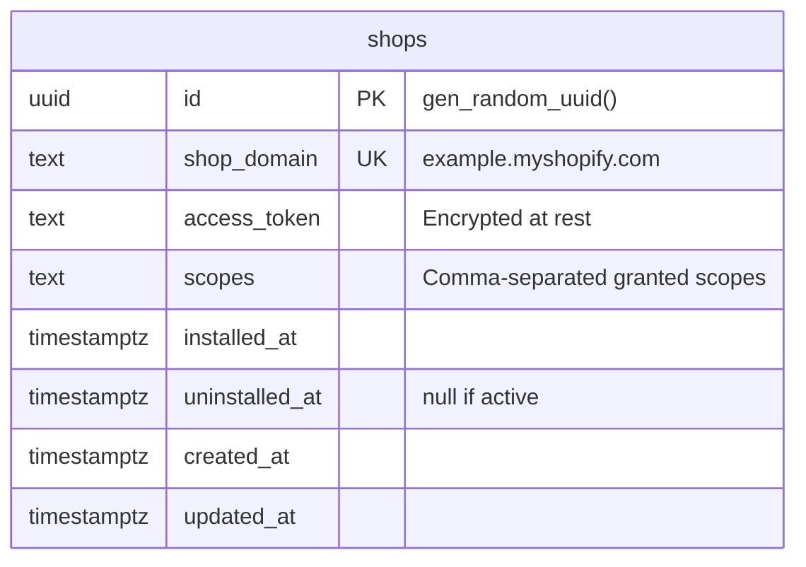
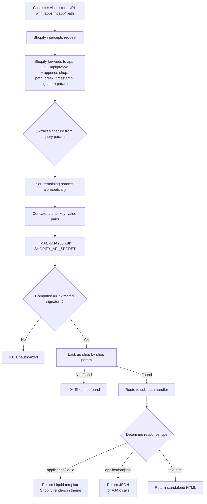
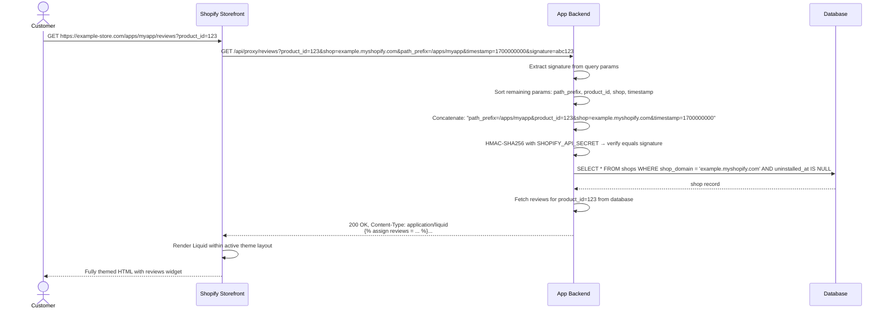
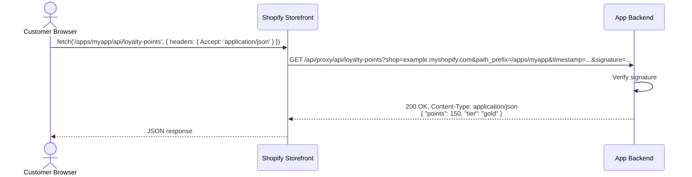
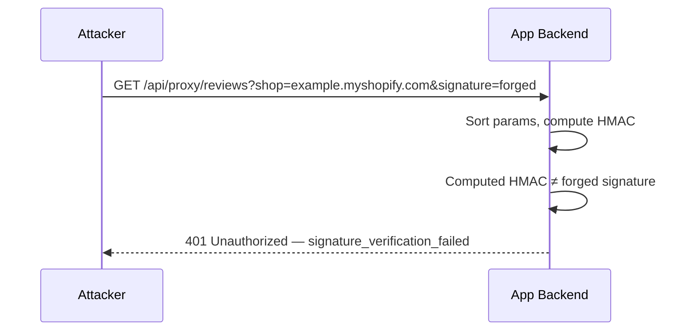

# Shopify App Proxy

## 1. Overview

### Problem Statement

Shopify apps run in the admin iframe, but merchants often need app-generated content surfaced on their storefront — a loyalty widget, a review feed, a custom form. The App Proxy is Shopify's mechanism for this: Shopify forwards storefront requests to the app, and the app responds with HTML, JSON, or Liquid that Shopify renders within the active theme. Without App Proxy, apps have no legitimate way to inject dynamic content into the merchant's storefront under the store's own domain.

### User Stories

- **Merchant**: I want my app's product review widget to appear on my storefront under my store's domain, not a third-party URL
- **Merchant**: I want customers to be able to submit forms (loyalty sign-up, custom inquiries) powered by the app, from within my theme
- **Developer**: I want to serve Liquid templates that access theme context (cart, shop, customer) without managing a separate frontend deployment
- **Developer**: I want AJAX calls from theme JavaScript to hit a secure, Shopify-verified endpoint and get JSON back

### When to use this block

- App needs to surface content on the storefront (not just the admin)
- User mentions: "storefront widget", "liquid template", "app proxy", "theme integration", "/apps/ URL"
- App needs to serve content under the merchant's own domain via Shopify's proxy infrastructure

### When NOT to use

- Content only needed in the admin — use Admin API / embedded app instead
- Building a Headless storefront — use Storefront API directly
- Need customer authentication on the proxied endpoint — App Proxy requests are always public; use Storefront API + customer tokens instead

---

## 2. Data Model

No new tables. This block uses the `shops` table from `auth.shopify-oauth` to look up shop records by the `shop` query parameter Shopify forwards with every proxy request.



### Shop Lookup

Every proxy request includes `shop=example.myshopify.com` as a query parameter. After signature verification, the handler looks up the shop:

```sql
SELECT * FROM shops WHERE shop_domain = $1 AND uninstalled_at IS NULL
```

---

## 3. Data Flow



---

## 4. Sequence Diagrams

### Proxy Request — Happy Path (Liquid response)



### Proxy Request — AJAX JSON Response



### Proxy Request — Invalid Signature



---

## 5. State Management

This block is backend-only. No client-side state — the proxy is a request/response cycle.

| State | Storage | Survives Reload | Notes |
|-------|---------|-----------------|-------|
| Shop context | Database (`shops` table, read-only) | Yes | Looked up per-request by `shop` param |
| Response cache | HTTP cache headers | Configurable | Set `Cache-Control: s-maxage=APP_PROXY_CACHE_TTL` |

### Cache Strategy

Proxy responses can be cached by Shopify's CDN. Cache keys must include `shop` to prevent cross-shop cache poisoning. Dynamic user-specific content should set `Cache-Control: no-store`.

---

## 6. Integration Points

### Inbound

| Caller | How | Purpose |
|--------|-----|---------|
| Shopify Storefront (proxy) | GET /api/proxy/* | Customer visits /apps/{subpath}/* on storefront |
| Theme JavaScript | GET /api/proxy/* via fetch | AJAX call from storefront theme code |

### Outbound

| Target | How | Purpose |
|--------|-----|---------|
| Database | SQL | Look up shop record by domain |
| Internal data sources | Function calls | Fetch content to render (e.g., reviews, loyalty data) |

### Events

| Event | Payload | When |
|-------|---------|------|
| `proxy.request_received` | `{ shopDomain, path, queryParams }` | Valid signature verified, before processing |
| `proxy.request_served` | `{ shopDomain, path, responseType, durationMs }` | Response sent successfully |

### Shopify Partner Dashboard Setup

The app proxy must be configured in the Shopify Partner Dashboard before requests are forwarded:

1. App setup → App proxy
2. Set subpath (e.g., `myapp`) — storefront URL becomes `/apps/myapp/*`
3. Set proxy URL (e.g., `https://myapp.com/api/proxy`)
4. Shopify forwards requests with `shop`, `path_prefix`, `timestamp`, `signature` appended

---

## 7. Configuration Surface

| Key | Type | Default | Description |
|-----|------|---------|-------------|
| `APP_PROXY_SUBPATH` | `string` | required | Base path for proxy handler (e.g., `/api/proxy`) |
| `APP_PROXY_CACHE_TTL` | `number` | `300` | Cache TTL in seconds for proxy responses (`s-maxage`) |
| `SHOPIFY_API_SECRET` | `string` | required | Used for HMAC signature verification (from `auth.shopify-oauth`) |
