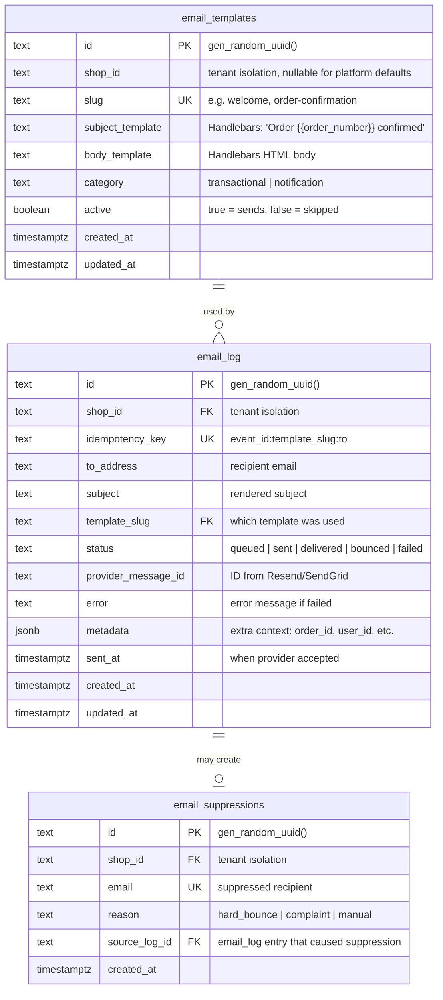
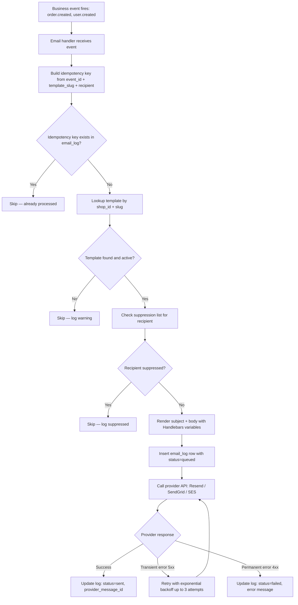
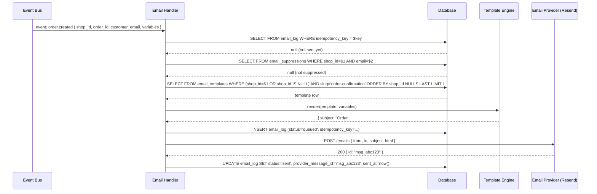
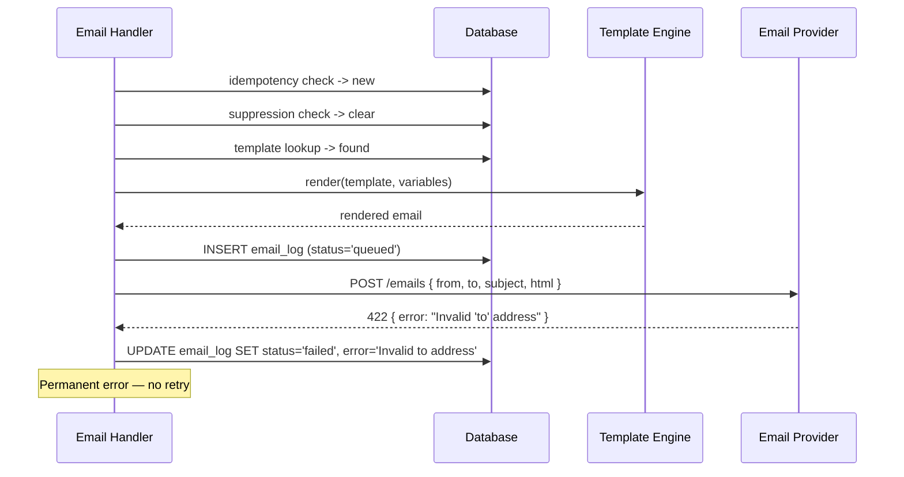
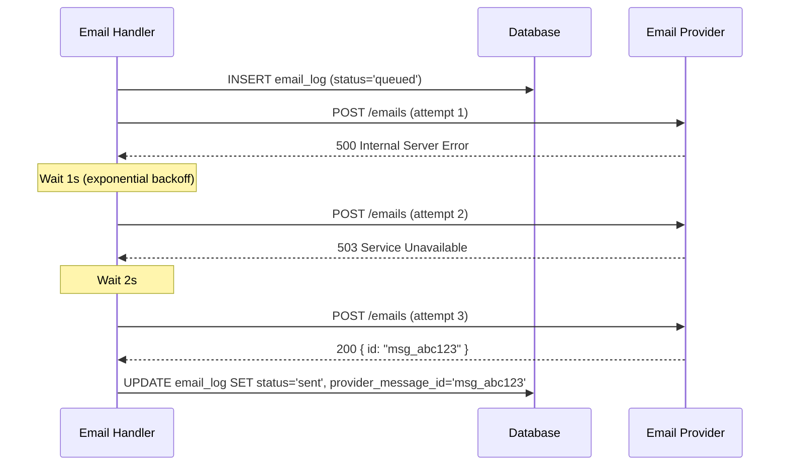

# Send Transactional Email

## 1. Overview

### Problem Statement

Merchant apps need to send transactional emails triggered by business events: order confirmations, welcome emails, shipping notifications, password resets. Each email uses a pre-defined template with dynamic variables filled at send time. The system must reliably deliver emails, handle provider failures with retries, log every send attempt, and prevent duplicate sends.

### User Stories

- **End user**: I place an order and receive a confirmation email within seconds
- **End user**: I sign up and receive a welcome email with onboarding info
- **End user**: My order ships and I receive a tracking notification email
- **Merchant admin**: I create and edit email templates with subject/body using variables like `{{customer_name}}`
- **Merchant admin**: I preview a template with sample data before activating it
- **Merchant admin**: I deactivate a template to stop that email type without deleting it
- **Merchant admin**: I see a log of all sent emails with delivery status (delivered, bounced, failed)

### When to use this block

- User says: "email", "send email", "transactional email", "order confirmation", "welcome email", "notification email"
- App needs event-driven email notifications (order placed, user signed up, item shipped)
- Merchant wants to manage email templates through admin UI

### When NOT to use

- Marketing/bulk email campaigns (newsletter blasts) -> dedicated marketing email block
- SMS or push notifications -> separate notification channel blocks
- In-app notifications only (no email) -> skip

---

## 2. Data Model



### Table: `email_templates`

| Column | Type | Constraints | Notes |
|--------|------|-------------|-------|
| `id` | `text` | PK, default `gen_random_uuid()` | |
| `shop_id` | `text` | nullable | NULL = platform default template; non-null = merchant override |
| `slug` | `text` | NOT NULL | Unique per `(shop_id, slug)` |
| `subject_template` | `text` | NOT NULL | Handlebars template |
| `body_template` | `text` | NOT NULL | Handlebars HTML template |
| `category` | `text` | NOT NULL, default `'transactional'` | `transactional` or `notification` |
| `active` | `boolean` | NOT NULL, default `true` | Inactive = sends skipped |
| `created_at` | `timestamptz` | NOT NULL, default `now()` | |
| `updated_at` | `timestamptz` | NOT NULL, default `now()` | |

**Template resolution order**: lookup by `(shop_id, slug)` first; if no match, fallback to `(NULL, slug)` for platform default.

### Table: `email_log`

| Column | Type | Constraints | Notes |
|--------|------|-------------|-------|
| `id` | `text` | PK, default `gen_random_uuid()` | |
| `shop_id` | `text` | NOT NULL | Tenant isolation |
| `idempotency_key` | `text` | UNIQUE, NOT NULL | `${event_id}:${template_slug}:${to}` |
| `to_address` | `text` | NOT NULL | Recipient email |
| `subject` | `text` | NOT NULL | Rendered subject |
| `template_slug` | `text` | NOT NULL | Which template was used |
| `status` | `text` | NOT NULL, default `'queued'` | `queued` -> `sent` -> `delivered` / `bounced` / `failed` |
| `provider_message_id` | `text` | nullable | Returned by provider on accept |
| `error` | `text` | nullable | Error message on failure |
| `metadata` | `jsonb` | nullable | Context: `{ order_id, user_id }` |
| `sent_at` | `timestamptz` | nullable | When provider accepted the email |
| `created_at` | `timestamptz` | NOT NULL, default `now()` | |
| `updated_at` | `timestamptz` | NOT NULL, default `now()` | |

### Table: `email_suppressions`

| Column | Type | Constraints | Notes |
|--------|------|-------------|-------|
| `id` | `text` | PK, default `gen_random_uuid()` | |
| `shop_id` | `text` | NOT NULL | Tenant isolation |
| `email` | `text` | NOT NULL | Unique per `(shop_id, email)` |
| `reason` | `text` | NOT NULL | `hard_bounce`, `complaint`, `manual` |
| `source_log_id` | `text` | FK -> email_log.id, nullable | Log entry that triggered suppression |
| `created_at` | `timestamptz` | NOT NULL, default `now()` | |

### Migration (reference)

```sql
CREATE TABLE IF NOT EXISTS email_templates (
  id text PRIMARY KEY DEFAULT gen_random_uuid()::text,
  shop_id text,
  slug text NOT NULL,
  subject_template text NOT NULL,
  body_template text NOT NULL,
  category text NOT NULL DEFAULT 'transactional',
  active boolean NOT NULL DEFAULT true,
  created_at timestamptz NOT NULL DEFAULT now(),
  updated_at timestamptz NOT NULL DEFAULT now(),
  UNIQUE (shop_id, slug)
);

CREATE TABLE IF NOT EXISTS email_log (
  id text PRIMARY KEY DEFAULT gen_random_uuid()::text,
  shop_id text NOT NULL,
  idempotency_key text UNIQUE NOT NULL,
  to_address text NOT NULL,
  subject text NOT NULL,
  template_slug text NOT NULL,
  status text NOT NULL DEFAULT 'queued',
  provider_message_id text,
  error text,
  metadata jsonb,
  sent_at timestamptz,
  created_at timestamptz NOT NULL DEFAULT now(),
  updated_at timestamptz NOT NULL DEFAULT now()
);

CREATE TABLE IF NOT EXISTS email_suppressions (
  id text PRIMARY KEY DEFAULT gen_random_uuid()::text,
  shop_id text NOT NULL,
  email text NOT NULL,
  reason text NOT NULL,
  source_log_id text REFERENCES email_log(id),
  created_at timestamptz NOT NULL DEFAULT now(),
  UNIQUE (shop_id, email)
);

CREATE INDEX idx_email_templates_shop_slug ON email_templates(shop_id, slug);
CREATE INDEX idx_email_log_shop_id ON email_log(shop_id);
CREATE INDEX idx_email_log_status ON email_log(status) WHERE status IN ('queued', 'sent');
CREATE INDEX idx_email_log_to ON email_log(to_address, shop_id);
CREATE INDEX idx_email_suppressions_lookup ON email_suppressions(shop_id, email);
```

---

## 3. Data Flow



---

## 4. Sequence Diagrams

### Happy Path: Event triggers email send



### Error Path: Provider rejects the request



### Retry Path: Transient failure with exponential backoff



---

## 5. State Management

| State | Storage | Notes |
|-------|---------|-------|
| Template cache | In-memory Map, TTL 5 min | Keyed by `(shop_id, slug)`. Invalidate on template CRUD |
| Send queue | Database (`email_log` rows with `status='queued'`) | Persistent, survives restarts |
| Delivery status | Database (`email_log.status`) | Updated by provider webhook |
| Suppression list | Database (`email_suppressions`) | Checked before every send |

### Email status transitions

```
queued → sent → delivered
                → bounced → (auto-add to suppressions if hard bounce)
       → failed (permanent provider error, max retries exceeded)
```

---

## 6. Integration Points

### Inbound (events this block listens to)

| Event | Source | Template slug | Variables |
|-------|--------|---------------|-----------|
| `order.created` | Order block | `order-confirmation` | `customer_name, order_number, order_total, line_items, order_url` |
| `user.created` | Auth block | `welcome` | `user_name, user_email, login_url` |
| `order.shipped` | Fulfillment block | `shipping-notification` | `customer_name, tracking_number, tracking_url, carrier` |
| `password.reset_requested` | Auth block | `password-reset` | `user_name, reset_url, expires_in_minutes` |

### Outbound (events this block emits)

| Event | Payload | When |
|-------|---------|------|
| `email.sent` | `{ log_id, shop_id, to, template_slug, provider_message_id }` | Provider accepted the email |
| `email.delivered` | `{ log_id, shop_id, to }` | Provider webhook confirms delivery |
| `email.bounced` | `{ log_id, shop_id, to, bounce_type }` | Provider webhook reports bounce |
| `email.failed` | `{ log_id, shop_id, to, error }` | Permanent send failure |

### Provider Webhooks (inbound from email provider)

| Provider | Webhook events | Purpose |
|----------|---------------|---------|
| Resend | `email.delivered`, `email.bounced`, `email.complained` | Update `email_log.status`, manage suppressions |
| SendGrid | Event Webhook (`delivered`, `bounce`, `spamreport`) | Same |

---

## 7. Configuration Surface

| Key | Type | Default | Description |
|-----|------|---------|-------------|
| `EMAIL_PROVIDER` | env var | `"resend"` | Provider choice: `resend`, `sendgrid`, `ses` |
| `EMAIL_PROVIDER_API_KEY` | env var | (required) | Provider API key |
| `FROM_EMAIL` | env var | (required) | Sender email address (must be verified with provider) |
| `FROM_NAME` | env var | `""` | Sender display name |
| `REPLY_TO` | env var | `""` | Reply-to address (optional) |
| `EMAIL_RATE_LIMIT_PER_SHOP` | number | `100` | Max emails per shop per hour |
| `EMAIL_RATE_LIMIT_PER_RECIPIENT` | number | `10` | Max emails per recipient per hour (anti-spam) |
| `EMAIL_MAX_RETRIES` | number | `3` | Max retry attempts for transient failures |
| `EMAIL_RETRY_BASE_DELAY_MS` | number | `1000` | Base delay for exponential backoff |
| `EMAIL_WEBHOOK_SECRET` | env var | (required if provider supports webhook signing) | HMAC secret for verifying provider webhooks |
