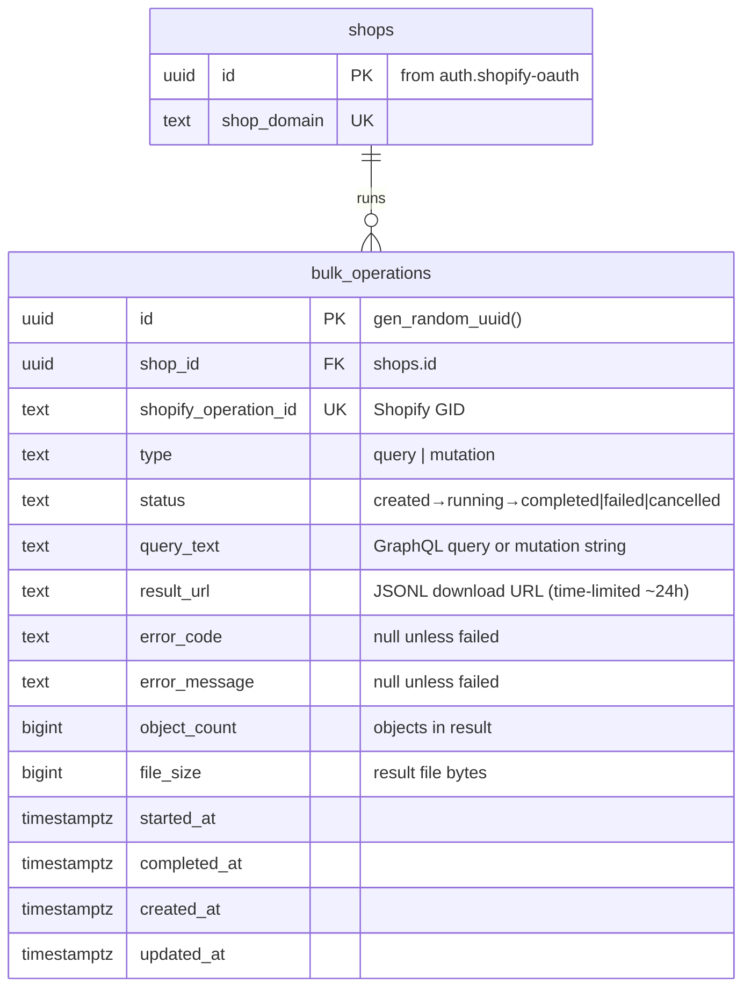
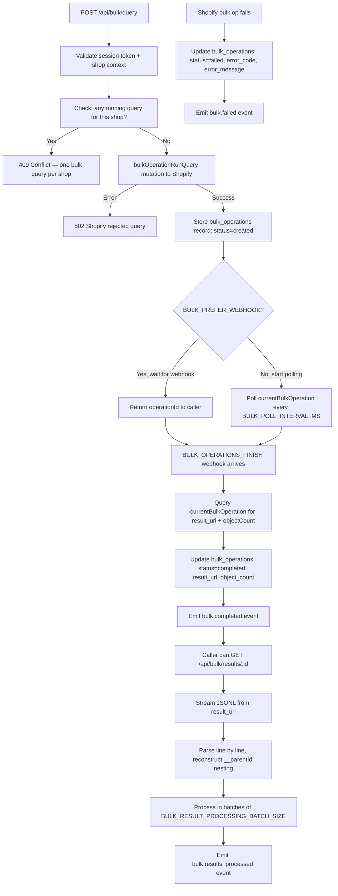
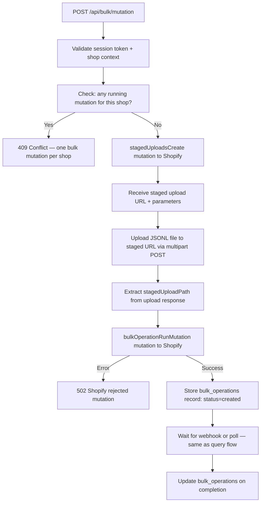
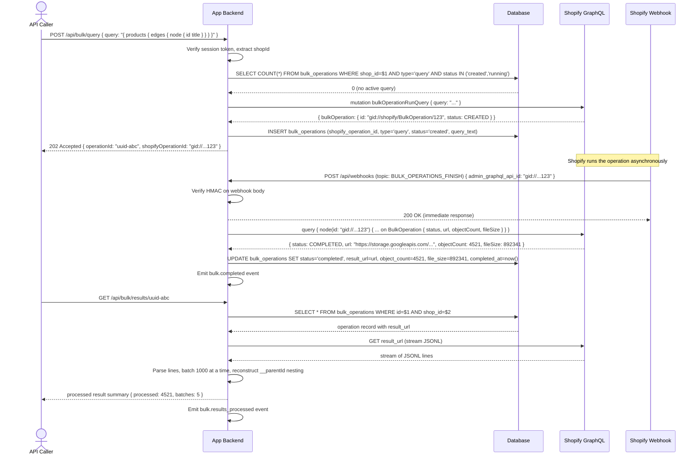
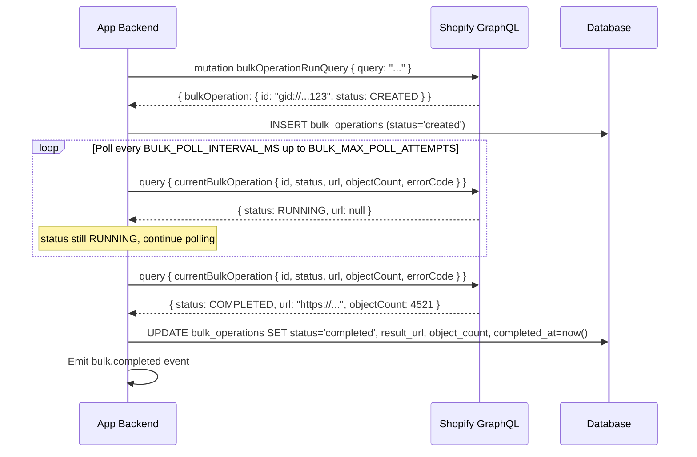
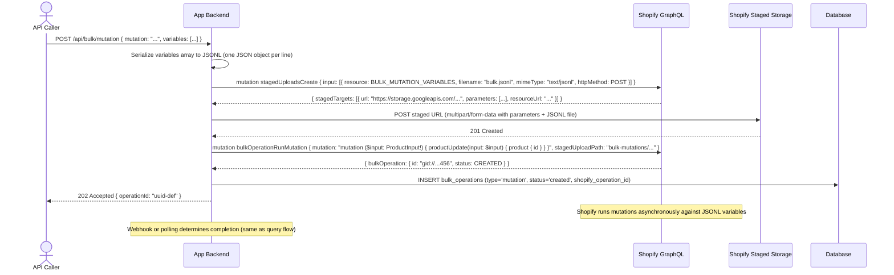
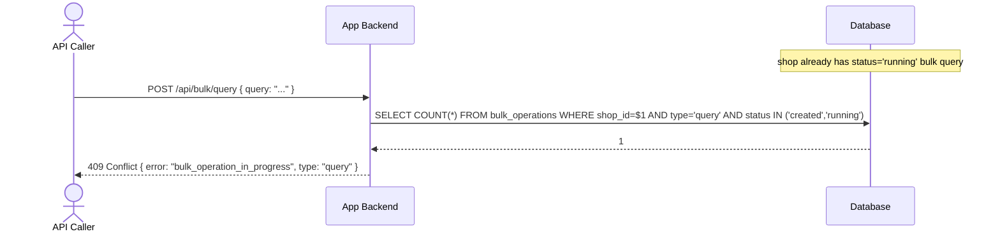

# Shopify Bulk Operations

## 1. Overview

### Problem Statement

Shopify's standard GraphQL API is rate-limited and paginated — fetching 100,000 products requires hundreds of requests over many minutes. Bulk operations solve this by running a query or mutation asynchronously on Shopify's infrastructure, then making the full result available as a JSONL download. Without bulk operations, any app that needs to process large datasets (catalog exports, price updates, inventory syncs) is forced into slow, expensive polling loops that exhaust rate limits.

### User Stories

- **Developer**: I want to export all products and their variants so I can sync them to an external system without hitting rate limits
- **Developer**: I want to update prices for thousands of product variants in a single operation rather than looping individual mutations
- **Developer**: I want to know when a bulk operation completes so I can process the results immediately (via webhook)
- **Developer**: I want to parse JSONL results efficiently, including nested objects that use the `__parentId` convention
- **Merchant / App**: I want bulk imports and exports to complete reliably without timing out or losing data mid-process

### When to use this block

- App needs to read or write more than a few hundred records at once
- User mentions: "bulk export", "bulk import", "bulk update", "large dataset", "JSONL", "bulkOperationRunQuery", "bulkOperationRunMutation"
- App needs to sync full Shopify catalog to an external system
- App needs to update prices, inventory, or metafields for thousands of products

### When NOT to use

- Fetching fewer than ~200 records — use paginated GraphQL queries instead
- Real-time operations that need an immediate response — bulk ops are async (minutes to hours)
- Operations that need per-record error handling — bulk mutation errors are aggregated, not per-line

---

## 2. Data Model



### Table: `bulk_operations`

| Column | Type | Constraints | Notes |
|--------|------|-------------|-------|
| `id` | `uuid` | PK, default `gen_random_uuid()` | |
| `shop_id` | `uuid` | NOT NULL, FK `shops.id` ON DELETE CASCADE | |
| `shopify_operation_id` | `text` | UNIQUE, nullable | Shopify GID — null until Shopify accepts the operation |
| `type` | `text` | NOT NULL | `'query'` or `'mutation'` |
| `status` | `text` | NOT NULL, default `'created'` | State machine: `created → running → completed \| failed \| cancelled` |
| `query_text` | `text` | NOT NULL | The full GraphQL query or mutation string |
| `result_url` | `text` | nullable | JSONL download URL — set on completion, time-limited (~24h) |
| `error_code` | `text` | nullable | Shopify error code if status is `failed` |
| `error_message` | `text` | nullable | Human-readable error if status is `failed` |
| `object_count` | `bigint` | nullable | Number of objects in the JSONL result |
| `file_size` | `bigint` | nullable | Result file size in bytes |
| `started_at` | `timestamptz` | nullable | When Shopify moved to `RUNNING` status |
| `completed_at` | `timestamptz` | nullable | When Shopify moved to terminal status |
| `created_at` | `timestamptz` | NOT NULL, default `now()` | |
| `updated_at` | `timestamptz` | NOT NULL, default `now()` | |

### Migration (reference)

```sql
CREATE TABLE IF NOT EXISTS bulk_operations (
  id                   uuid PRIMARY KEY DEFAULT gen_random_uuid(),
  shop_id              uuid NOT NULL REFERENCES shops(id) ON DELETE CASCADE,
  shopify_operation_id text UNIQUE,
  type                 text NOT NULL CHECK (type IN ('query', 'mutation')),
  status               text NOT NULL DEFAULT 'created'
                            CHECK (status IN ('created', 'running', 'completed', 'failed', 'cancelled')),
  query_text           text NOT NULL,
  result_url           text,
  error_code           text,
  error_message        text,
  object_count         bigint,
  file_size            bigint,
  started_at           timestamptz,
  completed_at         timestamptz,
  created_at           timestamptz NOT NULL DEFAULT now(),
  updated_at           timestamptz NOT NULL DEFAULT now()
);

CREATE INDEX idx_bulk_shop ON bulk_operations(shop_id);
CREATE INDEX idx_bulk_status ON bulk_operations(shop_id, status);
CREATE INDEX idx_bulk_shopify_id ON bulk_operations(shopify_operation_id) WHERE shopify_operation_id IS NOT NULL;
```

---

## 3. Data Flow

### Bulk Query Flow



### Bulk Mutation Flow



---

## 4. Sequence Diagrams

### Bulk Query — Webhook Completion (happy path)



### Bulk Query — Polling Completion



### Bulk Mutation — Staged Upload + Submit



### Conflict — Concurrent Bulk Operation Attempt



---

## 5. State Management

This block is backend-only. No frontend state.

| State | Storage | Survives Reload | Notes |
|-------|---------|-----------------|-------|
| `bulk_operations` record | Database | Yes | Persistent record of all submitted operations |
| `result_url` | Database | Yes (~24h) | Time-limited URL from Shopify — must process before expiry |
| Polling loop | In-memory / job queue | No | Restarted if server restarts; webhook mode is more resilient |

### Status State Machine

```
created   → running    (Shopify starts processing)
running   → completed  (Shopify finishes, result_url available)
running   → failed     (Shopify error, error_code + error_message set)
running   → cancelled  (app called cancel or merchant cancelled in admin)
```

Terminal states: `completed`, `failed`, `cancelled`

### One-per-Shop Constraint

Shopify enforces at most 1 active bulk query and 1 active bulk mutation per shop simultaneously. The app mirrors this constraint by rejecting new submissions when a `created` or `running` operation of the same type exists for the shop.

---

## 6. Integration Points

### Inbound

| Caller | How | Purpose |
|--------|-----|---------|
| Embedded app / backend job | POST /api/bulk/query | Submit a bulk query |
| Embedded app / backend job | POST /api/bulk/mutation | Submit a bulk mutation |
| Embedded app / backend job | GET /api/bulk/status/:id | Poll operation status |
| Embedded app / backend job | GET /api/bulk/results/:id | Retrieve and process results |
| Shopify webhook system | POST /api/webhooks (BULK_OPERATIONS_FINISH) | Completion notification |

### Outbound

| Target | How | Purpose |
|--------|-----|---------|
| Shopify GraphQL Admin API | `bulkOperationRunQuery` mutation | Submit bulk query |
| Shopify GraphQL Admin API | `bulkOperationRunMutation` mutation | Submit bulk mutation |
| Shopify GraphQL Admin API | `stagedUploadsCreate` mutation | Get staged upload URL for mutation variables |
| Shopify GraphQL Admin API | `currentBulkOperation` query | Poll operation status |
| Shopify staged storage (GCS) | Multipart POST | Upload JSONL mutation variables |
| Shopify result URL (GCS) | GET (stream) | Download JSONL results |
| Database | SQL | Track operation records |

### Events

| Event | Payload | When |
|-------|---------|------|
| `bulk.started` | `{ operationId, shopId, type, shopifyOperationId }` | Shopify accepts the operation |
| `bulk.completed` | `{ operationId, shopId, type, objectCount, fileSize, resultUrl }` | Operation reaches `completed` status |
| `bulk.failed` | `{ operationId, shopId, type, errorCode, errorMessage }` | Operation reaches `failed` status |
| `bulk.results_processed` | `{ operationId, shopId, processedCount, batchCount }` | All JSONL lines processed |

---

## 7. Configuration Surface

| Key | Type | Default | Description |
|-----|------|---------|-------------|
| `BULK_PREFER_WEBHOOK` | `boolean` | `true` | Use `BULK_OPERATIONS_FINISH` webhook instead of polling for completion |
| `BULK_POLL_INTERVAL_MS` | `number` | `2000` | Milliseconds between polling attempts (when not using webhook) |
| `BULK_MAX_POLL_ATTEMPTS` | `number` | `500` | Max poll attempts before treating operation as timed-out (~16 min at 2s interval) |
| `BULK_RESULT_PROCESSING_BATCH_SIZE` | `number` | `1000` | JSONL lines to process per batch (controls memory footprint) |
