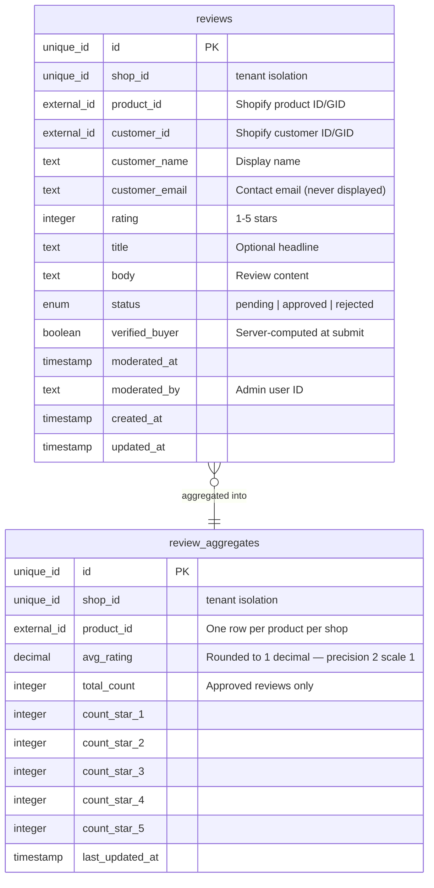
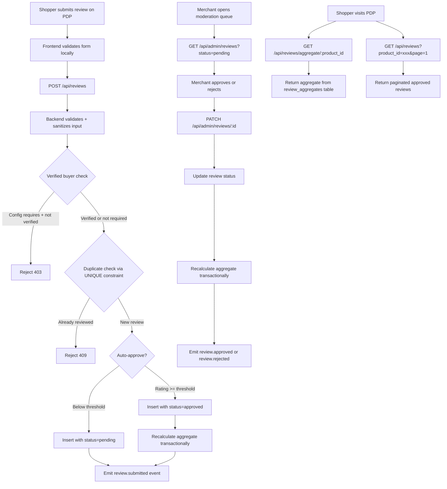
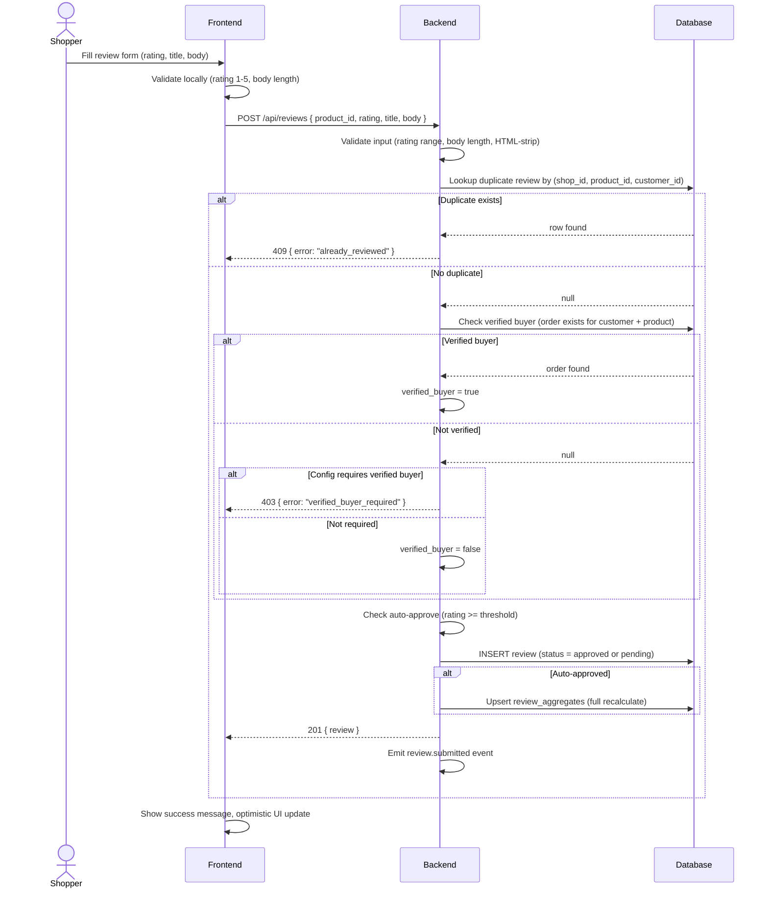
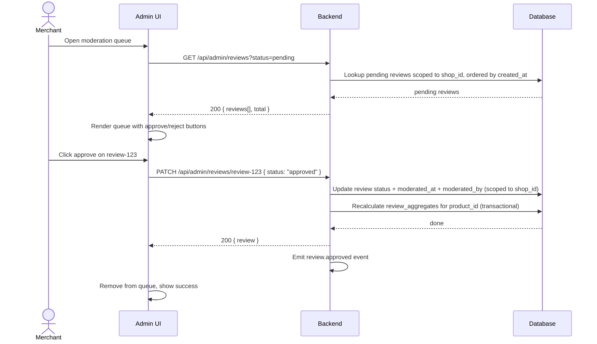
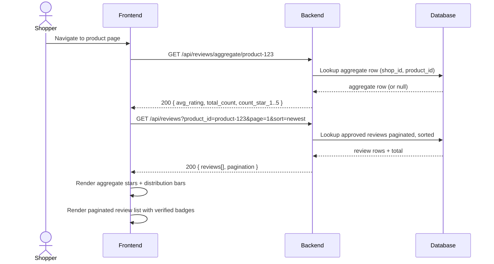

# Product Reviews

## 1. Overview

### Problem Statement

Social proof drives conversion. Shoppers trust other shoppers more than marketing copy — a product with 50 reviews at 4.3 stars converts measurably better than one with zero reviews. Merchants need a way for shoppers to submit reviews, a moderation workflow to filter spam/abuse, and a storefront display that shows aggregate ratings + individual reviews on product pages.

### User Stories

- **Shopper**: I purchased a product, I want to leave a star rating and written review so other shoppers can benefit from my experience
- **Shopper**: I'm browsing a product page, I want to see the average rating, star distribution, and read individual reviews so I can make an informed purchase decision
- **Merchant**: I want to moderate reviews before they appear publicly so I can filter spam, abuse, or off-topic content
- **Merchant**: I want verified buyer badges on reviews so shoppers trust the authenticity
- **Merchant**: I want high-rating reviews to auto-approve so I spend less time on moderation

### When to use this block

- User mentions: "reviews", "ratings", "social proof", "product feedback", "star rating", "UGC"
- App needs product page enrichment with customer opinions
- Merchant wants moderation control over user-generated content

### When NOT to use

- Merchant wants Q&A on products (not ratings/reviews) → block: `ugc.product-qa`
- Merchant wants site-wide testimonials (not product-specific) → block: `ugc.testimonials`
- Merchant wants photo/video reviews only → extend this block with media upload

---

## 2. Data Model

> Types dưới đây là **logical types** (canonical mapping ở `docs/SPEC_GUIDELINES.md` mục 5). Reference SQL dialect-specific ở mục [Reference Migration](#reference-migration-postgres) cuối section này.



### Table: `reviews`

| Column | Logical Type | Constraints | Notes |
|--------|------|-------------|-------|
| `id` | `unique_id` | PK | distributed-safe ID |
| `shop_id` | `unique_id` | NOT NULL, indexed | Tenant isolation |
| `product_id` | `external_id` | NOT NULL | Shopify product ID/GID |
| `customer_id` | `external_id` | NOT NULL | Shopify customer ID/GID |
| `customer_name` | `text` | NOT NULL | Display name shown on review |
| `customer_email` | `text` | NOT NULL | Stored for merchant contact; **never returned in public APIs** |
| `rating` | `integer` | NOT NULL, CHECK `1 ≤ rating ≤ 5` | Star rating |
| `title` | `text` | nullable | Optional headline (≤200 chars, HTML-stripped) |
| `body` | `text` | NOT NULL | Review content (`MIN_BODY_LENGTH..MAX_BODY_LENGTH`, HTML-stripped) |
| `status` | `enum` | NOT NULL, default `pending` | one of: `pending`, `approved`, `rejected` |
| `verified_buyer` | `boolean` | NOT NULL, default `false` | **Server-computed** at submit time — never accepted from client |
| `moderated_at` | `timestamp` | nullable | Set on approve/reject |
| `moderated_by` | `text` | nullable | Admin user ID or `system` for auto-approve |
| `created_at` | `timestamp` | NOT NULL, default = now | UTC instant |
| `updated_at` | `timestamp` | NOT NULL, default = now | UTC instant |

**Indexes**: `shop_id`; `(shop_id, product_id, status)` for storefront list; partial `(shop_id, status, created_at) WHERE status = 'pending'` for moderation queue.
**UNIQUE**: `(shop_id, product_id, customer_id)` — one review per customer per product per shop.

### Table: `review_aggregates`

Denormalized table (not materialized view) — updated transactionally on each approve/reject. This avoids refresh-overhead and staleness windows that hurt PDP latency. Trade-off: slight write overhead on moderation actions, but moderation is low-frequency compared to PDP reads.

| Column | Logical Type | Constraints | Notes |
|--------|------|-------------|-------|
| `id` | `unique_id` | PK | |
| `shop_id` | `unique_id` | NOT NULL | Tenant isolation |
| `product_id` | `external_id` | NOT NULL | Shopify product ID/GID |
| `avg_rating` | `decimal` | NOT NULL, default `0`, precision 2 scale 1 | Range `0.0..5.0`, rounded to 1 decimal place |
| `total_count` | `integer` | NOT NULL, default `0` | Count of approved reviews |
| `count_star_1` | `integer` | NOT NULL, default `0` | |
| `count_star_2` | `integer` | NOT NULL, default `0` | |
| `count_star_3` | `integer` | NOT NULL, default `0` | |
| `count_star_4` | `integer` | NOT NULL, default `0` | |
| `count_star_5` | `integer` | NOT NULL, default `0` | |
| `last_updated_at` | `timestamp` | NOT NULL, default = now | UTC instant |

**UNIQUE**: `(shop_id, product_id)` — one aggregate row per product per shop.

### Aggregate Rating Calculation Rule

- `avg_rating = AVG(rating)` over reviews where `status = 'approved'`, rounded to **1 decimal place** (e.g. `4.23` → `4.2`)
- `total_count = COUNT(*)` over reviews where `status = 'approved'`
- `count_star_N = COUNT(*)` over reviews where `status = 'approved' AND rating = N` for N in 1..5
- Recalculation is **full recompute** from `reviews` (not increment/decrement) — race-free, drift-proof
- Recalculated transactionally with the moderation status change

### Reference Migration (Postgres)

<!-- REFERENCE: dialect=postgres -->
<!-- ADAPT: cho MySQL/SQLite — map theo bảng Logical Types ở docs/SPEC_GUIDELINES.md mục 5:
       - `text PRIMARY KEY DEFAULT gen_random_uuid()::text` → MySQL `CHAR(36) PRIMARY KEY` + UUID() default; SQLite `TEXT PRIMARY KEY` + uuid4 ở app layer
       - `timestamptz` → MySQL `DATETIME(6)`; SQLite `TEXT` ISO 8601 với `Z` suffix
       - `numeric(2,1)` → MySQL `DECIMAL(2,1)`; SQLite `NUMERIC`
       - `boolean` → MySQL `TINYINT(1)`; SQLite `INTEGER 0/1`
       - `COUNT(*) FILTER (WHERE ...)` (Postgres) → MySQL/SQLite `SUM(CASE WHEN ... THEN 1 ELSE 0 END)`
       - Partial index `WHERE status = 'pending'`: postgres + SQLite; MySQL dùng full index (chấp nhận overhead nhỏ)
       - `CHECK (rating BETWEEN 1 AND 5)`: phổ thông SQL — giữ nguyên -->

Table `reviews`:

```sql
CREATE TABLE IF NOT EXISTS reviews (
  id text PRIMARY KEY DEFAULT gen_random_uuid()::text,
  shop_id text NOT NULL,
  product_id text NOT NULL,
  customer_id text NOT NULL,
  customer_name text NOT NULL,
  customer_email text NOT NULL,
  rating integer NOT NULL CHECK (rating BETWEEN 1 AND 5),
  title text,
  body text NOT NULL,
  status text NOT NULL DEFAULT 'pending'
         CHECK (status IN ('pending','approved','rejected')),
  verified_buyer boolean NOT NULL DEFAULT false,
  moderated_at timestamptz,
  moderated_by text,
  created_at timestamptz NOT NULL DEFAULT now(),
  updated_at timestamptz NOT NULL DEFAULT now()
);
CREATE INDEX idx_reviews_shop_id ON reviews(shop_id);
CREATE INDEX idx_reviews_product_status ON reviews(shop_id, product_id, status);
CREATE INDEX idx_reviews_moderation_queue
  ON reviews(shop_id, status, created_at) WHERE status = 'pending';
CREATE UNIQUE INDEX idx_reviews_unique_per_customer
  ON reviews(shop_id, product_id, customer_id);
```

Table `review_aggregates`:

```sql
CREATE TABLE IF NOT EXISTS review_aggregates (
  id text PRIMARY KEY DEFAULT gen_random_uuid()::text,
  shop_id text NOT NULL,
  product_id text NOT NULL,
  avg_rating numeric(2,1) NOT NULL DEFAULT 0,
  total_count integer NOT NULL DEFAULT 0,
  count_star_1 integer NOT NULL DEFAULT 0,
  count_star_2 integer NOT NULL DEFAULT 0,
  count_star_3 integer NOT NULL DEFAULT 0,
  count_star_4 integer NOT NULL DEFAULT 0,
  count_star_5 integer NOT NULL DEFAULT 0,
  last_updated_at timestamptz NOT NULL DEFAULT now()
);
CREATE UNIQUE INDEX idx_review_aggregates_product
  ON review_aggregates(shop_id, product_id);
```

---

## 3. Data Flow



---

## 4. Sequence Diagrams

### Submit Review (with verified buyer check)



### Moderate Review (approve/reject)



### Display Reviews on PDP



---

## 5. State Management

| State | Storage | Survives Reload | Notes |
|-------|---------|-----------------|-------|
| `aggregate` | In-memory (reactive) | No — fetched on PDP load | `{ avgRating, totalCount, countPerStar }` or `null` |
| `reviews` | In-memory (reactive) | No — fetched with pagination | `Review[]` |
| `pagination` | In-memory | No | `{ page, totalPages, totalCount }` |
| `sortOrder` | URL query param | Yes | `newest`, `highest`, `lowest` |
| `reviewForm` | In-memory | No | `{ rating, title, body }` |
| `formStatus` | In-memory | No | `idle`, `submitting`, `success`, `error` |
| `moderationQueue` | In-memory (admin) | No | `Review[]` with status filters |

### State transitions

```
PDP Load → fetch aggregate + fetch reviews page 1
  ├── Both succeed → render aggregate + review list
  ├── Aggregate empty → show "No reviews yet" + review form
  └── Error → show error state, retry button

Review Submit → formStatus=submitting → POST /api/reviews
  ├── 201 → formStatus=success → optimistic add to list (if auto-approved) → refetch aggregate
  ├── 409 → formStatus=error → "You already reviewed this product"
  ├── 403 → formStatus=error → "Only verified buyers can review"
  └── 422 → formStatus=error → show validation errors

Sort Change → update URL param → refetch reviews page 1

Page Change → fetch reviews page N → append or replace list
```

---

## 6. Integration Points

### Inbound

| Caller | How | Purpose |
|--------|-----|---------|
| Product page (PDP) | Component embed | Display aggregate + review list |
| Authenticated shopper | POST /api/reviews | Submit review |
| Admin panel | GET/PATCH /api/admin/reviews | Moderation queue |

### Outbound

| Target | How | Purpose |
|--------|-----|---------|
| Database | SQL | Reviews + aggregates CRUD |
| Orders data | Order lookup | Verified buyer check — does an order exist for this customer + product? |

### Events

| Event | Payload | When |
|-------|---------|------|
| `review.submitted` | `{ reviewId, shopId, productId, customerId, rating, status }` | Review created |
| `review.approved` | `{ reviewId, shopId, productId, rating }` | Merchant approves |
| `review.rejected` | `{ reviewId, shopId, productId }` | Merchant rejects |

### Verified Buyer Check Strategy

Synchronous lookup against the orders source at submit time. Logical query: does an order exist for this `shop_id` + `customer_id` that contains `product_id` in its line items? Result is stored as `verified_buyer` boolean on the review row — not re-checked later.

Trade-off: if a customer returns the product after reviewing, the badge persists. Acceptable because post-return badge removal adds complexity with minimal UX benefit, and the review content remains valid.

---

## 7. Configuration Surface

| Key | Type | Default | Description |
|-----|------|---------|-------------|
| `REQUIRE_VERIFIED_BUYER` | `boolean` | `false` | Reject reviews from non-buyers when true |
| `AUTO_APPROVE_THRESHOLD` | `number` | `0` (disabled) | Ratings ≥ this value auto-approve. Set 4 or 5 to auto-approve positive reviews. `0` = all reviews go to moderation queue |
| `MIN_BODY_LENGTH` | `number` | `10` | Minimum characters for review body |
| `MAX_BODY_LENGTH` | `number` | `5000` | Maximum characters for review body |
| `REVIEWS_PER_PAGE` | `number` | `10` | Pagination size for storefront display |
| `DEFAULT_SORT` | `string` | `"newest"` | Default sort order: `newest`, `highest`, `lowest` |
| `REVIEW_SUBMIT_RATE_LIMIT` | `number` | `5` | Max submissions per customer per hour (anti-spam) |
