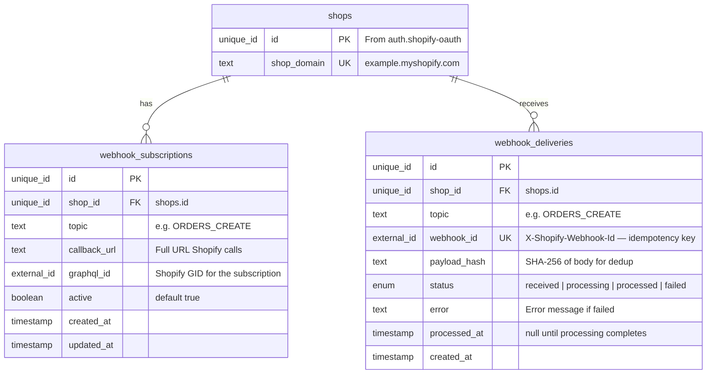
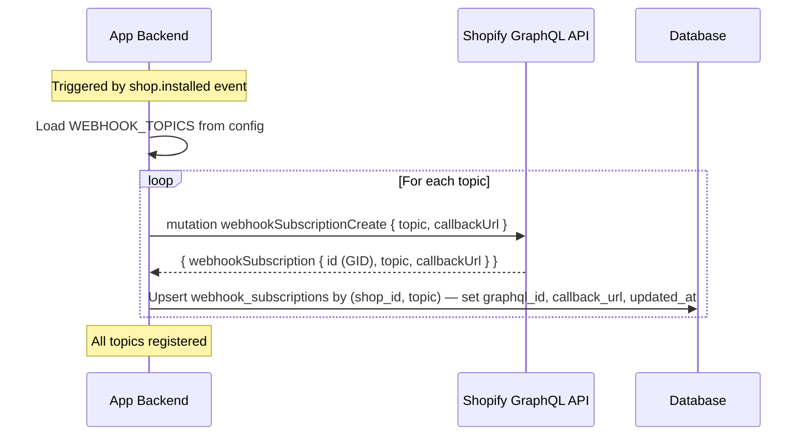
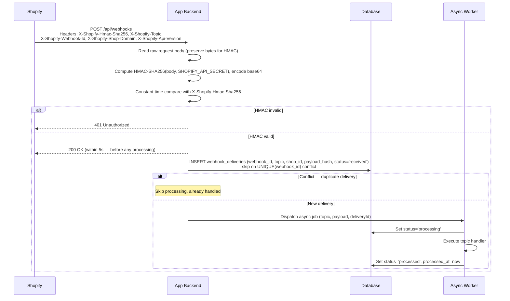
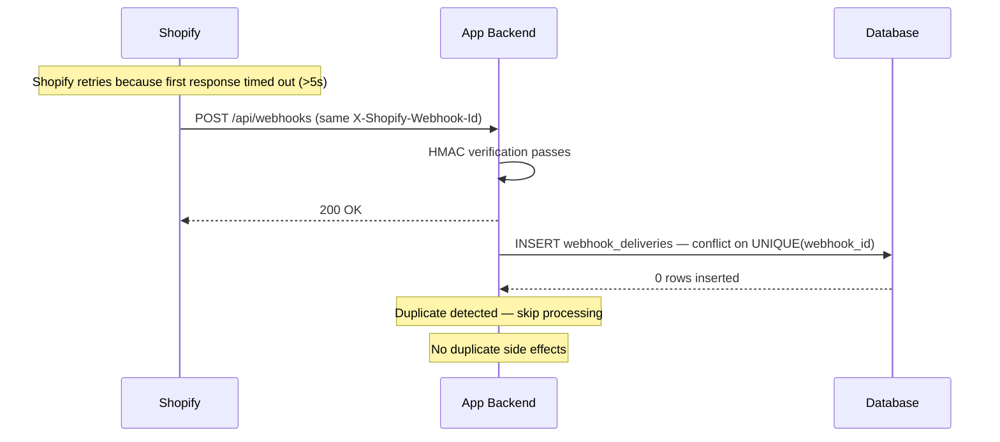

# Shopify Webhook Management

## 1. Overview

### Problem Statement

Shopify apps need real-time event notifications when things change in a merchant's store — orders placed, products updated, customers created, app uninstalled. Without webhooks, the app must poll the Admin API constantly, burning rate limit budget and adding latency. The webhook system is the event backbone: register once per shop, receive push notifications for all configured topics, verify every delivery with HMAC, and process each payload exactly once regardless of Shopify's retry behavior.

### User Stories

- **Developer**: I want to subscribe to Shopify events (orders, products, customers) so my app reacts in real time without polling
- **Developer**: I want to verify that webhook deliveries are genuinely from Shopify, not forged by an attacker
- **Developer**: I want to process each webhook exactly once even if Shopify retries delivery due to a timeout
- **Developer**: I want a clear status trail of every webhook received, processed, or failed for debugging

### When to use this block

- App needs to react to Shopify events in real time
- User mentions: "webhook", "event", "orders create", "notify when", "real-time updates"
- App needs APP_UNINSTALLED notification to mark shops inactive
- Downstream blocks need an event backbone (`compliance.shopify-gdpr` depends on this block)

### When NOT to use

- Need one-time data sync → use `operations.shopify-bulk`
- Need storefront data without real-time requirement → poll via Admin API with caching
- Building a theme (no webhooks needed)

---

## 2. Data Model

> Types dưới đây là **logical types** (canonical mapping ở `docs/SPEC_GUIDELINES.md` mục 5). Reference SQL dialect-specific ở mục [Reference Migration](#reference-migration-postgres) cuối section này.



### Table: `webhook_subscriptions`

| Column | Logical Type | Constraints | Notes |
|--------|------|-------------|-------|
| `id` | `unique_id` | PK | distributed-safe ID |
| `shop_id` | `unique_id` | NOT NULL, FK → `shops.id` ON DELETE CASCADE | tenant isolation |
| `topic` | `text` | NOT NULL | e.g. `ORDERS_CREATE`, `APP_UNINSTALLED` (GraphQL enum form) |
| `callback_url` | `text` | NOT NULL | Full URL Shopify delivers to |
| `graphql_id` | `external_id` | nullable | Shopify GID returned by `webhookSubscriptionCreate` |
| `active` | `boolean` | NOT NULL, default `true` | |
| `created_at` | `timestamp` | NOT NULL, default = now | UTC instant |
| `updated_at` | `timestamp` | NOT NULL, default = now | UTC instant |

**Indexes**: `shop_id`. UNIQUE: `(shop_id, topic)` — one subscription per topic per shop.

### Table: `webhook_deliveries`

| Column | Logical Type | Constraints | Notes |
|--------|------|-------------|-------|
| `id` | `unique_id` | PK | |
| `shop_id` | `unique_id` | NOT NULL, FK → `shops.id` ON DELETE CASCADE | tenant isolation |
| `topic` | `text` | NOT NULL | Mirrors `X-Shopify-Topic` header (slash form, e.g. `orders/create`) |
| `webhook_id` | `external_id` | NOT NULL, UNIQUE | `X-Shopify-Webhook-Id` — canonical idempotency key from Shopify |
| `payload_hash` | `text` | NOT NULL | SHA-256 hex of raw body (forensic dedup) |
| `status` | `enum` | NOT NULL, default `received` | one of: `received`, `processing`, `processed`, `failed` |
| `error` | `text` | nullable | Set on failure |
| `processed_at` | `timestamp` | nullable | Set when status reaches terminal state |
| `created_at` | `timestamp` | NOT NULL, default = now | UTC instant |

**Indexes**: `shop_id`; `(shop_id, status)` for status filtering. UNIQUE: `(webhook_id)` — enforces exactly-once processing.

### Reference Migration (Postgres)

<!-- REFERENCE: dialect=postgres -->
<!-- ADAPT: cho MySQL/SQLite — map theo bảng Logical Types ở docs/SPEC_GUIDELINES.md mục 5:
       - `uuid PRIMARY KEY DEFAULT gen_random_uuid()` → MySQL `BINARY(16) PRIMARY KEY` + UUID() trigger; SQLite `TEXT PRIMARY KEY` + uuid4 ở app layer
       - `timestamptz` → MySQL `DATETIME(6)`; SQLite `TEXT` ISO 8601 với `Z` suffix
       - `text` cho `status` đủ cho mọi dialect; thay bằng PG enum hoặc `CHECK (status IN (...))` nếu muốn enforce ở DB
       - Partial index `WHERE status = ...` không có trên MySQL — dùng full index hoặc bỏ qua -->
```sql
CREATE TABLE IF NOT EXISTS webhook_subscriptions (
  id          uuid PRIMARY KEY DEFAULT gen_random_uuid(),
  shop_id     uuid NOT NULL REFERENCES shops(id) ON DELETE CASCADE,
  topic       text NOT NULL,
  callback_url text NOT NULL,
  graphql_id  text,
  active      boolean NOT NULL DEFAULT true,
  created_at  timestamptz NOT NULL DEFAULT now(),
  updated_at  timestamptz NOT NULL DEFAULT now(),
  UNIQUE(shop_id, topic)
);

CREATE INDEX idx_webhook_sub_shop ON webhook_subscriptions(shop_id);

CREATE TABLE IF NOT EXISTS webhook_deliveries (
  id           uuid PRIMARY KEY DEFAULT gen_random_uuid(),
  shop_id      uuid NOT NULL REFERENCES shops(id) ON DELETE CASCADE,
  topic        text NOT NULL,
  webhook_id   text NOT NULL UNIQUE,
  payload_hash text NOT NULL,
  status       text NOT NULL DEFAULT 'received'
               CHECK (status IN ('received','processing','processed','failed')),
  error        text,
  processed_at timestamptz,
  created_at   timestamptz NOT NULL DEFAULT now()
);

CREATE INDEX idx_webhook_del_shop ON webhook_deliveries(shop_id);
CREATE INDEX idx_webhook_del_status ON webhook_deliveries(shop_id, status);
```

---

## 3. Data Flow

```mermaid
flowchart TD
    subgraph Registration["Registration (after install)"]
        A[app.install completes] --> B[registerWebhooks shopId]
        B --> C{For each topic in WEBHOOK_TOPICS}
        C --> D[webhookSubscriptionCreate mutation]
        D -->|Success| E[Store subscription record with graphql_id]
        D -->|Already exists| F[Update existing subscription record]
        D -->|GraphQL error| G[Log error, continue next topic]
        E --> C
        F --> C
    end

    subgraph Receiving["Receiving"]
        H[Shopify POST /api/webhooks] --> I[Read raw body bytes]
        I --> J{Verify HMAC-SHA256<br/>X-Shopify-Hmac-Sha256}
        J -->|Invalid| K[401 Unauthorized]
        J -->|Valid| L[Respond 200 within 5s]
        L --> M[Extract headers:<br/>X-Shopify-Webhook-Id<br/>X-Shopify-Topic<br/>X-Shopify-Shop-Domain]
        M --> N{INSERT webhook_deliveries<br/>UNIQUE webhook_id — skip on conflict}
        N -->|Conflict: duplicate| O[Skip — already processed]
        N -->|Inserted: new delivery| P[Route to topic handler]
        P --> Q[Process async]
        Q -->|Success| R[Set status = processed]
        Q -->|Failure| S[Set status = failed, set error]
    end
```



---

## 4. Sequence Diagrams

### Registration Flow (after install)



### Receiving + Processing Flow



### Duplicate Delivery Handling



---

## 5. State Management

This block is backend-only. No frontend state.

| State | Storage | Survives Restart | Notes |
|-------|---------|-----------------|-------|
| `webhook_subscriptions` | Database | Yes | Registered topics per shop |
| `webhook_deliveries` | Database | Yes | Delivery audit trail + idempotency |
| Processing lock | DB unique constraint on `webhook_id` | Yes | Prevents duplicate processing |

### Delivery Status Transitions

```
received → processing → processed
                      → failed
```

- `received`: INSERT on first delivery
- `processing`: SET before handler runs
- `processed`: SET after handler completes successfully
- `failed`: SET if handler throws, with error message

---

## 6. Integration Points

### Inbound

| Caller | How | Purpose |
|--------|-----|---------|
| Shopify webhook system | POST `WEBHOOK_PATH` | Deliver event payloads |
| App install flow | Internal function call | Trigger `registerWebhooks(shopId)` |

### Outbound

| Target | How | Purpose |
|--------|-----|---------|
| Shopify GraphQL Admin API | GraphQL mutation `webhookSubscriptionCreate` | Register webhook subscriptions |
| Database | SQL | Store subscriptions + delivery records |
| Async job queue | Internal dispatch | Process webhook payloads after responding 200 |

### Events

| Event | Payload | When |
|-------|---------|------|
| `webhook.received` | `{ deliveryId, shopId, topic, webhookId }` | New delivery inserted (not duplicate) |
| `webhook.processed` | `{ deliveryId, shopId, topic, webhookId }` | Handler completes successfully |
| `webhook.failed` | `{ deliveryId, shopId, topic, webhookId, error }` | Handler throws unhandled error |

### External Protocol Contract (Shopify — concrete)

Bound by Shopify's webhook spec — these values are NOT abstractable:

| Item | Value | Source |
|---|---|---|
| HMAC algorithm | `HMAC-SHA256` | Shopify webhook spec |
| HMAC encoding | base64 (over raw request body) | Shopify webhook spec |
| HMAC header | `X-Shopify-Hmac-Sha256` (case-insensitive per HTTP, but spec dictates this exact spelling) | Shopify webhook spec |
| Topic header | `X-Shopify-Topic` (value uses slash form, e.g. `orders/create`) | Shopify webhook spec |
| Shop header | `X-Shopify-Shop-Domain` | Shopify webhook spec |
| Idempotency header | `X-Shopify-Webhook-Id` | Shopify webhook spec |
| API version header | `X-Shopify-Api-Version` | Shopify webhook spec |
| Response timeout | **5 seconds** — Shopify retries on slower replies | Shopify webhook spec |
| Retry policy | up to 19 retries over 48 hours, same `X-Shopify-Webhook-Id` | Shopify webhook spec |
| Registration mutation | GraphQL `webhookSubscriptionCreate` | Shopify Admin GraphQL |
| Topic enum (GraphQL) | UPPER_SNAKE_CASE form (e.g. `ORDERS_CREATE`); header form uses slash (`orders/create`) | Shopify Admin GraphQL |

### Shared Utilities Used

This block reuses from `auth.shopify-oauth`:
1. **`verifyShopifyHmac(secret, body, hmac)`** — HMAC-SHA256 over raw request body, base64 comparison, constant-time
2. **GraphQL Admin API client** — for `webhookSubscriptionCreate` and `webhookSubscriptionDelete` mutations

---

## 7. Configuration Surface

| Key | Type | Default | Description |
|-----|------|---------|-------------|
| `WEBHOOK_TOPICS` | `string[]` | `["APP_UNINSTALLED"]` | Topics to register on each shop install (GraphQL enum form) |
| `WEBHOOK_PATH` | `string` | `"/api/webhooks"` | HTTP path that receives all webhook deliveries |
| `WEBHOOK_PROCESS_ASYNC` | `boolean` | `true` | Dispatch to background worker after responding 200 |
