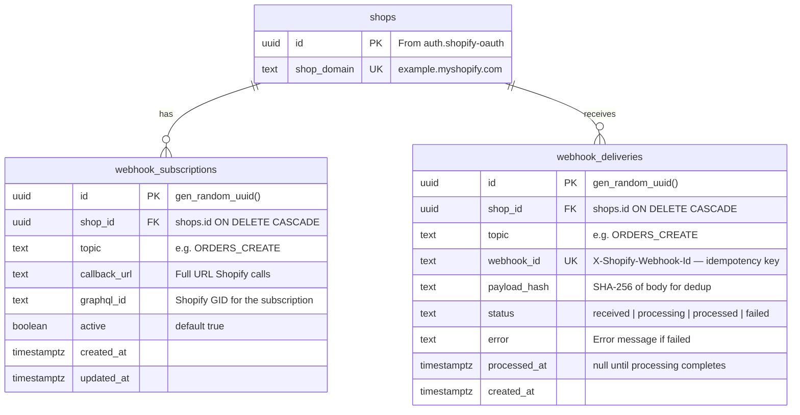
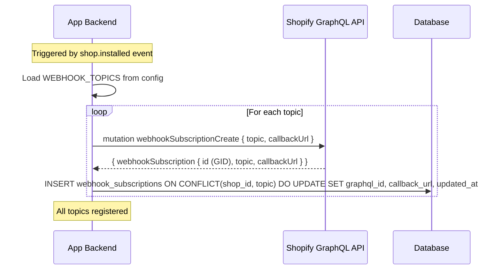
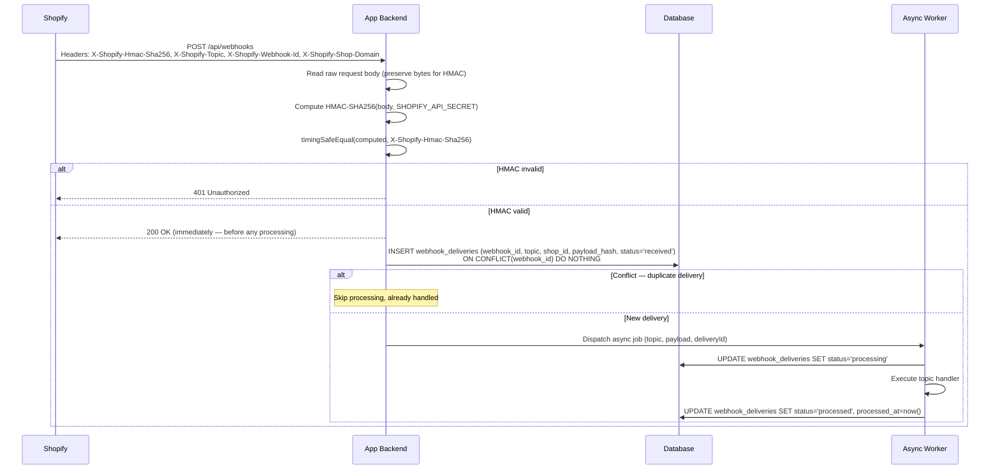
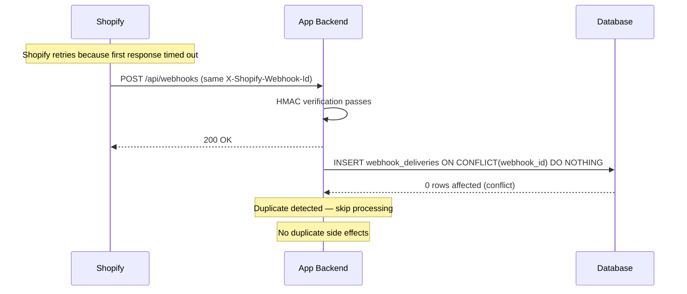

# Shopify Webhook Management

## 1. Overview

### Problem Statement

Shopify apps need real-time event notifications when things change in a merchant's store — orders placed, products updated, customers created, app uninstalled. Without webhooks, the app must poll the Admin API constantly, burning rate limit budget and adding latency. The webhook system is the event backbone: register once per shop, receive push notifications for all configured topics, verify every delivery with HMAC, and process each payload exactly once regardless of Shopify's retry behavior.

### User Stories

- **Developer**: I want to subscribe to Shopify events (orders, products, customers) so my app reacts in real time without polling
- **Developer**: I want to verify that webhook deliveries are genuinely from Shopify, not forged by an attacker
- **Developer**: I want to process each webhook exactly once even if Shopify retries delivery due to a timeout
- **Developer**: I want a clear status trail of every webhook received, processed, or failed for debugging

### When to use this block

- App needs to react to Shopify events in real time
- User mentions: "webhook", "event", "orders create", "notify when", "real-time updates"
- App needs APP_UNINSTALLED notification to mark shops inactive
- Downstream blocks need an event backbone (`compliance.shopify-gdpr` depends on this block)

### When NOT to use

- Need one-time data sync → use `operations.shopify-bulk`
- Need storefront data without real-time requirement → poll via Admin API with caching
- Building a theme (no webhooks needed)

---

## 2. Data Model



### Table: `webhook_subscriptions`

| Column | Type | Constraints | Notes |
|--------|------|-------------|-------|
| `id` | `uuid` | PK, default `gen_random_uuid()` | |
| `shop_id` | `uuid` | NOT NULL, FK → `shops.id` CASCADE | |
| `topic` | `text` | NOT NULL | e.g. `ORDERS_CREATE`, `APP_UNINSTALLED` |
| `callback_url` | `text` | NOT NULL | Full URL Shopify delivers to |
| `graphql_id` | `text` | nullable | Shopify's GID for deletion/sync |
| `active` | `boolean` | NOT NULL, default `true` | |
| `created_at` | `timestamptz` | NOT NULL, default `now()` | |
| `updated_at` | `timestamptz` | NOT NULL, default `now()` | |

UNIQUE constraint: `(shop_id, topic)` — one subscription per topic per shop.

### Table: `webhook_deliveries`

| Column | Type | Constraints | Notes |
|--------|------|-------------|-------|
| `id` | `uuid` | PK, default `gen_random_uuid()` | |
| `shop_id` | `uuid` | NOT NULL, FK → `shops.id` CASCADE | |
| `topic` | `text` | NOT NULL | Mirrors `X-Shopify-Topic` header |
| `webhook_id` | `text` | NOT NULL, UNIQUE | `X-Shopify-Webhook-Id` — idempotency key |
| `payload_hash` | `text` | NOT NULL | SHA-256 hex of raw body |
| `status` | `text` | NOT NULL, default `'received'` | `received` → `processing` → `processed` / `failed` |
| `error` | `text` | nullable | Set on failure |
| `processed_at` | `timestamptz` | nullable | Set when status reaches terminal state |
| `created_at` | `timestamptz` | NOT NULL, default `now()` | |

UNIQUE constraint: `(webhook_id)` — enforces exactly-once processing.

### Migration (reference)

```sql
CREATE TABLE IF NOT EXISTS webhook_subscriptions (
  id          uuid PRIMARY KEY DEFAULT gen_random_uuid(),
  shop_id     uuid NOT NULL REFERENCES shops(id) ON DELETE CASCADE,
  topic       text NOT NULL,
  callback_url text NOT NULL,
  graphql_id  text,
  active      boolean NOT NULL DEFAULT true,
  created_at  timestamptz NOT NULL DEFAULT now(),
  updated_at  timestamptz NOT NULL DEFAULT now(),
  UNIQUE(shop_id, topic)
);

CREATE INDEX idx_webhook_sub_shop ON webhook_subscriptions(shop_id);

CREATE TABLE IF NOT EXISTS webhook_deliveries (
  id           uuid PRIMARY KEY DEFAULT gen_random_uuid(),
  shop_id      uuid NOT NULL REFERENCES shops(id) ON DELETE CASCADE,
  topic        text NOT NULL,
  webhook_id   text NOT NULL UNIQUE,
  payload_hash text NOT NULL,
  status       text NOT NULL DEFAULT 'received',
  error        text,
  processed_at timestamptz,
  created_at   timestamptz NOT NULL DEFAULT now()
);

CREATE INDEX idx_webhook_del_shop ON webhook_deliveries(shop_id);
CREATE INDEX idx_webhook_del_status ON webhook_deliveries(shop_id, status);
```

---

## 3. Data Flow

```mermaid
flowchart TD
    subgraph Registration["Registration (after install)"]
        A[app.install completes] --> B[registerWebhooks shopId]
        B --> C{For each topic in WEBHOOK_TOPICS}
        C --> D[webhookSubscriptionCreate mutation]
        D -->|Success| E[Store subscription record with graphql_id]
        D -->|Already exists| F[Update existing subscription record]
        D -->|GraphQL error| G[Log error, continue next topic]
        E --> C
        F --> C
    end

    subgraph Receiving["Receiving"]
        H[Shopify POST /api/webhooks] --> I[Read raw body bytes]
        I --> J{Verify HMAC-SHA256\nX-Shopify-Hmac-Sha256}
        J -->|Invalid| K[401 Unauthorized]
        J -->|Valid| L[Respond 200 immediately]
        L --> M[Extract headers:\nX-Shopify-Webhook-Id\nX-Shopify-Topic\nX-Shopify-Shop-Domain]
        M --> N{INSERT webhook_deliveries\nON CONFLICT webhook_id DO NOTHING}
        N -->|Conflict: duplicate| O[Skip — already processed]
        N -->|Inserted: new delivery| P[Route to topic handler]
        P --> Q[Process async]
        Q -->|Success| R[UPDATE status = processed]
        Q -->|Failure| S[UPDATE status = failed, set error]
    end
```



---

## 4. Sequence Diagrams

### Registration Flow (after install)



### Receiving + Processing Flow



### Duplicate Delivery Handling



---

## 5. State Management

This block is backend-only. No frontend state.

| State | Storage | Survives Restart | Notes |
|-------|---------|-----------------|-------|
| `webhook_subscriptions` | Database | Yes | Registered topics per shop |
| `webhook_deliveries` | Database | Yes | Delivery audit trail + idempotency |
| Processing lock | DB unique constraint | Yes | Prevents duplicate processing |

### Delivery Status Transitions

```
received → processing → processed
                      → failed
```

- `received`: INSERT on first delivery
- `processing`: SET before handler runs
- `processed`: SET after handler completes successfully
- `failed`: SET if handler throws, with error message

---

## 6. Integration Points

### Inbound

| Caller | How | Purpose |
|--------|-----|---------|
| Shopify webhook system | POST `WEBHOOK_PATH` | Deliver event payloads |
| App install flow | Internal function call | Trigger `registerWebhooks(shopId)` |

### Outbound

| Target | How | Purpose |
|--------|-----|---------|
| Shopify GraphQL Admin API | GraphQL mutation | Register webhook subscriptions |
| Database | SQL | Store subscriptions + delivery records |
| Async job queue | Internal dispatch | Process webhook payloads after responding 200 |

### Events

| Event | Payload | When |
|-------|---------|------|
| `webhook.received` | `{ deliveryId, shopId, topic, webhookId }` | New delivery inserted (not duplicate) |
| `webhook.processed` | `{ deliveryId, shopId, topic, webhookId }` | Handler completes successfully |
| `webhook.failed` | `{ deliveryId, shopId, topic, webhookId, error }` | Handler throws unhandled error |

### Shared Utilities Used

This block reuses from `auth.shopify-oauth`:
1. **`verifyShopifyHmac(secret, body, hmac)`** — HMAC-SHA256 verification over raw request body
2. **GraphQL Admin API client** — for `webhookSubscriptionCreate` and `webhookSubscriptionDelete` mutations

---

## 7. Configuration Surface

| Key | Type | Default | Description |
|-----|------|---------|-------------|
| `WEBHOOK_TOPICS` | `string[]` | `["APP_UNINSTALLED"]` | Topics to register on each shop install |
| `WEBHOOK_PATH` | `string` | `"/api/webhooks"` | HTTP path that receives all webhook deliveries |
| `WEBHOOK_PROCESS_ASYNC` | `boolean` | `true` | Dispatch to background worker after responding 200 |
